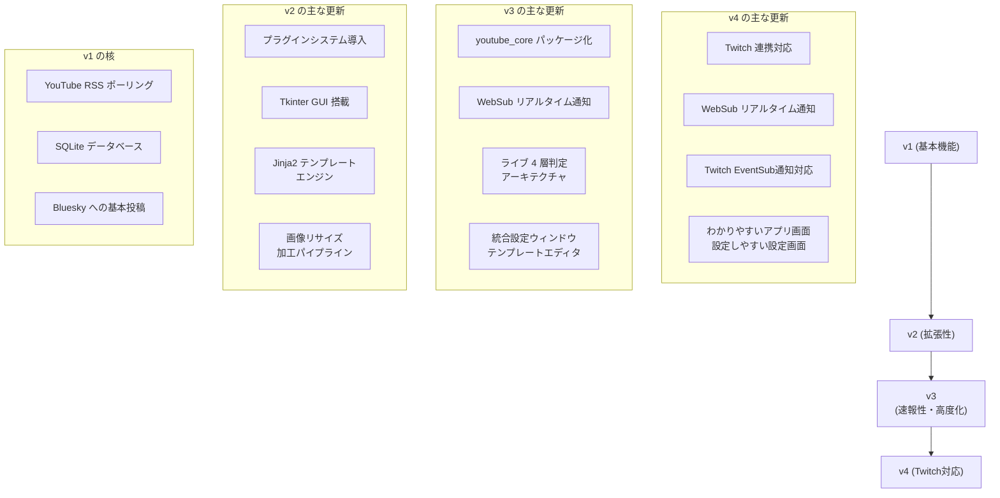

# 更新履歴 / リリースノート (Changelog)

このページでは、StreamNotify のバージョンアップ履歴や機能の更新内容を記録しています。  
過去のバージョンから最新バージョンまでの主な変更点を確認できます。

## 世代別サマリー

| 世代 | エントリポイント | 代表的なバージョン | 主要なテーマ |
| :--- | :--- | :--- | :--- |
| **v1** | `v1/main_v1.py` | v0.1.0 | 単一ファイルによる RSS ポーリング。 プラグインや GUI は未搭載。 |
| **v2** | `v2/main_v2.py` | v2.1.0 | プラグインシステム、GUI、ニコニコ動画対応、 画像処理、テンプレート対応、YouTubeLive対応。 |
| **v3** | `v3/main_v3.py` | v3.2.1 | WebSub (リアルタイム通知)、ライブ 4 層判定、統合設定、 一括予約、テンプレート編集。 |
| **v4** | `v4/main_v4.py` | 4.0.0-alpha（開発中） | センター経由の WebSub / Twitch EventSub、ローカル Webhook、 `poll` / `websub` の切替と RSS フォールバック、SQLAlchemy DB 等。 |

- v1〜v4 はそれぞれ独立したディレクトリ (`v1/`, `v2/`, `v3/` , `v4/`) に格納されています。  
- v4からは、 `launcher.py` / `start_launcher.bat` (Windows用起動ランチャー)からも起動できます。  
- 各世代は基本的に自己完結したアプリケーションツリーとして利用できます。

---

## 世代別の機能追加マップ

---

## v1 — 単一ファイルの RSS ボット
v1 はプロジェクトの基礎を築きました。固定間隔で YouTube の RSS をチェックし、  
新着があれば Bluesky に自動投稿するという設計です。  
すべてのロジックが少数のフラットなファイルに収められていました。

## v2 — GUI とプラグインアーキテクチャ
v2 では、現在の設計の根幹となる「コア + 拡張機能」の構成が導入されました。
- **プラグインシステム**: `PluginManager` を導入し、複数の SNS への同時投稿や機能追加が容易になりました。
- **GUI**: Tkinter による操作画面が追加され、手動投稿や統計確認が可能になりました。
- **ニコニコ動画対応**: RSS を介したニコニコ動画の監視ができるようになりました。
- **画像処理**: 画像のリサイズや加工パイプラインが追加されました。
- **テンプレート対応**: Jinja2 テンプレートエンジンを導入し、動画の内容を動的に投稿できるようになりました。
- **YouTubeLive対応**: YouTubeLiveの監視ができるようになりました。

## v3 — WebSub、ライブ判定、統合設定
v3 では、さらなるリアルタイム性と使い勝手の向上が図られました。
- **WebSub 対応**: YouTube からの通知をリアルタイムで受け取る「プッシュ型」の通知に対応しました。
- **ライブ 4 層判定**: ライブ配信の「予定・開始・終了・アーカイブ化」という複雑な状態遷移を  
正確に捉える専用モジュールが開発されました。
- **統合設定**: GUI 上から安全に `settings.env` を編集できるようになり、  
テンプレートのライブプレビュー機能も搭載されました。
- **一括予約**: 一括で複数の動画を予約できるようになりました。
- **テンプレート編集**: GUI 上からテンプレートを編集できるようになりました。

## v4 — センター連携クライアント（開発版）
v4 は、YouTube 新着の取り方として **定期チェック（poll）** と **通知サーバー経由（websub）** を選べるクライアントです。  
websub 利用時はローカルで Webhook を受け、センターと同期しつつ **Twitch EventSub** なども扱えます。  
通知が届かない間は RSS へフォールバックし、GUI から再接続を試せます。  
詳細は Wiki の [v4 概要](v4_overview)、技術寄りの [v4 概要と使い方（技術）](https://github.com/mayu0326/StreamNotify/blob/wiki/wiki/technical/v4-overview-and-usage.md) を参照してください。

---

## Wiki（ドキュメント）更新履歴

アプリ本体のリリースノートとは別に、**この Wiki リポジトリ上のユーザー向けページ** の主な更新を記します。

### 2026-03-29 — StreamNotify v4 向けユーザー向けガイドの追加
初めて v4 を使う方向けに、v3 系ページと同じくらいやさしい文体の導線を整備しました。

- [Home](Home): 「StreamNotify v4 をお使いの方」メニューを追加。v3 向けリンクに注記。
- [v4 クイックスタート](v4_getting_started): 環境準備から起動・テスト・トラブルシュートまで。
- [v4 概要](v4_overview): v4 の位置づけと、poll / websub・Twitch などの要点。
- [v4 ユーザーマニュアル](v4_user_manual): 日常の運用フロー。
- [v4 GUI 操作マニュアル](v4_gui_usermanual): ツールバー・フィルタ・右クリック（v3 との表記差も記載）。
- [v4 のフォルダ構成](v4_folder_structure): `settings.env`、ログ、DB、`Asset` まわり。
- [Twitch 連携設定ガイド（v4）](twitch_setup): Twitch は v4・センター＋OAuth 前提の手順。
- [v4 のログファイル案内](v4_logs_guide): `v4/logs/` の各ファイルに何が書かれるかのユーザー向け説明。

---

## プラグイン別のバージョン (v3.2.1 時点)
アプリ自体のバージョンとは別に、各プラグインも個別に進化しています。
- **LoggingPlugin (v2.0.0)**: ログの整理と日次ローテーション。
- **BlueskyImagePlugin (v1.1.0)**: 画像添付と Jinja2 レンダリング。
- **YouTubeAPIPlugin (v0.2.0)**: クォータ節約のためのバッチ取得対応。
- **NiconicoPlugin (v0.4.0)**: OGP サムネイル取得の最適化。