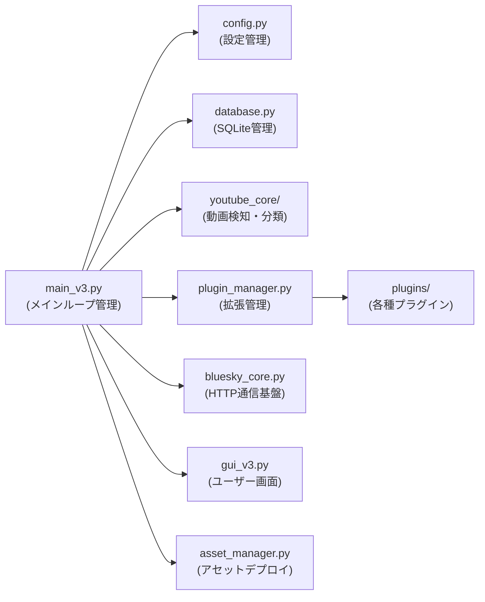
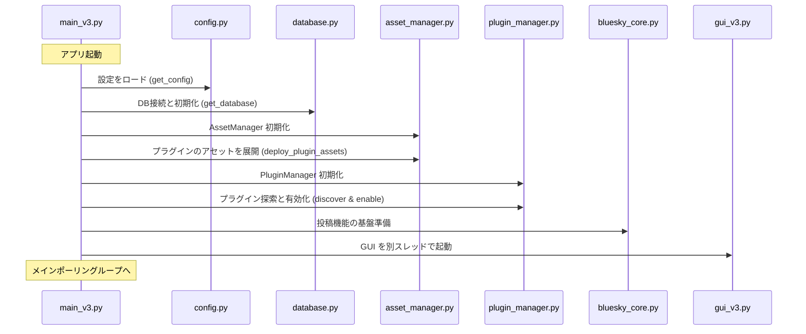
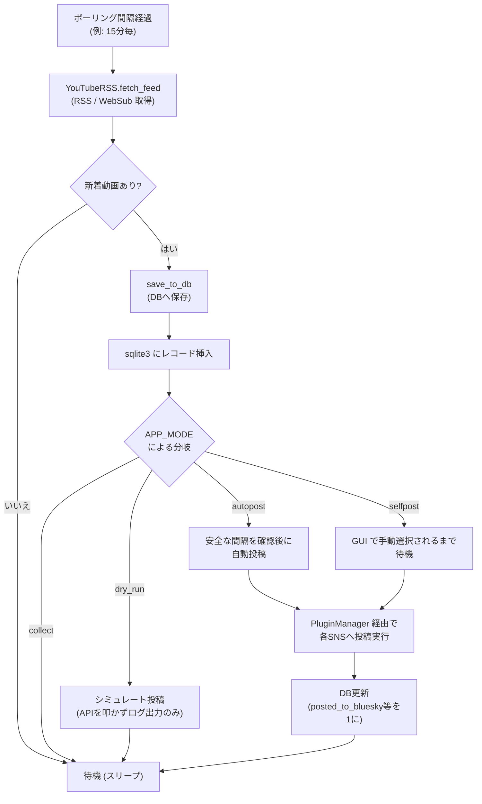

# システムアーキテクチャ設計書 (Architecture)

このページでは、StreamNotify v3 の「コア領域」と「プラグイン領域」に分かれたアーキテクチャ、  
処理の流れ、および主要なモジュールの役割について説明します。

---

## 1. 設計原則: コア vs. 拡張プラグイン

StreamNotify は機能を以下の 2 つの階層に分離し、柔軟性と安定性を両立しています。

| 階層 | 主な責務 | 格納ディレクトリ |
| :--- | :--- | :--- |
| **コア領域 (Core)** | RSS 取得、設定ロード、DB 管理、Bluesky への基盤投稿、GUI | `v3/*.py`, `v3/youtube_core/` |
| **拡張領域 (Extensions)** | API 通信、ニコニコ動画 RSS 取得、画像処理、<br>ライフサイクルフック | `v3/plugins/` |

**コア領域**は、特定のプラグインが有効でなくても独立して動作可能です。  
**拡張プラグイン**は `plugin_interface.py` で定義された基底クラスを実装し、コアの振る舞いを拡張しますが、  
コアの責務を肩代わりすることはありません。

---

## 2. コンポーネント構成と役割

コア領域を構成する主なモジュール群と、それぞれの役割は以下の通りです。



### 主要モジュールの責務一覧

| モジュール名 | 主な責務 |
| :--- | :--- |
| **`main_v3.py`** | アプリの入り口。起動シーケンスの実行とメインポーリングループの所有。 |
| **`config.py`** | `settings.env` の読み込みと変数のバリデーション、各モジュールへの設定値の提供。 |
| **`database.py`** | `data/video_list.db` への CRUD 操作。レコードの重複排除や状態（未/既投稿等）の管理。 |
| **`youtube_core/`** | YouTube RSS や WebSub の取得（`youtube_rss.py`）、動画種別の分類（`youtube_video_classifier.py`）。 |
| **`bluesky_core.py`** | Bluesky AT Protocol のセッション管理や、低レイヤーの API (createRecord) 呼び出し。 |
| **`asset_manager.py`** | 起動時にデフォルトテンプレートや画像をコピー<br>（ただしユーザーの既存ファイルは上書きしない安全な設計）。 |
| **`plugin_manager.py`** | 導入済みプラグインの自動探索、ライフサイクル管理、イベントディスパッチ（呼び出し）。 |

---

## 3. アプリケーションの起動シーケンス

アプリケーションを起動すると、ポーリングループに入る前に固定された順番で初期化が行われます。



---

## 4. メイン処理ループ (Polling Loop)

起動が完了すると、`main_v3.py` は設定された間隔ごとにフィードをフェッチします。



---

## 5. プラグインを通じた投稿パイプライン

新着動画の投稿が決定すると、`main_v3.py` や GUI は `PluginManager.post_video_with_all_enabled()` を呼び出します。  
これにより、有効化されている全プラグインでの投稿処理が順次実行されます。

例として、Bluesky への投稿の流れは以下のようになります：

1. `PluginManager` が **`BlueskyImagePlugin`** (拡張プラグイン層) に投稿指令を出します。
2. プラグインは `template_utils.py` を呼び出して Jinja2 テンプレートを評価（レンダリング）します。
3. 添付画像がある場合、`image_processor.py` を呼び出してファイルサイズや形式を最適化します。
4. 全ての準備が整うと、プラグインは **`bluesky_core.py`** (コア層) を呼び出します。
5. コア層が実際に Bluesky の AT Protocol API (`createRecord`) を叩いて投稿を完了させます。

---

## 6. ディレクトリ構造の全体像

```
v3/
├── main_v3.py                  # アプリの入り口、メインループ管理
├── config.py                   # 設定の読み込み・バリデーション
├── database.py                 # SQLite の読み書き
├── plugin_manager.py           # プラグインの統合と呼び出し
├── bluesky_core.py             # 通信基盤 (Bluesky API)
├── template_utils.py           # Jinja2 テンプレート評価
├── youtube_core/               # YouTube に特化した動画の取得・分類ロジック
├── plugins/                    # 拡張システム (BlueskyPlugin, YouTubeAPIPlugin, NiconicoPlugin 等)
├── data/
│   ├── video_list.db           # SQLite データベース実体
│   └── deleted_videos.json     # 削除済みキャッシュ (再取得防止用)
├── templates/                  # 投稿文章のテンプレート集
├── images/                     # デフォルト画像や処理用の一時画像
├── Asset/                      # ユーザーに変更されない初期設定アセットのマスター
└── logs/                       # アクセスログやエラーログ
```

---

## 7. さらに詳細なモジュール仕様について

よりディープな各モジュールの仕様  
（バッチ処理の最適化、ポーラーの動作、データベースキャッシュの詳細など）については、  
以下のインデックスページから各仕様書を参照してください。

- **[開発者向け詳細技術仕様書 (docs/technical/index.md)](./docs/technical/index.md)**
