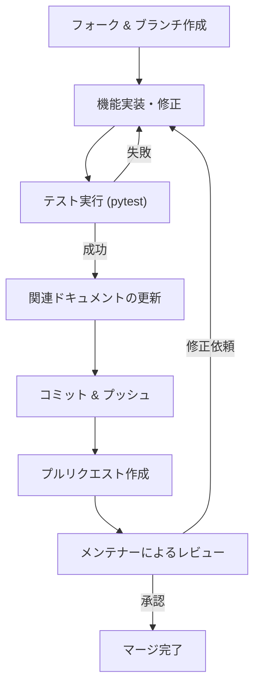

# 開発者向け総合ガイド (Developer Guide)

このページでは、StreamNotify へのコード貢献方法やバグレポートの提出、開発環境の構築手順、  
および将来の開発計画（ロードマップ）について説明します。

---

## 開発環境のセットアップ

### システム要件
| 要件 | 最小構成 | 推奨 |
| :--- | :--- | :--- |
| OS | Windows 10<br>Debian Linux<br>Ubuntu Linux | Windows 10・11<br>Debian Linux<br>Ubuntu Linux<br>WSL2<br> MacOS |
| Python | 3.10 | 3.12 |
| Git | 任意 | 最新の安定版 |

### セットアップ手順

開発を始めるための完全な初期セットアップ手順です。
> **注意**
> 本ドキュメント作成時点のバージョンは`v3.2.0`です。そのため、`v3.2.0`を基準に説明しています。  
> 旧バージョンまたは世代の場合は、該当するバージョンの内容に適宜読み替えてください。

1. **リポジトリのクローンと移動**
   ```bash
   git clone <repository-url>
   cd Streamnotify_on_Bluesky/v3
   ```
   以降のすべてのコマンドは、`v3/` ディレクトリ内で実行します。

2. **仮想環境の作成と有効化**
   システム上の Python パッケージと分離して管理するために、仮想環境を推奨します。
   ```bash
   python -m venv .venv

   # Windows の場合
   .venv\Scripts\activate

   # Linux / macOS / WSL の場合
   source .venv/bin/activate
   ```

3. **依存関係のインストール**
   ```bash
   pip install -r requirements.txt
   ```

4. **開発用ツールのインストール**
   リンターやテストランナー等をインストールします。
   ```bash
   pip install pytest autopep8 black flake8 pre-commit
   ```

5. **設定ファイルの準備**
   ```bash
   cp settings.env.example settings.env
   ```
   - 作成した `settings.env` に開発用のテストアカウント  
   （YouTubeチャンネルID、Blueskyハンドル、アプリパスワードなど）を設定します。  
   - 安全のため、本番アカウントではないものを使用することをおすすめします。

---

## コーディング規約

すべての Python ソースコードは以下の標準に従う必要があります。

- **スタイル規約**: PEP 8 に準拠。インデントは 4 スペース。1 行の最大長は 100 文字。
- **命名規則**:
  - 変数・関数: `snake_case`
  - 定数: `UPPER_SNAKE_CASE`
  - クラス: `PascalCase`
  - 非公開メンバ: `_` プレフィックス
- **ドキュメンテーション**: すべての公開関数・クラスに docstring を記述してください。  
英語のほか、日本語の併記も可能です。

---

## プリコミット・フック (Pre-commit Hooks)

コミットを行う前に、以下のコマンドでフックを有効化してください。
```bash
pre-commit install
```
コミット時に `flake8` による構文チェック、`autopep8` による自動整形、`ggshield` による  
機密情報の混入チェックが自動実行され、コードの品質を保ちます。

---

## テスト手順

テストフレームワークとして `pytest` を使用しています。  
テストコードは `tests/` ディレクトリに配置されています。
```bash
# 全テスト実行
python -m pytest tests/

# カバレッジレポート付きで実行
python -m pytest --cov=. tests/
```
新しい機能を追加したりバグを修正する場合は、必ず対応するテストコードを記述してください。

---

## プルリクエスト (PR) の流れ



### ブランチ・コミット命名規則
- **ブランチ名**: `feature/` (機能追加), `fix/` (修正), `docs/` (ドキュメント関連)
- **コマンドメッセージ**: `feat:`, `fix:`, `docs:` などの Conventional Commits 形式を推奨します。

---

## ロードマップ (Roadmap)

### 実装済み (v3.2.1まで)
- YouTube Live 4層追跡
- WebSub (リアルタイム通知)
- 4条件複合フィルタリング
- ZIP バックアップ/復元
- YouTube API バッチ最適化

### フェーズ 4 — 計画中 (v4.0.x+)
- **Twitch API プラグイン**: 配信開始/終了の監視。
- **トンネル統合プラグイン**: Cloudflare Tunnel 等との連携。
- **Discord 通知プラグイン**: Webhook によるリッチな通知。

### フェーズ 5 — 計画中 (v4.1.x+)
- **Web UI**: ブラウザから設定・投稿管理。
- **Windows クライアント**: デスクトップアプリ化。
- **ホットリロード**: 再起動なしのプラグイン有効化。

### フェーズ 6 — 計画中
- **分散型 SNS 対応**: Mastodon / Misskey (ActivityPub) への同時投稿。

---

## 設計上の制約
- StreamNotify は「**ローカル環境で完結して動作すること**」を重視しています。  
そのため、現時点では、常時稼働サーバーが必須となる機能（Twitch の EventSub など）より、   
ポーリング方式などを優先して採用しています。
- 今後、Twitch対応を行う場合は、WebSubセンターサーバーを公式提供し、  
`Twitch EventSub Webhook`を採用する予定です。仕様が決まり次第再度お知らせします。
---

## 各モジュールの詳細な技術仕様
本ガイドで解説した内容よりもさらに深く、  
各機能（GUI実装、Bluesky投稿基盤、画像リサイズ処理など）のコードレベルの内部仕様を知りたい場合は、  
以下のディレクトリを参照してください。

- **[開発者向け詳細技術仕様書 (docs/technical/index.md)](./docs/technical/index.md)**

---

## ライセンス
StreamNotify は **GPL License v2** の下で公開されています。貢献されたコードも同ライセンスに従います。
