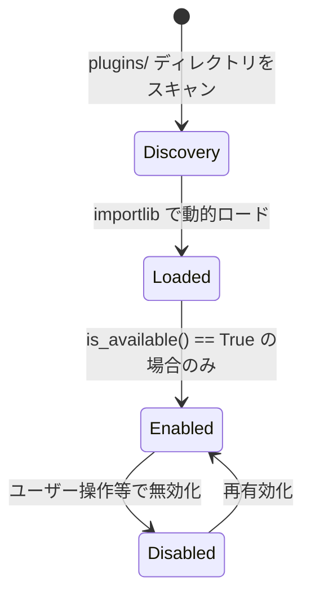

# プラグイン開発ガイド (Plugin Development)

このページでは、StreamNotify のプラグインシステムの仕組みと、  
新しい拡張プラグインを自作するための手順について説明します。

---

## 1. プラグインシステムの概要

StreamNotify はコア機能（設定ロード、DB管理、基本ループ）と、  
プラグイン（プラットフォーム固有の機能、YouTubeAPI通信、Bluesky投稿など）を明確に分離しています。

すべてのプラグインは `plugins/` ディレクトリ配下に配置され、  
起動時に `PluginManager` によって自動的に発見・ロードされます。

**現在の同梱プラグイン構成:**
```
plugins/
├── bluesky_plugin.py          # Bluesky へのテキスト・画像投稿
├── niconico_plugin.py         # ニコニコ動画のRSS監視
├── logging_plugin.py          # ログ出力とローテーション管理
└── youtube/
    ├── youtube_api_plugin.py  # YouTube Data API v3 通信
    └── live_module.py         # YouTube Live の状態追跡
```

---

## 2. NotificationPlugin インターフェース

すべてのプラグインは `plugin_interface.py` で定義されている抽象基底クラス `NotificationPlugin` を  
継承する必要があります。 以下の4つのメソッドの実装が**必須**です。

| 必須メソッド | 戻り値 | 目的 |
| :--- | :--- | :--- |
| **`is_available()`** | `bool` | 依存パッケージや認証情報（APIキー等）が揃っているか。<br>`True` の場合のみ有効化されます。 |
| **`post_video(video)`** | `bool` | 通知・投稿処理の本体。<br>エラー等の致命的でないスキップ時は例外を投げず `False` を返します。<br>実行成功時は `True`。 |
| **`get_name()`** | `str` | ログやGUIに表示される人間が読みやすいプラグイン名。 |
| **`get_version()`** | `str` | プラグインのバージョン。 `"1.0.0"` などの文字列。 |

また、状態管理のために以下の**任意**のフックメソッドを使用できます。

| 任意メソッド | 目的 |
| :--- | :--- |
| **`on_enable()`** | プラグインが有効化された直後に呼ばれるコールバック。初期化処理などに使用。 |
| **`on_disable()`** | プラグインが無効化されるときに呼ばれるコールバック。 |
| **`get_description()`** | 管理UIで表示するための短い説明文。 |
| **`set_dry_run(flag)`** | テスト投稿（ドライラン）時、実際に外部APIを叩かないように<br>フラグを受け取るためのメソッド。 |

---

## 3. プラグインのライフサイクル

`PluginManager` がプラグインを管理する一連の流れです。



---

## 4. イベントのルーティング (ディスパッチ)

動画の投稿が決定すると、`main_v3.py` や GUI は単一のエントリポイントである `PluginManager.post_video_with_all_enabled(video)` を呼び出します。  
これにより、有効になっている全プラグインの `post_video()` に処理がルーティングされます。

重要な挙動：
- プラグイン内で発生した例外は個別にキャッチされ、**他のプラグインの実行を妨げません**。
- `dry_run`（テスト投稿フラグ）は、プラグインが `set_dry_run` メソッドを持っている場合、  
自動的に各プラグインへ伝達されます。

---

## 5. 新しいプラグインの作り方

`plugins/` ディレクトリに、新しい Python スクリプト（例: `my_discord_plugin.py`）を作成し、  
以下のようなクラスを定義するだけで自動で認識されます。

### 最小限の実装テンプレ―ト

```python
from typing import Dict, Any
import os

from plugin_interface import NotificationPlugin

class MyDiscordPlugin(NotificationPlugin):
    
    def is_available(self) -> bool:
        # settings.env に Webhook URL が設定されている場合のみ有効化
        return os.getenv("DISCORD_WEBHOOK_URL") is not None

    def post_video(self, video: Dict[str, Any]) -> bool:
        # video辞書には title, video_url, channel_name などのデータが入っています
        try:
            # TODO: ここに Discord Webhook へ送信する処理を記述
            
            return True # 成功
        except Exception as e:
            print(f"Error in MyDiscordPlugin: {e}")
            return False # 失敗・スキップ

    def get_name(self) -> str:
        return "Discord Notification Plugin"

    def get_version(self) -> str:
        return "1.0.0"
        
    def get_description(self) -> str:
        return "新しい動画を Discord サーバーの Webhook に通知します。"
```

### 追加の制約とベストプラクティス
1. 渡される `video` 辞書のデータを**破壊的に書き換えない**でください（他のプラグインにも渡されるため）。
2. 画像リサイズやテンプレートなどの依存ファイルが必要な場合は、  
`Asset/` ディレクトリから静的ファイルをデプロイする `AssetManager` を利用してください。
3. デバッグログを出力する場合は標準の `logging` モジュール（`LoggingPlugin`で管理）を使用してください。
