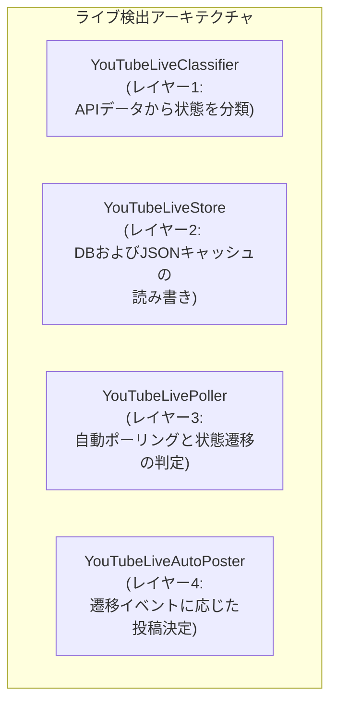

# 主要機能の技術仕様まとめ (Technical Specs)

このページでは、StreamNotify v3 を支える複雑なコア機能の裏側の設計・データフローについて詳細にまとめます。

---

## 1. YouTube ライブ配信の 4層検出アーキテクチャ

YouTubeのライブ配信（待機所→配信中→終了→アーカイブ化）という複雑な状態遷移を正確に追跡するため、`YouTubeLivePlugin` は4つのレイヤーに責任を分割しています。

### 状態遷移のライフサイクル
YouTube の API は、配信終了直後の動画をすぐに「アーカイブ」として扱わない仕様があります。  
これを解決するため、本システムでは**2段階の終了遷移**を行っています。

1. **`upcoming` → `live`**: 配信開始を検出。
2. **`live` → `completed` (内部的にはまだLive扱い)**: 配信終了を検出。  
ここで「配信終了しました」というテンプレートで投稿します。
3. **`completed` → `archive`**: YouTube側でアーカイブ化が完了したことを後から検出し、  
最終的なアーカイブ通知を投稿します。

APIの過剰な呼び出しを防ぐため、これらの状態は `data/youtube_live_cache.json` に一時的にキャッシュされ、  
DBでのチェックと併用して遷移を判断します。

---

## 2. テンプレートシステムと 24時超え拡張表記

投稿文章を動的に生成する Jinja2 テンプレートエンジンの仕様です。

### テンプレートのパス解決フォールバック
指定されたイベントタイプのテンプレートファイルが存在しない場合でもシステムが停止しないよう、  
多層のフォールバックが組まれています。

1. ` settings.env` の `TEMPLATE_..._PATH` で指定されたパス
2. `templates/{service}/{short}_{event}_template.txt` （自動推論）
3. `templates/.templates/default_template.txt` （デフォルト）
4. `templates/.templates/fallback_template.txt` （最終安全策）

### 拡張時間表現 (24時超え・27:00 等)
深夜配信などを視聴者に分かりやすく伝えるため、v3では「24時間表記の拡張処理」を標準搭載しています。  
動画の公開時刻（`published_at`）が **00:00 〜 11:59** の間である場合、内部的に「前日の延長」として解釈されます。

- 通常時刻: `2024-03-05 03:00:00`
- 拡張時刻変数 (`extended_hour`): **27**
- これにより、テンプレート上で `{{ extended_hour }}:00` と指定することで、  
自然に「27:00から配信開始！」のような表現が可能になります。

---

## 3. データベースと削除済み動画キャッシュ

すべての監視対象動画は SQLiteデータベースに記録され、状態が管理されています。

### `video_list.db` のスキーマ概要
`videos` テーブルには、以下のような情報が保存されています。
- **識別情報**: `video_id` (一意), `title`, `channel_name`, `source` (youtube/niconicoなど)
- **状態管理**: `posted_to_bluesky` (投稿済みフラグ), `live_status` (upcoming/live/completed)
- **投稿用データ**: `image_filename`, `scheduled_at`

### 削除済み動画キャッシュ (`deleted_videos.json`)
ユーザーが「アプリ上のリストから不要な動画を削除した」際、単純にDBから消すだけでは、  
次回のRSSポーリング時に **「新着動画だ」と誤認して再登録** されてしまいます。

これを防ぐためのブラックリスト機構が `DeletedVideoCache` です。
1. **削除時**: GUIから動画を消すと、DB上のレコードが消え、そのIDが `data/deleted_videos.json` に追記されます。
2. **取得時**: RSSポーラーはDBへ挿入依頼を出す前に、この JSON リストをチェックします。
3. **スキップ**: JSON内にIDが存在すれば「ユーザーが意図的に削除した動画である」と判断し、DBへの登録を無視します。
