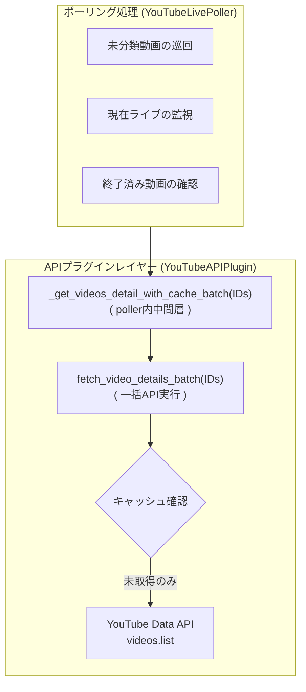

# API バッチ最適化 (API Batch Optimization)

関連ソースファイル
- [v2/docs/Guides/YOUTUBE_SETUP_GUIDE.md](https://github.com/mayu0326/test/blob/abdd8266/v2/docs/Guides/YOUTUBE_SETUP_GUIDE.md)
- [v2/plugins/youtube_api_plugin.py](https://github.com/mayu0326/test/blob/abdd8266/v2/plugins/youtube_api_plugin.py)
- [v3/docs/Guides/YOUTUBE_SETUP_GUIDE.md](https://github.com/mayu0326/test/blob/abdd8266/v3/docs/Guides/YOUTUBE_SETUP_GUIDE.md)
- [v3/docs/Technical/Archive/YouTube/YOUTUBE_API_BATCH_OPTIMIZATION_CHANGES.md](https://github.com/mayu0326/test/blob/abdd8266/v3/docs/Technical/Archive/YouTube/YOUTUBE_API_BATCH_OPTIMIZATION_CHANGES.md)
- [v3/docs/Technical/Archive/YouTube/YOUTUBE_API_BATCH_OPTIMIZATION_IMPLEMENTATION_SUMMARY.md](https://github.com/mayu0326/test/blob/abdd8266/v3/docs/Technical/Archive/YouTube/YOUTUBE_API_BATCH_OPTIMIZATION_IMPLEMENTATION_SUMMARY.md)
- [v3/docs/Technical/Archive/YouTube/YOUTUBE_API_BATCH_OPTIMIZATION_v0_3_1.md](https://github.com/mayu0326/test/blob/abdd8266/v3/docs/Technical/Archive/YouTube/YOUTUBE_API_BATCH_OPTIMIZATION_v0_3_1.md)
- [v3/plugins/youtube/youtube_api_plugin.py](https://github.com/mayu0326/test/blob/abdd8266/v3/plugins/youtube/youtube_api_plugin.py)

このページでは、バージョン v0.3.1 で `YouTubeLivePlugin` サブシステムに導入されたバッチ（一括）処理の最適化について説明します。複数の動画情報の取得を 1 回の API 呼び出しに統合する方法と、キャッシュレイヤーによる重複リクエストの防止策について解説します。

一般的な `YouTubeAPIPlugin` の機能（クォータ管理、チャンネル解決など）については、[YouTube API プラグイン](./YouTube-API-Plugin.md) を参照してください。

---

## 背景: クォータ（割当）問題

YouTube Data API v3 では、1 日あたり 10,000 ユニットのクォータが割り当てられています。`videos.list` リクエストは、**1 回の呼び出しに含める動画 ID の数に関わらず 1 ユニット**を消費します（最大 50 件まで一括取得可能）。

最適化前は、ポーリングごとに動画 1 件につき 1 ユニットを消費していました。これをバッチ化することで、クォータ消費を大幅に削減（最大約 92% 減）しました。

| ポーリング処理 | 動画数(例) | 最適化前(ユニット) | 最適化後(ユニット) |
| :--- | :--- | :--- | :--- |
| 未分類動画のチェック | 20 | 20 | **1** |
| ライブ状態の追跡 | 10 | 10 | **1** |
| 終了済みキャッシュの処理 | 8 | 8 | **1** |
| **1サイクル合計** | **38** | **38** | **3** |

---

## アーキテクチャ: 3 層の呼び出しスタック

情報の取得は以下の 3 段階の構造で行われます。



---

## 実装の詳細

### 1. `YouTubeAPIPlugin.fetch_video_details_batch()`
API レイヤーにおける核となるメソッドです。
- 受け取った ID リストを「キャッシュ済み」と「未取得」に分けます。
- 未取得の ID を 50 件ずつのチャンクに分割し、1 ユニットずつのコストで API を叩きます。
- 取得結果をキャッシュに保存し、ディスクへの書き出しを 1 回にまとめて I/O 負荷を軽減します。

### 2. `YouTubeLivePoller` 内のバッチ管理
各ポーリングロジックから呼ばれる中間メソッドです。
- API プラグインから情報を一括取得します。
- 取得した各動画を分類器 (`YouTubeVideoClassifier`) にかけ、ライブ形式であれば即座にライブ監視対象（ライブキャッシュ）へ登録します。

### 3. 最適化された各ポーリング処理
すべてのポーリング処理は「ID 収集 → 一括取得 → マップの繰り返し処理」という 3 ステップのパターンに統一されました。これによって、何十件動画があっても API 消費は最小限に抑えられます。

---

## 性能への影響（シミュレーション）

1 日 10 回ポーリングを行う場合の推計コストです。

| シナリオ | 最適化前 (ユニット/日) | 最適化後 (ユニット/日) |
| :--- | :--- | :--- |
| 初回起動時（キャッシュなし） | 380 | **30** |
| 通常運用時（一部キャッシュ） | 380 | **約 10〜20** |
| すべてキャッシュ済み | 380 | **0** |

`YouTubeAPIPlugin` のキャッシュ有効期限は 7 日間であるため、運用を続けるほど API 消費コストはゼロに近づきます。

---

## クォータ安全機構 (Quota Safety)

バッチ処理においても、以下の 2 つの守護機能が働いています。

1. **事前コストチェック (`_check_quota`)**: API を叩く前に「今回のコストを追加しても 10,000 を超えないか」を確認します。超える場合はリクエストを遮断します。
2. **クォータ超過フラグ (`quota_exceeded`)**: サーバーから 403 エラー（上限超過）が返ってきた場合、即座にフラグを立てて以降の API 呼び出しをすべてスキップし、無駄な通信を防止します。

---

## ログ出力例

デバッグ用に、バッチ処理の効率が分かるログが出力されます。

```
[DEBUG] 📦 バッチ処理開始: 未分類 20 件
[DEBUG] 📦 バッチ処理: キャッシュヒット=15, API取得=5
[INFO]  ✅ API コスト（バッチ）: 1 ユニット / 5 動画
```