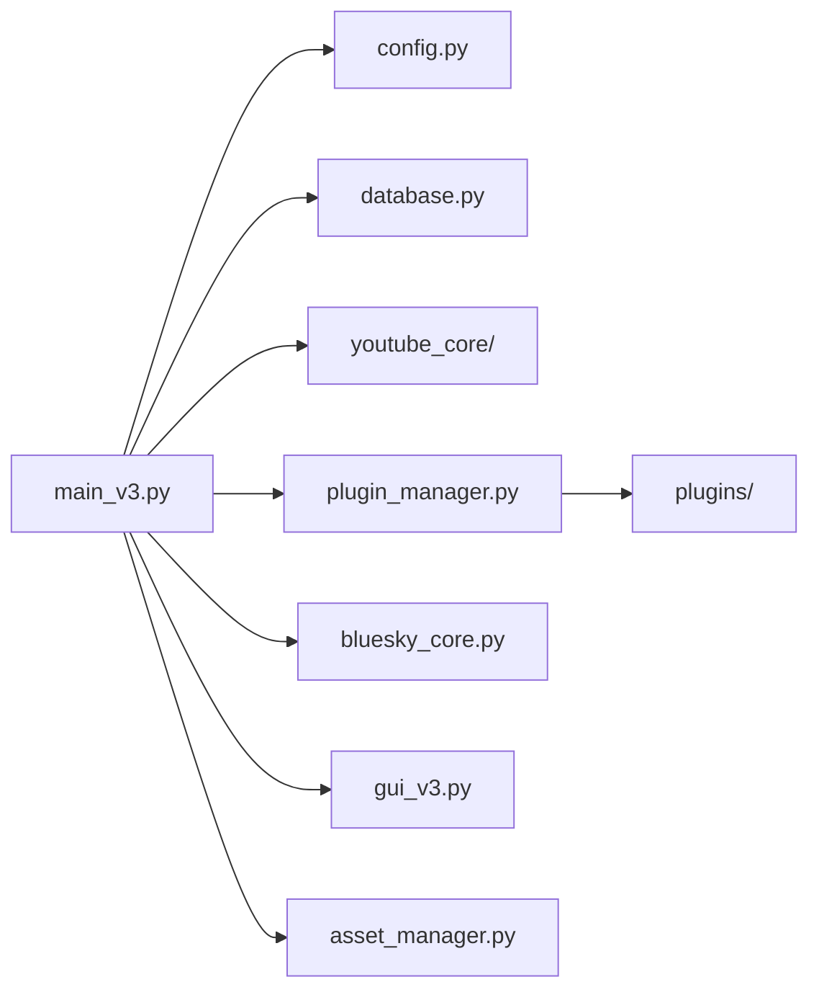
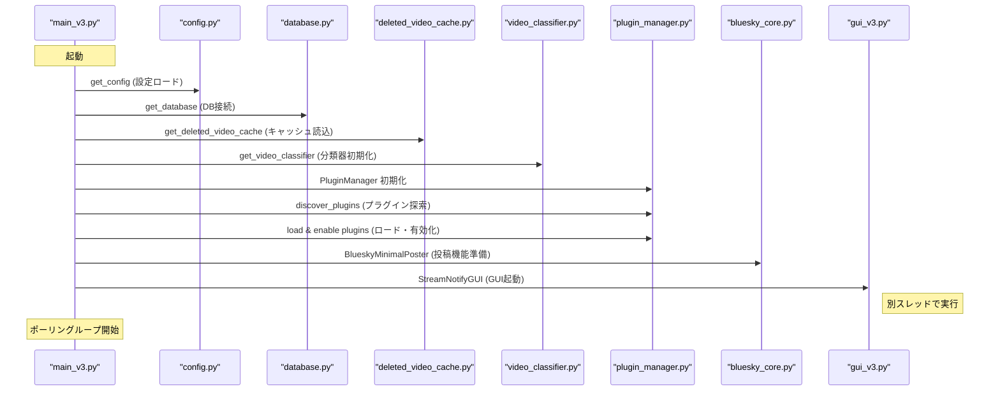
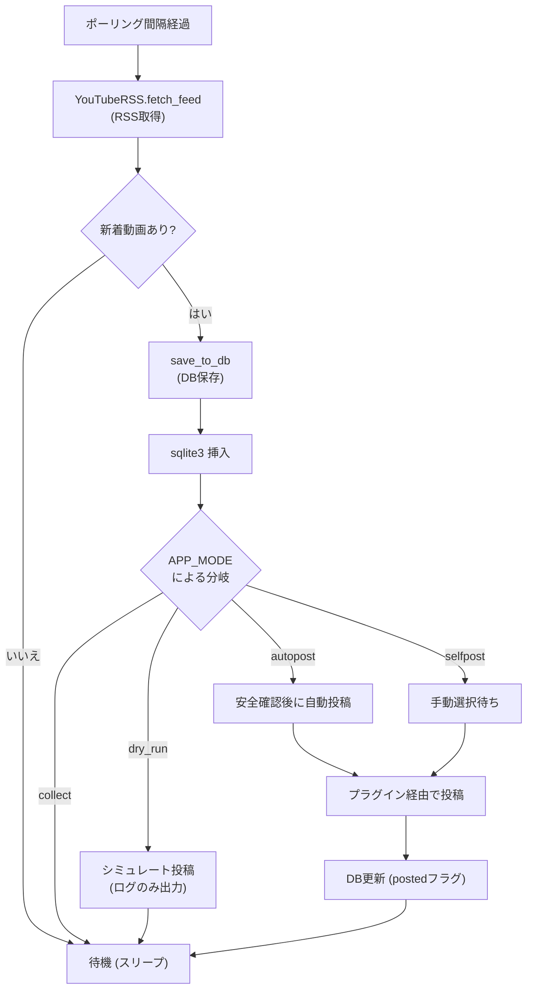
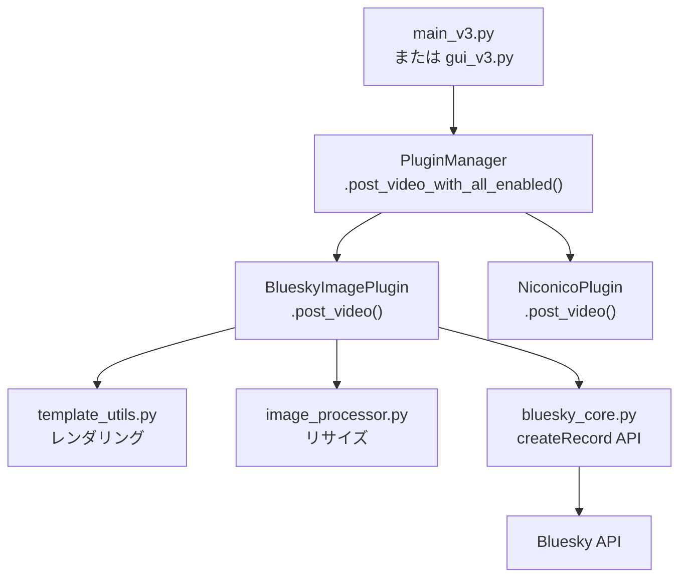

# アーキテクチャ (Architecture)

関連ソースファイル
- [v1/docs/SETUP_GUIDE_v1.md](https://github.com/mayu0326/test/blob/abdd8266/v1/docs/SETUP_GUIDE_v1.md)
- [v2/CONTRIBUTING.md](https://github.com/mayu0326/test/blob/abdd8266/v2/CONTRIBUTING.md)
- [v2/docs/Technical/ARCHITECTURE_AND_DESIGN.md](https://github.com/mayu0326/test/blob/abdd8266/v2/docs/Technical/ARCHITECTURE_AND_DESIGN.md)
- [v3/docs/CONTRIBUTING.md](https://github.com/mayu0326/test/blob/abdd8266/v3/docs/CONTRIBUTING.md)
- [v3/docs/References/ModuleList_v3.md](https://github.com/mayu0326/test/blob/abdd8266/v3/docs/References/ModuleList_v3.md)
- [v3/docs/Technical/Archive/ARCHITECTURE_AND_DESIGN.md](https://github.com/mayu0326/test/blob/abdd8266/v3/docs/Technical/Archive/ARCHITECTURE_AND_DESIGN.md)
- [v3/readme_v3.md](https://github.com/mayu0326/test/blob/abdd8266/v3/readme_v3.md)
- [wiki/Getting-Started-Setup.md](https://github.com/mayu0326/test/blob/abdd8266/wiki/Getting-Started-Setup.md)

このページでは、StreamNotify v3 の「コア領域（Core）」と「拡張領域（Extensions）」に分かれた 2 階層アーキテクチャ、アプリケーションの起動シーケンス、および `main_v3.py` におけるメイン処理ループについて説明します。また、コアモジュール同士やプラグインレイヤーとの相互作用についても解説します。

個別のコンポーネントの詳細については、子ページである [コアモジュール](./Core-Modules.md)、[プラグインシステム](./Plugin-System.md)、[データベースと削除済み動画キャッシュ](./Database-&-Deleted-Video-Cache.md) を参照してください。YouTube ライブの 4 層検出アーキテクチャについては、[YouTube ライブ検出](./YouTube-Live-Detection.md) を参照してください。

---

## 設計原則: コア vs. 拡張

StreamNotify は機能を以下の 2 つの階層に分離しています。

| 階層 | 場所 | 主な責務 |
| :--- | :--- | :--- |
| **コア領域 (Core)** | `v3/*.py`<br>`v3/youtube_core/` | RSS 取得、SQLite ストレージ、Bluesky 投稿(基礎)、GUI、設定ロード |
| **拡張領域 (Extensions)** | `v3/plugins/` | YouTube Data API、ニコニコ動画 RSS、画像処理、ロギング管理 |

コア領域は、特定のプラグインがなくても独立して動作可能です。プラグインは `plugin_interface.py` で定義された `NotificationPlugin` 抽象インターフェースを実装し、起動時に `plugin_manager.py` によって発見、ロード、有効化されます。プラグインはコア機能を拡張しますが、コアの責務を肩代わりすることはありません。

情報源: [v3/docs/Technical/Archive/ARCHITECTURE_AND_DESIGN.md (L22-70)](https://github.com/mayu0326/test/blob/abdd8266/v3/docs/Technical/Archive/ARCHITECTURE_AND_DESIGN.md#L22-L70)

---

## コンポーネント・マップ

**図: トップレベルコンポーネントとソースファイル**



---

## 起動シーケンス (Startup Sequence)

`main_v3.py` は、メインのポーリングループに入る前に、固定された順序で初期化を実行します。

**図: main_v3.py 起動シーケンス**



---

## 基本処理ループ (Main Polling Loop)

起動後、`main_v3.py` は設定された間隔 (`YOUTUBE_RSS_POLL_INTERVAL_MINUTES`) でポーリングを行います。各イテレーション（繰り返し）は以下の判定フローに従います。

**図: メインポーリング処理の流れ — RSS 取得から投稿まで**



---

## モジュールの責務

### コアモジュール (Core Modules)
| モジュール名 | クラス / エントリポイント | 主な責務 |
| :--- | :--- | :--- |
| `main_v3.py` | `main()` | アプリの入り口。起動シーケンスとポーリングループの所有。 |
| `config.py` | `get_config()` | `settings.env` の読み込みと全変数のバリデーション。 |
| `database.py` | `get_database()` | SQLite (`video_list.db`) への CRUD 操作と値の正規化。 |
| `deleted_video_cache.py` | `get_deleted_video_cache()` | 削除済み動画の再検出を防ぐための JSON キャッシュ管理。 |
| `youtube_core/youtube_rss.py` | `YouTubeRSS` | RSS の取得、時間変換 (UTC→JST)、重複除外。 |
| `youtube_core/youtube_video_classifier.py` | `YouTubeVideoClassifier` | 動画を種別 (コンテンツタイプ) やライブ状態に分類。 |
| `bluesky_core.py` | `BlueskyMinimalPoster` | AT Protocol のセッション管理、投稿 API 呼び出し。 |
| `asset_manager.py` | `get_asset_manager()` | デフォルトのテンプレートや画像を配置（上書きせず維持）。 |
| `plugin_manager.py` | `PluginManager` | プラグインの自動発見、ライフサイクル管理、呼び出し。 |

### 拡張プラグイン (Extension Plugins)
| プラグイン名 | クラス名 | 主な責務 |
| :--- | :--- | :--- |
| `bluesky_plugin.py` | `BlueskyImagePlugin` | テンプレート適用、画像縮小、投稿のルーティング。 |
| `youtube_api_plugin.py` | `YouTubeAPIPlugin` | YouTube Data API v3 通信、クォータ(制限)管理。 |
| `live_module.py` | `YouTubeLivePlugin` | ライブ配信状態の継続的な追跡。 |
| `niconico_plugin.py` | `NiconicoPlugin` | ニコニコ動画 RSS の取得と動画情報の抽出。 |

---

## プラグイン呼び出しパス (Plugin Dispatch Path)

動画の投稿が必要になると、`main_v3.py` や `gui_v3.py` は `PluginManager.post_video_with_all_enabled()` を呼び出します。このメソッドが有効な全プラグインに対して繰り返し処理を行います。

**図: PluginManager を通じた投稿のディスパッチ**



---

## GUI とコア領域の相互作用

- `gui_v3.py` (`StreamNotifyGUI`) は、メインのポーリングループとは**別のスレッド**で動作します。DB やプラグインの参照を受け取りますが、ポーリングループ自体を制御することはありません。
- `unified_settings_window.py` は `settings.env` を直接編集します。変更を反映させるには、アプリケーションの再起動が必要です。
- `template_editor_dialog.py` は `template_utils.py` を呼び出し、リアルタイムな Jinja2 プレビューを実現しています。

---

## ディレクトリ構造の概要

```
v3/
├── main_v3.py                  # アプリの入り口、メインループ
├── config.py                   # 設定ローダー
├── database.py                 # SQLite アクセス
├── plugin_manager.py           # プラグインのライフサイクル管理
├── bluesky_core.py             # Bluesky 通信
├── template_utils.py           # テンプレートレンダリング
├── youtube_core/               # YouTube 専用処理
├── plugins/                    # 拡張プラグイン群
├── data/
│   ├── video_list.db           # データベース本体
│   └── deleted_videos.json     # 削除済みキャッシュ
├── templates/                  # 配信されたテンプレート(編集可能)
├── Asset/                      # 編集されないソースアセット
└── logs/                       # ログディレクトリ
```