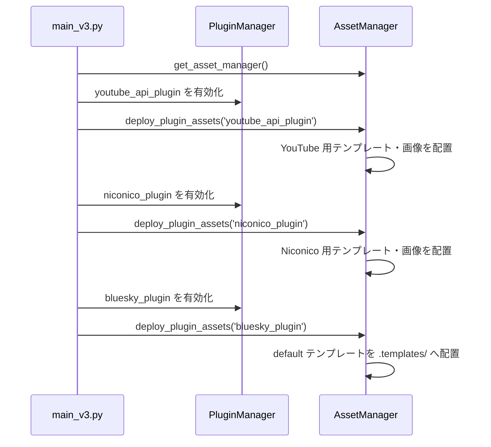
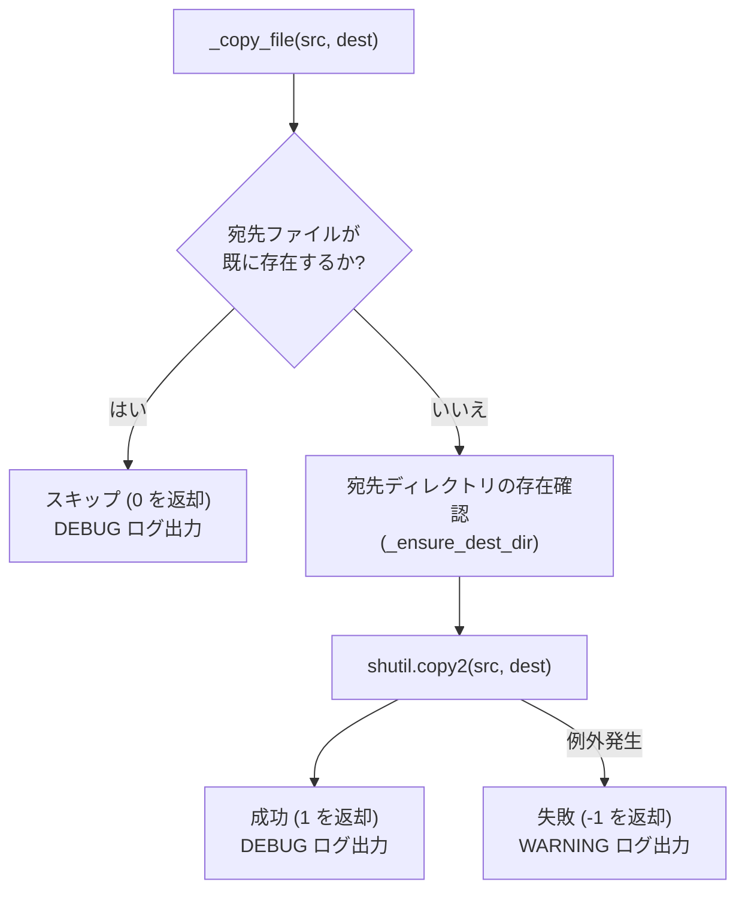
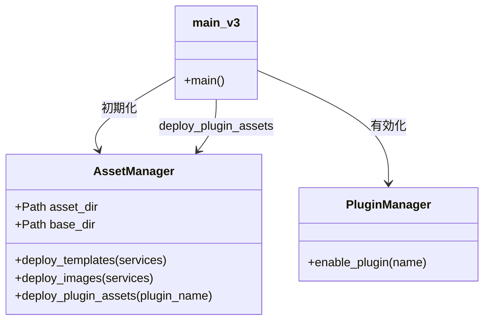

# アセット管理 (Asset Management)

関連ソースファイル
- [v2/asset_manager.py](https://github.com/mayu0326/test/blob/abdd8266/v2/asset_manager.py)
- [v2/docs/Technical/ASSET_MANAGER_INTEGRATION_v2.md](https://github.com/mayu0326/test/blob/abdd8266/v2/docs/Technical/ASSET_MANAGER_INTEGRATION_v2.md)
- [v3/asset_manager.py](https://github.com/mayu0326/test/blob/abdd8266/v3/asset_manager.py)
- [v3/docs/Guides/ASSET_MANAGER_GUIDE.md](https://github.com/mayu0326/test/blob/abdd8266/v3/docs/Guides/ASSET_MANAGER_GUIDE.md)
- [v3/docs/Technical/Archive/ASSET_MANAGER_INTEGRATION_v3.md](https://github.com/mayu0326/test/blob/abdd8266/v3/docs/Technical/Archive/ASSET_MANAGER_INTEGRATION_v3.md)

このページでは、`AssetManager` クラス ([v3/asset_manager.py](https://github.com/mayu0326/test/blob/abdd8266/v3/asset_manager.py)) と `Asset/` ソースディレクトリの構造について説明します。`AssetManager` は、同梱されているデフォルトのテンプレートや画像を、アプリケーション起動時に実行用ディレクトリ (`templates/` および `images/`) へ配置（デプロイ）する役割を担います。

なお、テンプレートのレンダリングや投稿ロジック自体は担当しません。それらについては、[テンプレートシステム](./Template-System.md) および [Bluesky 統合](./Bluesky-Integration.md) を参照してください。

---

## 概要 (Overview)

StreamNotify は、デフォルトのテンプレートファイルやプレースホルダー画像を `Asset/` ディレクトリ内に保持しています。これはデフォルトファイルの内容の「正（Source of Truth）」となります。アプリケーションの起動時、`AssetManager` は `Asset/` 内のファイルを、アプリケーションの他の部分が読み取るディレクトリ (`templates/`, `images/`) にコピーします。宛先に既にファイルが存在する場合、**上書きされることはありません**。これにより、ユーザーによるカスタマイズが保護されます。

**4 つの設計原則:**

| 原則 | 内容 |
| :--- | :--- |
| **非侵襲的 (Non-invasive)** | 宛先に既存のファイルがある場合、無条件でスキップします。 |
| **透明性 (Transparent)** | すべてのコピーおよびスキップ操作は `logs/app.log` に記録されます。 |
| **遅延実行 (Lazy)** | 宛先に不足しているファイルのみをコピーし、不要な処理は行いません。 |
| **耐障害性 (Fault-tolerant)** | ファイルコピーの失敗は警告をログ出力しますが、アプリの起動は妨げません。 |

---

## ディレクトリ構造

`Asset/` ディレクトリは、サービス別のサブディレクトリで構成されています。テンプレートのサービス名は小文字、画像のサービス名は先頭大文字（Title Case）になっています。

**ソース側の構造例:**
```
Asset/
├── templates/
│   ├── default/
│   │   └── default_template.txt        ← 全サービスのフォールバック用
│   ├── youtube/
│   │   ├── yt_new_video_template.txt
│   │   └── ...
│   └── niconico/
└── images/
    ├── YouTube/
    └── Niconico/
```

**実行時の配置先:**
```
templates/
├── youtube/
├── niconico/
└── .templates/                         ← default_template.txt はここへ
images/
├── YouTube/
└── Niconico/
```

注: `Asset/templates/default/` は `templates/.templates/` にマップされます。この隠しサブディレクトリは、テンプレート解決システムが使用する最終的なフォールバック先となります。

---

## `AssetManager` クラス

クラスのインスタンスは、ファクトリ関数 `get_asset_manager()` を介して取得されます。

### 公開メソッド
| メソッド | シグネチャ | 役割 |
| :--- | :--- | :--- |
| `deploy_templates` | `(services: list = None) -> int` | 指定されたサービスのテンプレートを `Asset/templates/` から `templates/` へコピー。 |
| `deploy_images` | `(services: list = None) -> int` | 指定されたサービスの画像を `Asset/images/` から `images/` へコピー。 |
| `deploy_plugin_assets` | `(plugin_name: str) -> dict` | プラグイン名に紐付くアセット（テンプレート・画像）を一括配置。 |

コピー処理の核となる `_copy_file` メソッドでは、`dest.exists()` が `True` であれば `shutil.copy2` を呼び出さずに即座に復帰します。これがユーザーの編集済みファイルを保護する唯一の仕組みです。

---

## プラグインアセット・マップ (`plugin_asset_map`)

プラグイン名と、そのプラグインが必要とするサービスディレクトリの対応は、`deploy_plugin_assets` 内で定義されています。

| プラグイン名 | テンプレート配信 | 画像配信 |
| :--- | :--- | :--- |
| `youtube_api_plugin` | `["youtube"]` | `["youtube"]` |
| `niconico_plugin` | `["niconico"]` | `["niconico"]` |
| `bluesky_plugin` | `["default"]` | `["default"]` |

`bluesky_plugin` エントリは、`default_template.txt` を `templates/.templates/` に配置するための唯一のフックとなっています。

---

## 起動時の統合フロー

`AssetManager` は `main_v3.py` の起動シーケンスの初期段階で初期化されます。各プラグインがロード・有効化された直後に、そのプラグイン用のアセット配信メソッドが呼び出されます。

**標準的な配信順序:**



---

## コピー・ロジックの詳細

**図: _copy_file におけるコピー判定**



---

## クラスとコール階層



---

## 耐障害性 (Fault Tolerance)

ファイル操作中のエラーは複数のレベルでキャッチされます。

- `_ensure_dest_dir`: ディレクトリ作成失敗をキャッチし、`WARNING` をログ出力。
- `_copy_file`: `shutil.copy2` の失敗をキャッチし、`WARNING` をログ出力。
- `main_v3.py`: `deploy_plugin_assets` を `try/except` で囲み、失敗しても次のプラグインのロードを続行。

`AssetManager` 内部の例外によってアプリケーションがクラッシュすることはありません。

---

## 配置済みのファイルを更新する方法

`AssetManager` は既存ファイルを上書きしないため、`Asset/` 内の新しいバージョンを強制的に反映させるには、以下の手順が必要です。

1. `templates/`（または `images/`）内にある、更新したい宛先ファイルを一度削除します。
2. アプリケーションを再起動します。
3. `AssetManager` がファイルの欠落を検知し、`Asset/` から最新版をコピーします。

これは、ユーザーが意図的にデフォルトに戻したい場合や、Git pull で同梱アセットが更新された場合の両方に適用されます。

---

## ログ出力リファレンス

すべての操作は `AppLogger` を通じて `logs/app.log` に記録されます。

| 状況 | レベル | メッセージ例 |
| :--- | :--- | :--- |
| コピー成功 | `DEBUG` | `✅ ファイルをコピーしました: ... -> ...` |
| 既存のためスキップ | `DEBUG` | `既に存在するため、スキップしました: ...` |
| サービスの配置完了 | `INFO` | `✅ [youtube] 1 個のテンプレートをコピーしました` |
| プラグインの配置完了 | `INFO` | `✅ プラグイン '...' のアセットを配置しました` |
| 全アセット配置済み | `DEBUG` | `プラグイン '...' のアセットはすべて配置済みです` |
| ディレクトリ作成失敗 | `WARNING` | `ディレクトリ作成失敗 ...: Permission denied` |
| ファイルコピー失敗 | `WARNING` | `ファイルコピー失敗 ...: Permission denied` |