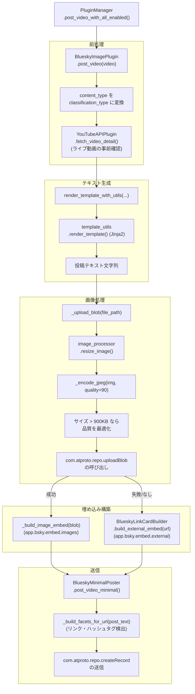
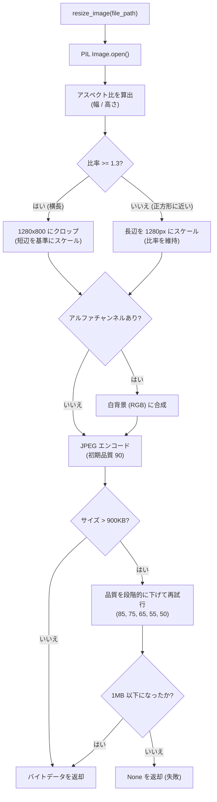

# Bluesky 統合 (Bluesky Integration)

関連ソースファイル
- [v2/docs/ARCHIVE/SESSION_REPORTS.md](https://github.com/mayu0326/test/blob/abdd8266/v2/docs/ARCHIVE/SESSION_REPORTS.md)
- [v2/docs/Technical/RICHTEXT_FACET_SPECIFICATION.md](https://github.com/mayu0326/test/blob/abdd8266/v2/docs/Technical/RICHTEXT_FACET_SPECIFICATION.md)
- [v2/docs/Technical/TEMPLATE_SYSTEM.md](https://github.com/mayu0326/test/blob/abdd8266/v2/docs/Technical/TEMPLATE_SYSTEM.md)
- [v2/template_utils.py](https://github.com/mayu0326/test/blob/abdd8266/v2/template_utils.py)
- [v3/docs/FAQ_TROUBLESHOOTING_BASIC.md](https://github.com/mayu0326/test/blob/abdd8266/v3/docs/FAQ_TROUBLESHOOTING_BASIC.md)
- [v3/docs/Technical/Archive/DEBUG_DRY_RUN_GUIDE.md](https://github.com/mayu0326/test/blob/abdd8266/v3/docs/Technical/Archive/DEBUG_DRY_RUN_GUIDE.md)
- [v3/docs/Technical/Archive/IMAGE_RESIZE_GUIDE.md](https://github.com/mayu0326/test/blob/abdd8266/v3/docs/Technical/Archive/IMAGE_RESIZE_GUIDE.md)
- [v3/docs/Technical/Archive/LOGGING_OPTIMIZATION_GUIDE.md](https://github.com/mayu0326/test/blob/abdd8266/v3/docs/Technical/Archive/LOGGING_OPTIMIZATION_GUIDE.md)
- [v3/docs/Technical/Archive/RICHTEXT_FACET_SPECIFICATION.md](https://github.com/mayu0326/test/blob/abdd8266/v3/docs/Technical/Archive/RICHTEXT_FACET_SPECIFICATION.md)
- [v3/plugins/bluesky_plugin.py](https://github.com/mayu0326/test/blob/abdd8266/v3/plugins/bluesky_plugin.py)
- [v3/template_utils.py](https://github.com/mayu0326/test/blob/abdd8266/v3/template_utils.py)

このページでは、StreamNotify がどのように投稿を作成し Bluesky に送信するかについて、エンドツーエンドの概要を説明します。認証、テンプレートによる投稿テキストの生成、リッチテキスト・ファセットの構築、画像データのアップロード、および embed（埋め込み）の型制約について網羅しています。各サブシステムの詳細については、以下を参照してください:

- コアな投稿処理と認証: [コアな投稿処理と認証](./Core-Posting-and-Authentication.md) を参照
- テンプレートシステム: [テンプレートシステム](./Template-System.md) を参照
- リッチテキスト・ファセット: [リッチテキスト・ファセット](./Rich-Text-Facets.md) を参照
- 画像処理とリサイズ: [画像処理とリサイズ](./Image-Processing-and-Resizing.md) を参照

---

## コンポーネント (Components)

Bluesky パイプラインは、連携する 2 つのクラスに分かれています。

| クラス | ファイル | 責任 |
| :--- | :--- | :--- |
| `BlueskyMinimalPoster` | `v3/bluesky_core.py` | 認証、ファセット検出、`com.atproto.repo.createRecord` の呼び出し |
| `BlueskyImagePlugin` | `v3/plugins/bluesky_plugin.py` | 画像のリサイズ、アップロード、テンプレートレンダリング、埋め込み構築 |

`BlueskyImagePlugin` は `NotificationPlugin` 抽象インターフェースを継承しており（[プラグインシステム](./Plugin-System.md) を参照）、再認証を避けるために既存の `BlueskyMinimalPoster` インスタンスをコンストラクタで受け取ります。すべての HTTP セッション状態は `BlueskyMinimalPoster` が保持します。

`PluginManager` によって `BlueskyImagePlugin` がロードされていない場合、システムは `BlueskyMinimalPoster` を直接使用してテキストのみの投稿を行うように動作が制限（デグレード）されます。

情報源: [v3/plugins/bluesky_plugin.py (L95-127)](https://github.com/mayu0326/test/blob/abdd8266/v3/plugins/bluesky_plugin.py#L95-L127), [v3/docs/Technical/Archive/RICHTEXT_FACET_SPECIFICATION.md (L1-20)](https://github.com/mayu0326/test/blob/abdd8266/v3/docs/Technical/Archive/RICHTEXT_FACET_SPECIFICATION.md#L1-L20)

---

## 全投稿パイプライン (Full Posting Pipeline)

**図: Bluesky 全投稿パイプライン（コード実体ビュー）**



情報源: [v3/plugins/bluesky_plugin.py (L128-260)](https://github.com/mayu0326/test/blob/abdd8266/v3/plugins/bluesky_plugin.py#L128-L260), [v3/docs/Technical/Archive/RICHTEXT_FACET_SPECIFICATION.md (L575-640)](https://github.com/mayu0326/test/blob/abdd8266/v3/docs/Technical/Archive/RICHTEXT_FACET_SPECIFICATION.md#L575-L640)

---

## 認証 (Authentication)

`BlueskyMinimalPoster` は、`BLUESKY_USERNAME` と `BLUESKY_PASSWORD`（メインパスワードではなく「アプリパスワード」）を使用して `com.atproto.server.createSession` を呼び出し、認証を行います。アクセストークンはインスタンス内に保存され、以降の呼び出しで再利用されます。

`BlueskyImagePlugin` は、冗長なログインを避けるために既存の `BlueskyMinimalPoster` を受け入れます。

情報源: [v3/plugins/bluesky_plugin.py (L102-114)](https://github.com/mayu0326/test/blob/abdd8266/v3/plugins/bluesky_plugin.py#L102-L114)

- `minimal_poster` が提供された場合 → 既存のセッションを再利用
- `minimal_poster` が `None` の場合 → 新しくログインを行う

`BlueskyImagePlugin` の `set_dry_run(bool)` は、内部の `BlueskyMinimalPoster.set_dry_run()` に転送されます。

| モード | API 呼び出し | DB 更新 |
| :--- | :--- | :--- |
| `dry_run=False` | 通常通り実行 | 実行する |
| `dry_run=True` | スキップ（ダミーを返却） | 実行しない |

セッションの再利用や `createRecord` のレコード構造の詳細は、[コアな投稿処理と認証](./Core-Posting-and-Authentication.md) を参照してください。

---

## テンプレートによる投稿テキストの生成

投稿テキストは、`v3/template_utils.py` によって管理される Jinja2 テンプレートから生成されます。テンプレートタイプ文字列によってテンプレートファイルが選択され、必要な変数キーが定義されます。

### テンプレート名と内容の対応
| ソース | `live_status` / `content_type` | テンプレートタイプ |
| :--- | :--- | :--- |
| YouTube | `video` | `youtube_new_video` |
| YouTube | `upcoming` | `youtube_schedule` |
| YouTube | `live` | `youtube_online` |
| YouTube | `completed` | `youtube_offline` |
| YouTube | `archive` | `youtube_archive` |
| ニコニコ動画 | — | `nico_new_video` |

### 必須キー

`template_utils.py` の `TEMPLATE_REQUIRED_KEYS` は、レンダリングを試行する前に動画辞書に存在しなければならないフィールドを定義しています。

| テンプレートタイプ | 必須キー |
| :--- | :--- |
| `youtube_new_video` | `title`, `video_id`, `video_url`, `channel_name` |
| `youtube_online` | `title`, `video_url`, `channel_name`, `live_status` |
| `youtube_offline` | `title`, `channel_name`, `live_status` |
| `youtube_archive` | `title`, `video_url`, `channel_name` |
| `nico_new_video` | `title`, `video_id`, `video_url`, `channel_name` |

必須キーが欠けている場合、テンプレートのレンダリングはスキップされ、代わりにハードコードされたフォールバックテキスト形式が使用されます。

### テンプレートパスの解決

`get_template_path()` は、定義された優先順位に従ってテンプレートファイルのパスを解決します。

**図: get_template_path() の解決優先順位**

```mermaid
flowchart TD
    START["get_template_path(...)"] --> ARG{env_var_name 引数が<br>明示されているか?}
    ARG -- "はい" --> ENV_ARG["os.getenv() を確認"]
    ENV_ARG -- "見つかった" --> RETURN["パスを返却"]
    
    ARG -- "いいえ" --> FMT["TEMPLATE_{TYPE}_PATH 形式<br>で os.getenv() 等を確認"]
    FMT -- "見つかった" --> RETURN
    
    FMT -- "見つからない" --> LEGACY["BLUESKY_YT_*_TEMPLATE_PATH<br>(レガシー形式) を確認"]
    LEGACY -- "見つかった" --> RETURN
    
    LEGACY -- "見つからない" --> DEF{default_fallback<br>引数があるか?}
    DEF -- "はい" --> INFER["templates/{service}/{event}_template.txt<br>を推測"]
    INFER -- "ファイルが存在" --> RETURN
    
    DEF -- "いいえ" & INFER -- "存在しない" --> NONE["None を返却"]
```

情報源: [v3/template_utils.py (L684-776)](https://github.com/mayu0326/test/blob/abdd8266/v3/template_utils.py#L684-L776)

### カスタム Jinja2 フィルタ

`template_utils.py` は、Jinja2 の `Environment` に以下のカスタムフィルタを登録しています。

| フィルタ名 | 内部関数 | 備考 |
| :--- | :--- | :--- |
| `datetimeformat` | `_format_datetime_filter()` | `+0900` などのタイムゾーン略称を含む ISO 文字列を処理 |
| `format_date` | `_format_date_filter()` | 日付のみ（時刻なし） |
| `random_emoji` | `_random_emoji_filter()` | カンマ区切りの絵文字リストを受け取るか、デフォルトを使用 |
| `extended_time` | `_extended_time_filter()` | 24 時間を超える時間を正規化 (`27:00` → `03:00`) |
| `extended_time_display` | `_extended_time_display_filter()` | `27:00` → `翌日3:00時` のように表示 |
| `weekday` | `_weekday_filter()` | 日本語の曜日略称を返却 |

`calculate_extended_time_for_event()` は、深夜帯の時間を 24 時間以上に加算して表現する日本の放送慣習をサポートするために、レンダリング前に `extended_hour` や `extended_display_date` フィールドを計算し、動画辞書に注入します。

テンプレート変数の全リスト、`TEMPLATE_ARGS`、およびテンプレートエディタの統合については、[テンプレートシステム](./Template-System.md) を参照してください。

---

## リッチテキスト・ファセット (Rich Text Facets)

`BlueskyMinimalPoster` 内の `_build_facets_for_url(text)` は、レンダリングされた投稿テキストをスキャンし、Bluesky のリッチテキスト・ファセットを構築します。これは `post_video_minimal()` 内で自動的に呼び出され、どのプラグインがロードされているかに関わらず有効です。

### 検出される要素
| 要素 | 正規表現 | ファセットの `$type` |
| :--- | :--- | :--- |
| URL | `https?://[^\s]+` | `app.bsky.richtext.facet#link` |
| ハッシュタグ | `(?:^\s)(#[^\s#]+)` | `app.bsky.richtext.facet#tag` |

### UTF-8 バイト位置

Bluesky API では、ファセットのインデックス位置を Python の文字インデックスではなく、**UTF-8 バイトオフセット**で指定する必要があります。日本語（1 文字 3 バイト）や絵文字（1 文字 4 バイト以上）の場合、文字数とバイト数は大きく異なります。そのため、システム内では必ず `encode('utf-8')` を使用してバイト位置を算出しています。

ファセットを含むポストレコードの例:
```json
{
  "$type": "app.bsky.feed.post",
  "text": "...",
  "facets": [
    {
      "index": { "byteStart": 123, "byteEnd": 156 },
      "features": [{ "$type": "app.bsky.richtext.facet#link", "uri": "https://..." }]
    }
  ]
}
```

URL やハッシュタグが見つからない場合、`facets` フィールドはレコードから除外されます。`BlueskyLinkCardBuilder` による OGP 取得の実装については、[リッチテキスト・ファセット](./Rich-Text-Facets.md) を参照してください。

情報源: [v3/docs/Technical/Archive/RICHTEXT_FACET_SPECIFICATION.md (L476-570)](https://github.com/mayu0326/test/blob/abdd8266/v3/docs/Technical/Archive/RICHTEXT_FACET_SPECIFICATION.md#L476-L570)

---

## 画像処理と Blob アップロード

画像の処理はすべて `BlueskyImagePlugin` 内で行われます。`_upload_blob()` は `v3/image_processor.py` の `resize_image()` を呼び出し、結果を JPEG としてエンコードし、そのバイトデータを `com.atproto.repo.uploadBlob` に送信します。

### リサイズ設定

実行時に `settings.env` からロードされる設定値です。

| 設定キー | デフォルト | 意味 |
| :--- | :--- | :--- |
| `IMAGE_RESIZE_TARGET_WIDTH` | `1280` | 横長クロップ時のターゲット幅 |
| `IMAGE_RESIZE_TARGET_HEIGHT` | `800` | 横長クロップ時のターゲット高さ (3:2 比率) |
| `IMAGE_OUTPUT_QUALITY_INITIAL` | `90` | JPEG エンコードの初期品質 |
| `IMAGE_SIZE_TARGET` | `800,000` | 理想的な出力ファイルサイズ (B) |
| `IMAGE_SIZE_THRESHOLD` | `900,000` | 品質削減を試行するしさい値 (B) |
| `IMAGE_SIZE_LIMIT` | `1,000,000` | 厳格な上限。これを超えると画像投稿をスキップ |

### リサイズ決定木

**図: image_processor.resize_image() のロジック**



情報源: [v3/docs/Technical/Archive/IMAGE_RESIZE_GUIDE.md (L10-260)](https://github.com/mayu0326/test/blob/abdd8266/v3/docs/Technical/Archive/IMAGE_RESIZE_GUIDE.md#L10-L260)

`_resize_image()` が `None` を返した場合、`post_video()` は `embed = None` として処理を続行し、リンクカード（external embed）へのフォールバックを試みます。

---

## 埋め込み（Embed）の型制約とフォールバック

Bluesky のポストレコードにおける `embed` フィールドは **Union 型**であり、1 回の投稿に含めることができる埋め込みの種類は 1 つだけです。

| シナリオ | `embed.$type` | データソース |
| :--- | :--- | :--- |
| 画像のアップロードに成功 | `app.bsky.embed.images` | `_build_image_embed(blob)` |
| 画像なし、またはアップロード失敗 | `app.bsky.embed.external` | `BlueskyLinkCardBuilder.build_external_embed()` |

**図: BlueskyImagePlugin.post_video() における Embed 選択**

```mermaid
flowchart TD
    START["post_video(video)"] --> USE_IMG{video 辞書の<br>use_image フラグ}
    
    USE_IMG -- "True" --> UPLOAD["_upload_blob(image_path)"]
    UPLOAD -- "成功 (バイトデータあり)" --> IMG_EMB["embed = app.bsky.embed.images"]
    
    USE_IMG -- "False" & UPLOAD -- "失敗/サイズ超過" --> EXT_EMB["BlueskyLinkCardBuilder<br>.build_external_embed(url)"]
    
    EXT_EMB --> OGP["og:title, og:description,<br>og:image を取得"]
    OGP --> EXT_FINAL["embed = app.bsky.embed.external"]
    
    IMG_EMB & EXT_FINAL --> RECORD["1つの embed を含むレコードを構築"]
```

情報源: [v3/docs/Technical/Archive/RICHTEXT_FACET_SPECIFICATION.md (L322-409)](https://github.com/mayu0326/test/blob/abdd8266/v3/docs/Technical/Archive/RICHTEXT_FACET_SPECIFICATION.md#L322-409), [v3/plugins/bluesky_plugin.py (L256-260)](https://github.com/mayu0326/test/blob/abdd8266/v3/plugins/bluesky_plugin.py#L256-L260)

この制約は AT Protocol の仕様（lexicon）によるものです。1 つのレコードに `app.bsky.embed.images` と `app.bsky.embed.external` の両方を含めようとすると、API エラーが発生します。なお、`facets`（リンクやハッシュタグ）は別のフィールドで動作するため、任意の埋め込みタイプと共存できます。

---

## ドライランモード (Dry Run Mode)

ドライランの設定はプラグインスタック全体に伝搬されます。

```
PluginManager.post_video_with_all_enabled(video, dry_run=True)
  → BlueskyImagePlugin.set_dry_run(True)
    → BlueskyMinimalPoster.set_dry_run(True)
```

ドライランモードでは以下の動作となります:

- `_upload_blob()` はアップロード API を呼び出さず、ダミーの blob オブジェクトを返します。
- `post_video_minimal()` は作成されたポストレコードをログに出力しますが、`com.atproto.repo.createRecord` の実行はスキップします。
- データベースの `posted_to_bluesky` フラグは設定されません。

ドライランは、GUI の「🧪 投稿テスト」ボタンをクリックするか、`settings.env` で `APP_MODE=dry_run` に設定することで有効になります。詳細は [操作モード](./Operation-Modes.md) を参照してください。