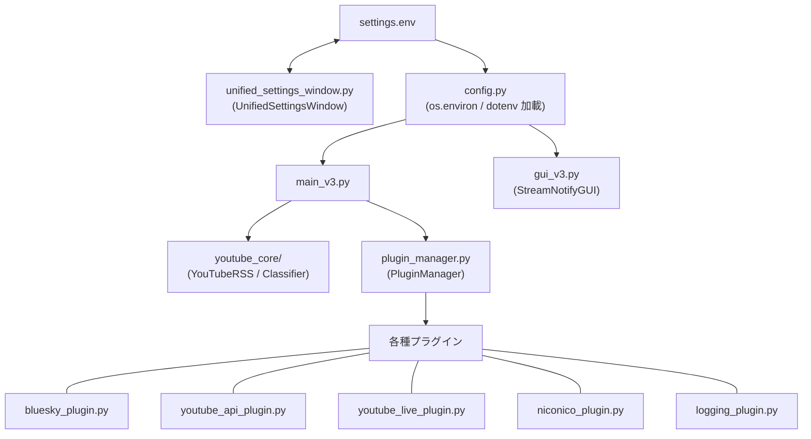
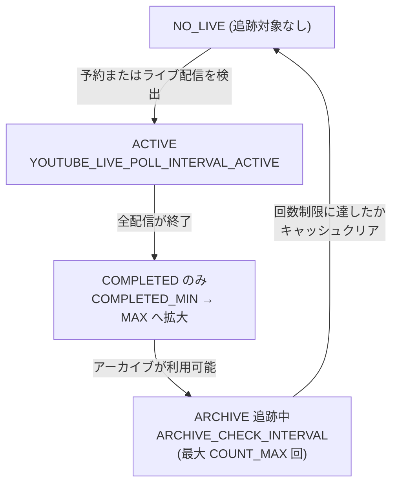
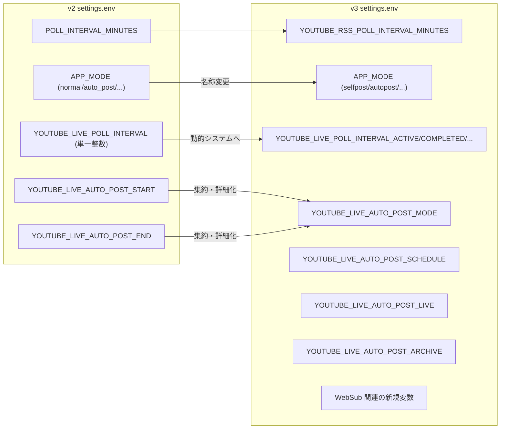

# 構成リファレンス (Configuration Reference)

関連ソースファイル
- [v2/docs/References/SETTINGS_OVERVIEW.md](https://github.com/mayu0326/test/blob/abdd8266/v2/docs/References/SETTINGS_OVERVIEW.md)
- [v2/settings.env.example](https://github.com/mayu0326/test/blob/abdd8266/v2/settings.env.example)
- [v3/docs/Guides/unified_settings_window_guide.md](https://github.com/mayu0326/test/blob/abdd8266/v3/docs/Guides/unified_settings_window_guide.md)
- [v3/docs/References/SETTINGS_OVERVIEW.md](https://github.com/mayu0326/test/blob/abdd8266/v3/docs/References/SETTINGS_OVERVIEW.md)
- [v3/docs/Technical/Archive/GUI_UNIFIED_SETTINGS.md](https://github.com/mayu0326/test/blob/abdd8266/v3/docs/Technical/Archive/GUI_UNIFIED_SETTINGS.md)
- [v3/settings.env.example](https://github.com/mayu0326/test/blob/abdd8266/v3/settings.env.example)
- [v3/unified_settings_window.py](https://github.com/mayu0326/test/blob/abdd8266/v3/unified_settings_window.py)

このページでは、v2 および v3 の `settings.env` 設定ファイルに含まれるすべての変数について説明します。各設定の型、デフォルト値、有効なオプション、および目的を機能カテゴリ別に整理して記載しています。

`settings.env` は唯一の設定ソースです。起動時に `config.py` によって読み込まれ、その値はアプリケーション全体のコアモジュールやプラグインで使用されます。アプリケーションがこれらの設定をランタイムでどのように使用するか（動作モード、投稿ロジックなど）については、[動作モード](./Operation-Modes.md) を参照してください。このファイルを読み書きする GUI ベースの設定エディタについては、[統合設定ウィンドウ](./Integrated-Settings-Window.md) を参照してください。

---

## ファイルの場所と形式

`settings.env` は、`main_v3.py` と同じアプリケーションのルートディレクトリに配置する必要があります。形式は単純な `KEY=VALUE` 形式です。`#` で始まる行はコメントとして無視されます。空行は保持されます。

```env
# これはコメントです
YOUTUBE_CHANNEL_ID=UCxxxxxxxxxxxxxxxxxx
APP_MODE=selfpost
```

利用可能なすべての変数のテンプレートが [v3/settings.env.example](https://github.com/mayu0326/test/blob/abdd8266/v3/settings.env.example) および [v2/settings.env.example](https://github.com/mayu0326/test/blob/abdd8266/v2/settings.env.example) に用意されています。例のファイルを `settings.env` にコピーし、必要な値を記入してください。**`settings.env` をパブリックリポジトリにコミットしないでください**（認証情報が含まれているため）。

> GUI 設定エディタ (`UnifiedSettingsWindow`) は、コメントや空行を保持したままこのファイルを読み書きし、保存前に自動的に `settings.env.backup` を作成します。

情報源: [v3/settings.env.example (L1-13)](https://github.com/mayu0326/test/blob/abdd8266/v3/settings.env.example#L1-L13), [v2/settings.env.example (L1-13)](https://github.com/mayu0326/test/blob/abdd8266/v2/settings.env.example#L1-L13), [v3/unified_settings_window.py (L79-114)](https://github.com/mayu0326/test/blob/abdd8266/v3/unified_settings_window.py#L79-L114)

---

## 設定値がアプリケーションに流れる仕組み

**図: settings.env から各モジュールへの流れ**



情報源: [v3/settings.env.example (L1-350)](https://github.com/mayu0326/test/blob/abdd8266/v3/settings.env.example#L1-L350), [v3/unified_settings_window.py (L60-114)](https://github.com/mayu0326/test/blob/abdd8266/v3/unified_settings_window.py#L60-L114)

---

## 変数リファレンス

### 1. コア / 基本設定 (Core / Basic Settings)

これらの変数は、どのプラグインが有効かに関わらず、必須または広く適用されるものです。

| 変数名 | 型 | デフォルト | 必須 | 説明 |
| :--- | :--- | :--- | :--- | :--- |
| `YOUTUBE_CHANNEL_ID` | 文字列 | — | ✅ | 監視する YouTube チャンネル ID（UC形式）。`YouTubeAPIPlugin` なしの場合、`UC-` プレフィックスの ID のみが動作します。 |
| `APP_MODE` | 列挙型 | `selfpost` | ✅ | アプリケーションの動作モード。詳細は下の表を参照。 |
| `DEBUG_MODE` | 真偽値 | `false` | — | `true` の場合、すべてのロガーが DEBUG レベルに切り替わります。 |
| `TIMEZONE` | 文字列 | `system` | — | 日付表示に使用するタイムゾーン。OS から継承する場合は `system`、または `Asia/Tokyo` や `UTC` などを指定。無効な値はシステム/UTC にフォールバックします。 |

**`APP_MODE` の値:**
| 値 (v3) | 値 (v2) | 投稿の有無 | 説明 |
| :--- | :--- | :--- | :--- |
| `selfpost` | `normal` | 手動のみ | GUI からの手動投稿選択。 |
| `autopost` | `auto_post` | 自動 | ロジックに基づいた自動投稿。 |
| `dry_run` | `dry_run` | なし | 投稿をシミュレートし、ログ出力のみを行います。 |
| `collect` | `collect` | なし | フィードの収集と DB 保存のみを行います。 |

情報源: [v3/settings.env.example (L18-37)](https://github.com/mayu0326/test/blob/abdd8266/v3/settings.env.example#L18-L37), [v2/settings.env.example (L18-36)](https://github.com/mayu0326/test/blob/abdd8266/v2/settings.env.example#L18-L36), [v3/docs/References/SETTINGS_OVERVIEW.md (L14-33)](https://github.com/mayu0326/test/blob/abdd8266/v3/docs/References/SETTINGS_OVERVIEW.md#L14-L33)

---

### 2. YouTube フィード取得 (YouTube Feed Acquisition)

アプリケーションがどのように新しい YouTube 動画を取得するかを制御します。

| 変数名 | 型 | デフォルト | v3専用 | 説明 |
| :--- | :--- | :--- | :--- | :--- |
| `YOUTUBE_FEED_MODE` | 列挙型 | `poll` | ✅ | `poll`: RSS ポーリング。`websub`: リレーサーバー経由の WebSub/HTTP プッシュ。 |
| `YOUTUBE_RSS_POLL_INTERVAL_MINUTES` | 整数 | `10` | ✅ | RSS ポーリングの間隔（分）。範囲: 10–60。`YOUTUBE_FEED_MODE=poll` 時に有効。 |
| `YOUTUBE_WEBSUB_POLL_INTERVAL_MINUTES` | 整数 | `5` | ✅ | WebSub ポーリングの間隔（分）。範囲: 3–30。`YOUTUBE_FEED_MODE=websub` 時に有効。 |
| `POLL_INTERVAL_MINUTES` | 整数 | `10` | v2のみ | v2 の RSS ポーリング間隔。範囲: 5–30。v3 では `YOUTUBE_RSS_POLL_INTERVAL_MINUTES` に置き換え。 |

情報源: [v3/settings.env.example (L39-58)](https://github.com/mayu0326/test/blob/abdd8266/v3/settings.env.example#L39-L58), [v2/settings.env.example (L23-24)](https://github.com/mayu0326/test/blob/abdd8266/v2/settings.env.example#L23-L24), [v3/docs/References/SETTINGS_OVERVIEW.md (L36-44)](https://github.com/mayu0326/test/blob/abdd8266/v3/docs/References/SETTINGS_OVERVIEW.md#L36-L44)

---

### 3. WebSub 設定 (WebSub Settings)

`YOUTUBE_FEED_MODE=websub` の場合のみ使用されます。WebSub はサポーター限定機能であり、リレーサーバーが必要です。

| 変数名 | 型 | デフォルト | 説明 |
| :--- | :--- | :--- | :--- |
| `WEBSUB_CLIENT_ID` | 文字列 | — | WebSub リクエストと共に送信されるクライアントインスタンスの識別子。 |
| `WEBSUB_CALLBACK_URL` | 文字列 | — | WebSub リレーサーバーのエンドポイント URL。例: `https://server.example.com` |
| `WEBSUB_CLIENT_API_KEY` | 文字列 | — | リレーサーバー用に発行された API キー。GUI ではマスクされて保存されます。 |
| `WEBSUB_LEASE_SECONDS` | 整数 | `432000` | 購読期間（秒）。範囲: 86400 (1日) – 2592000 (30日)。推奨: 432000 (5日)。 |

情報源: [v3/settings.env.example (L60-83)](https://github.com/mayu0326/test/blob/abdd8266/v3/settings.env.example#L60-L83), [v3/unified_settings_window.py (L458-610)](https://github.com/mayu0326/test/blob/abdd8266/v3/unified_settings_window.py#L458-L610), [v3/docs/References/SETTINGS_OVERVIEW.md (L46-63)](https://github.com/mayu0326/test/blob/abdd8266/v3/docs/References/SETTINGS_OVERVIEW.md#L46-L63)

---

### 4. Bluesky アカウント (Bluesky Account)

| 変数名 | 型 | デフォルト | 必須 | 説明 |
| :--- | :--- | :--- | :--- | :--- |
| `BLUESKY_USERNAME` | 文字列 | — | ✅ | Bluesky のハンドル名。例: `yourhandle.bsky.social` またはカスタムドメイン。 |
| `BLUESKY_PASSWORD` | 文字列 | — | ✅ | Bluesky の「アプリパスワード」（ログイン用ではない）。設定で生成してください。 |
| `BLUESKY_POST_ENABLED` | 真偽値 | `True` | — | Bluesky 投稿のマスターパスワード。`False` の場合、`APP_MODE` に関わらず投稿されません。 |

情報源: [v3/settings.env.example (L85-96)](https://github.com/mayu0326/test/blob/abdd8266/v3/settings.env.example#L85-L96), [v2/settings.env.example (L38-45)](https://github.com/mayu0326/test/blob/abdd8266/v2/settings.env.example#L38-L45), [v3/unified_settings_window.py (L612-653)](https://github.com/mayu0326/test/blob/abdd8266/v3/unified_settings_window.py#L612-L653)

---

### 5. 投稿動作 (Posting Behavior)

| 変数名 | 型 | デフォルト | 説明 |
| :--- | :--- | :--- | :--- |
| `PREVENT_DUPLICATE_POSTS` | 真偽値 | `false` | すでに投稿済みの動画の再投稿を阻止します。DB の `posted_to_bluesky` フィールドで判定します。 |
| `YOUTUBE_DEDUP_ENABLED` | 真偽値 | `true` | `true` の場合、優先度ベースの重複排除を適用します。同じ動画 ID のライブ/アーカイブが存在する場合、通常の動画エントリをスキップします。 |

情報源: [v3/settings.env.example (L98-111)](https://github.com/mayu0326/test/blob/abdd8266/v3/settings.env.example#L98-L111), [v3/unified_settings_window.py (L681-727)](https://github.com/mayu0326/test/blob/abdd8266/v3/unified_settings_window.py#L681-L727)

---

### 6. 自動投稿モード設定 (Autopost Mode Settings)

これらの変数は `APP_MODE=autopost` の場合のみ有効です。

| 変数名 | 型 | デフォルト | 範囲 | 説明 |
| :--- | :--- | :--- | :--- | :--- |
| `AUTOPOST_INTERVAL_MINUTES` | 整数 | `5` | 1–60 | 自動投稿の最小間隔。連投によるスパム化を防ぎます。 |
| `AUTOPOST_LOOKBACK_MINUTES` | 整数 | `30` | 5–1440 | 起動時に、ダウンタイム中に見逃した動画をキャッチするために遡る時間（分）。 |
| `AUTOPOST_UNPOSTED_THRESHOLD` | 整数 | `20` | 1–1000 | 安全ブレーキ: 遡及期間内の未投稿数がこれを超えると、`autopost` を開始しません。 |
| `AUTOPOST_INCLUDE_NORMAL` | 真偽値 | `true` | — | 通常の動画アップロードを自動投稿キューに含める。 |
| `AUTOPOST_INCLUDE_PREMIERE` | 真偽値 | `true` | — | YouTube プレミア公開を自動投稿キューに含める。 |
| `YOUTUBE_LIVE_POST_DELAY` | 列挙型 | `immediate` | * | ライブ配信が検出されてから投稿するまでの遅延。`immediate`, `delay_5min`, `delay_30min` から選択。 |

情報源: [v3/settings.env.example (L113-139)](https://github.com/mayu0326/test/blob/abdd8266/v3/settings.env.example#L113-L139), [v3/unified_settings_window.py (L753-870)](https://github.com/mayu0326/test/blob/abdd8266/v3/unified_settings_window.py#L753-L870), [v3/docs/References/SETTINGS_OVERVIEW.md (L73-80)](https://github.com/mayu0326/test/blob/abdd8266/v3/docs/References/SETTINGS_OVERVIEW.md#L73-L80)

---

### 7. YouTube ライブ配信の検出と投稿 (YouTube Live Detection and Posting)

`YouTubeLivePlugin` の動作を制御します。`autopost` 用のモード選択と、`selfpost` 用の細かなフラグに分かれています。

#### 7a. 自動投稿モード選択 (`APP_MODE=autopost` 用)
| 変数名 | 型 | デフォルト | 有効な値 | 説明 |
| :--- | :--- | :--- | :--- | :--- |
| `YOUTUBE_LIVE_AUTO_POST_MODE` | 列挙型 | `off` | * | `autopost` モードでどのライブイベントを自動投稿するか。`all`, `schedule`, `live`, `archive`, `off` から選択。 |

| 値 | 予約を投稿 | 配信開始/終了を投稿 | アーカイブを投稿 |
| :--- | :--- | :--- | :--- |
| `all` | ✅ | ✅ | ✅ |
| `schedule` | ✅ | ❌ | ❌ |
| `live` | ✅ | ✅ | ❌ |
| `archive` | ❌ | ❌ | ✅ |
| `off` | ❌ | ❌ | ❌ |

#### 7b. 詳細フラグ (`APP_MODE=selfpost` 用)

これらのフラグを使用すると、`selfpost` モードであっても特定のライブイベントを自動投稿できます。「ライブ配信のみ自動、通常の動画は手動」といった運用が可能です。

| 変数名 | 型 | デフォルト | 説明 |
| :--- | :--- | :--- | :--- |
| `YOUTUBE_LIVE_AUTO_POST_SCHEDULE` | 真偽値 | `true` | ライブ配信の予約（upcoming）が検出された際に自動投稿。 |
| `YOUTUBE_LIVE_AUTO_POST_LIVE` | 真偽値 | `true` | 配信開始および終了時に自動投稿。 |
| `YOUTUBE_LIVE_AUTO_POST_ARCHIVE` | 真偽値 | `true` | アーカイブが利用可能になった際に自動投稿。 |

> **v2 同等機能**: `YOUTUBE_LIVE_AUTO_POST_START` と `YOUTUBE_LIVE_AUTO_POST_END`。v2 では単純なフラグでしたが、v3 では `autopost` 用の `YOUTUBE_LIVE_AUTO_POST_MODE` に置き換えられました。

#### 7c. ライブ配信ポーリング間隔設定 (v3 動的制御)

`YouTubeLivePoller` はキャッシュの状態に基づいてポーリング頻度を調整します。

| 変数名 | 型 | デフォルト | 範囲 | 説明 |
| :--- | :--- | :--- | :--- | :--- |
| `YOUTUBE_LIVE_POLL_INTERVAL_ACTIVE` | 整数 | `15` | 5–60 | `schedule` または `live` 状態の動画がある時の間隔（分）。 |
| `YOUTUBE_LIVE_POLL_INTERVAL_COMPLETED_MIN` | 整数 | `60` | 30–180 | `completed`（終了済み）のみが存在する時の最小間隔。 |
| `YOUTUBE_LIVE_POLL_INTERVAL_COMPLETED_MAX` | 整数 | `180` | 30–240 | アーカイブ化を待つ間の最大間隔。`MIN` より大きい値である必要があります。 |
| `YOUTUBE_LIVE_ARCHIVE_CHECK_COUNT_MAX` | 整数 | `4` | 1–10 | `archive` への移行確認を行う最大回数。 |
| `YOUTUBE_LIVE_ARCHIVE_CHECK_INTERVAL` | 整数 | `180` | 30–480 | アーカイブ確認の追跡間隔（分）。 |

> v2 では単一の `YOUTUBE_LIVE_POLL_INTERVAL`（15–60分）でした。この動的な多相システムは v3 専用です。

**図: 動的なポーリングフェーズの遷移**



情報源: [v3/settings.env.example (L200-260)](https://github.com/mayu0326/test/blob/abdd8266/v3/settings.env.example#L200-L260), [v3/docs/References/SETTINGS_OVERVIEW.md (L119-134)](https://github.com/mayu0326/test/blob/abdd8266/v3/docs/References/SETTINGS_OVERVIEW.md#L119-L134), [v2/settings.env.example (L88-107)](https://github.com/mayu0326/test/blob/abdd8266/v2/settings.env.example#L88-L107), [v3/unified_settings_window.py (L947-1049)](https://github.com/mayu0326/test/blob/abdd8266/v3/unified_settings_window.py#L947-L1049)

---

### 8. YouTube API プラグイン (YouTube API Plugin)

| 変数名 | 型 | デフォルト | 必須 | 説明 |
| :--- | :--- | :--- | :--- | :--- |
| `YOUTUBE_API_KEY` | 文字列 | — | 任意 | YouTube Data API v3 キー。`UC-` 形式以外の ID の解決やメタデータ取得、ライブ検出に必要です。 |

情報源: [v3/settings.env.example (L195-199)](https://github.com/mayu0326/test/blob/abdd8266/v3/settings.env.example#L195-L199), [v2/settings.env.example (L83-85)](https://github.com/mayu0326/test/blob/abdd8266/v2/settings.env.example#L83-L85)

---

### 9. ニコニコプラグイン (Niconico Plugin)

| 変数名 | 型 | デフォルト | 説明 |
| :--- | :--- | :--- | :--- |
| `NICONICO_USER_ID` | 整数 | — | 監視するニコニコユーザー ID（数字のみ）。 |
| `NICONICO_USER_NAME` | 文字列 | — | テンプレートで使用される表示名（任意）。空白時は RSS のタグから自動取得を試みます。 |
| `NICONICO_POLL_INTERVAL` | 整数 | `10` | ニコニコ RSS のポーリング間隔（分）。最小 5 分。 |

情報源: [v3/settings.env.example (L263-277)](https://github.com/mayu0326/test/blob/abdd8266/v3/settings.env.example#L263-L277), [v2/settings.env.example (L112-122)](https://github.com/mayu0326/test/blob/abdd8266/v2/settings.env.example#L112-L122)

---

### 10. テンプレートパス (Template Paths)

テンプレートは Jinja2 形式のテキストファイルです。これらでデフォルトのパスを上書きできます。指定がない場合は、各イベントごとのデフォルトパスが使用されます。

| 変数名 | デフォルトパス | イベント |
| :--- | :--- | :--- |
| `TEMPLATE_YOUTUBE_NEW_VIDEO_PATH` | `templates/youtube/yt_new_video_template.txt` | 新着 YouTube 動画 (RSS) |
| `TEMPLATE_YOUTUBE_SCHEDULE_PATH` | `templates/youtube/yt_schedule_template.txt` | ライブ配信の予約 |
| `TEMPLATE_YOUTUBE_ONLINE_PATH` | `templates/youtube/yt_online_template.txt` | 配信開始 |
| `TEMPLATE_YOUTUBE_OFFLINE_PATH` | `templates/youtube/yt_offline_template.txt` | 配信終了 |
| `TEMPLATE_YOUTUBE_ARCHIVE_PATH` | `templates/youtube/yt_archive_template.txt` | アーカイブ公開 |
| `TEMPLATE_NICO_NEW_VIDEO_PATH` | `templates/niconico/nico_new_video_template.txt` | 新着ニコニコ動画 |

> v2 には `SCHEDULE` および `ARCHIVE` のテンプレート指定はありませんでした。

| 変数名 | デフォルト | 説明 |
| :--- | :--- | :--- |
| `BLUESKY_IMAGE_PATH` | `images/default/noimage.png` | サムネイルがない、またはDL失敗時のフォールバック画像。 |

情報源: [v3/settings.env.example (L147-192)](https://github.com/mayu0326/test/blob/abdd8266/v3/settings.env.example#L147-L192), [v2/settings.env.example (L56-77)](https://github.com/mayu0326/test/blob/abdd8266/v2/settings.env.example#L56-L77), [v3/docs/References/SETTINGS_OVERVIEW.md (L83-98)](https://github.com/mayu0326/test/blob/abdd8266/v3/docs/References/SETTINGS_OVERVIEW.md#L83-L98)

---

## v2 → v3 移行サマリー

**図: v2 から v3 への変数の名称変更と追加**



情報源: [v2/settings.env.example (L1-198)](https://github.com/mayu0326/test/blob/abdd8266/v2/settings.env.example#L1-L198), [v3/settings.env.example (L1-350)](https://github.com/mayu0326/test/blob/abdd8266/v3/settings.env.example#L1-L350)