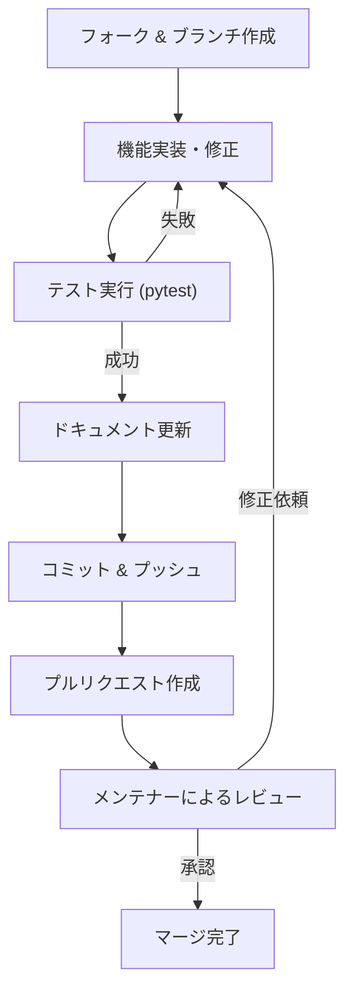

# 貢献とロードマップ (Contributing & Roadmap)

関連ソースファイル
- [v1/docs/SETUP_GUIDE_v1.md](https://github.com/mayu0326/test/blob/abdd8266/v1/docs/SETUP_GUIDE_v1.md)
- [v2/CONTRIBUTING.md](https://github.com/mayu0326/test/blob/abdd8266/v2/CONTRIBUTING.md)
- [v2/docs/References/FUTURE_ROADMAP_v2.md](https://github.com/mayu0326/test/blob/abdd8266/v2/docs/References/FUTURE_ROADMAP_v2.md)
- [v3/docs/CONTRIBUTING.md](https://github.com/mayu0326/test/blob/abdd8266/v3/docs/CONTRIBUTING.md)
- [v3/docs/References/FUTURE_ROADMAP_v3.md](https://github.com/mayu0326/test/blob/abdd8266/v3/docs/References/FUTURE_ROADMAP_v3.md)
- [v3/readme_v3.md](https://github.com/mayu0326/test/blob/abdd8266/v3/readme_v3.md)
- [wiki/Getting-Started-Setup.md](https://github.com/mayu0326/test/blob/abdd8266/wiki/Getting-Started-Setup.md)

このページでは、StreamNotify へのコード貢献方法やバグレポートの提出、および将来の開発計画（ロードマップ）について説明します。

---

## 開発環境のセットアップ

### システム要件
| 要件 | 最小構成 | 推奨 |
| :--- | :--- | :--- |
| OS | Windows 10 / Debian/Ubuntu Linux | 同左 |
| Python | 3.10 | 3.13+ |
| Git | 任意 | 最新の安定版 |

### セットアップ手順
1. リポジトリをクローンし、`v3` ディレクトリへ移動します。
2. 仮想環境 (`venv`) を作成・有効化します。
3. `pip install -r requirements.txt` で依存パッケージをインストールします。
4. `pip install pytest autopep8 black flake8 pre-commit` で開発用ツールをインストールします。
5. `settings.env` を作成し、チャンネル ID や Bluesky の認証情報を設定します。

正しく設定できたかは `python main_v3.py --version` で確認できます。

---

## コーディング規約

すべての Python ソースコードは以下の標準に従う必要があります。

- **スタイル規約**: PEP 8 に準拠。インデントは 4 スペース。1 行の最大長は 100 文字。
- **命名規則**:
  - 変数・関数: `snake_case`
  - 定数: `UPPER_SNAKE_CASE`
  - クラス: `PascalCase`
  - 非公開メンバ: `_` プレフィックス
- **ドキュメンテーション**: すべての公開関数・クラスに docstring を記述してください。英語のほか、日本語の併記も可能です。

---

## プリコミット・フック (Pre-commit Hooks)

コミットを行う前に、以下のコマンドでフックを有効化してください。
```bash
pip install pre-commit
pre-commit install
```
コミット時に `flake8` による構文チェック、`autopep8` による自動整形、`ggshield` による機密情報の混入チェックが自動実行されます。

---

## テスト手順

テストは `tests/` ディレクトリにあります。
```bash
# 全テスト実行
python -m pytest tests/

# カバレッジレポート付き
python -m pytest --cov=. tests/
```
新しい機能を追加する場合は、必ず対応するテストコードを記述してください。

---

## プルリクエスト (PR) 手順



### ブランチ・コミット命名
- ブランチ名: `feature/` (機能追加), `fix/` (修正), `docs/` (ドキュメント)
- コマンドメッセージ: `feat:`, `fix:`, `docs:` などの Conventional Commits 形式を推奨します。

---

## プラグイン開発

新しいプラグインは `plugin_interface.py` の `NotificationPlugin` を継承して作成します。詳細は [プラグインシステム](./Plugin-System.md) を参照してください。

---

## ロードマップ (Roadmap)

### 実装済み (v3.3.0まで)
- YouTube Live 4層追跡
- WebSub (リアルタイム通知)
- 4条件複合フィルタリング
- ZIP バックアップ/復元
- YouTube API バッチ最適化

### フェーズ 4 — 計画中 (v4.0.x+)
- **Twitch API プラグイン**: 配信開始/終了の監視。
- **トンネル統合プラグイン**: Cloudflare Tunnel 等との連携。
- **Discord 通知プラグイン**: Webhook によるリッチな通知。

### フェーズ 5 — 計画中 (v4.1.x+)
- **Web UI**: ブラウザから設定・投稿管理。
- **Windows クライアント**: デスクトップアプリ化。
- **ホットリロード**: 再起動なしのプラグイン有効化。

### フェーズ 6 — 計画中
- **分散型 SNS 対応**: Mastodon / Misskey (ActivityPub) への同時投稿。

---

## 設計上の制約
StreamNotify は「**ローカル環境で完結して動作すること**」を重視しています。そのため、常時稼働サーバーが必須となる機能（Twitch の EventSub など）より、ポーリング方式などを優先して採用しています。

---

## ライセンス
StreamNotify は **GPL License v2** の下で公開されています。貢献されたコードも同ライセンスに従います。