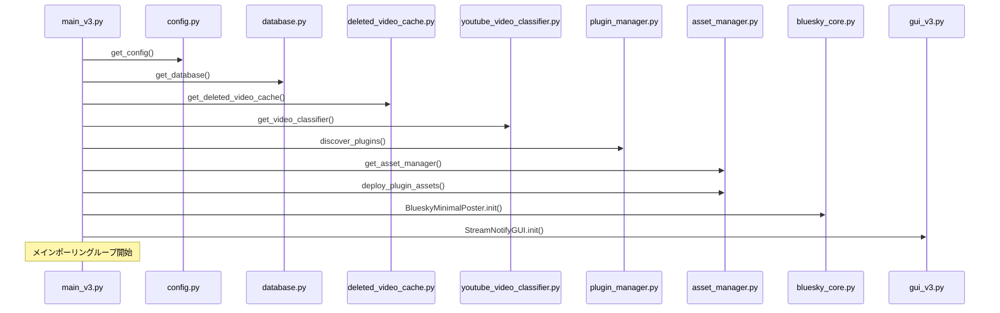
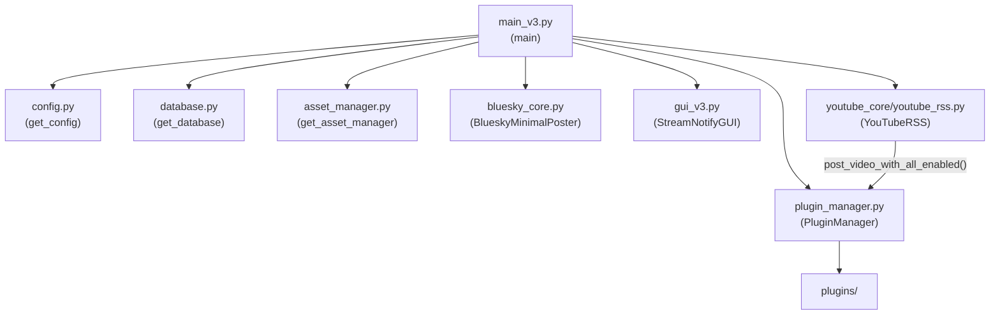
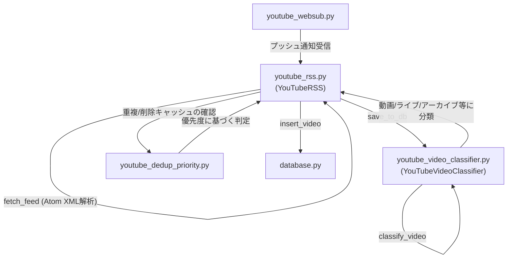
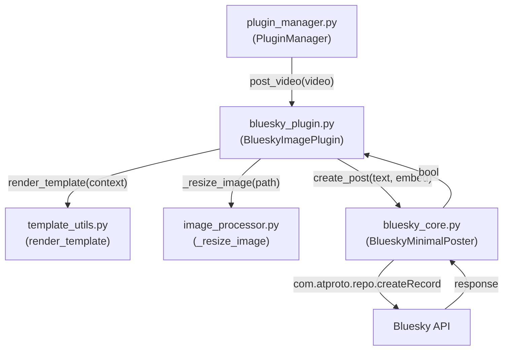
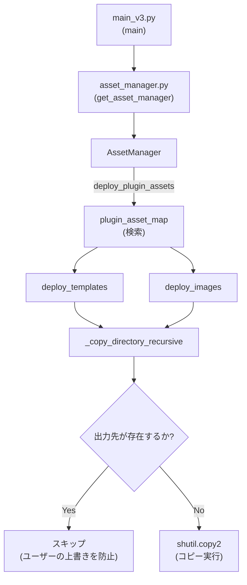

# コアモジュール (Core Modules)

関連ソースファイル
- [v2/asset_manager.py](https://github.com/mayu0326/test/blob/abdd8266/v2/asset_manager.py)
- [v2/docs/Technical/ARCHITECTURE_AND_DESIGN.md](https://github.com/mayu0326/test/blob/abdd8266/v2/docs/Technical/ARCHITECTURE_AND_DESIGN.md)
- [v2/docs/Technical/ASSET_MANAGER_INTEGRATION_v2.md](https://github.com/mayu0326/test/blob/abdd8266/v2/docs/Technical/ASSET_MANAGER_INTEGRATION_v2.md)
- [v3/asset_manager.py](https://github.com/mayu0326/test/blob/abdd8266/v3/asset_manager.py)
- [v3/docs/Guides/ASSET_MANAGER_GUIDE.md](https://github.com/mayu0326/test/blob/abdd8266/v3/docs/Guides/ASSET_MANAGER_GUIDE.md)
- [v3/docs/References/ModuleList_v3.md](https://github.com/mayu0326/test/blob/abdd8266/v3/docs/References/ModuleList_v3.md)
- [v3/docs/Technical/Archive/ARCHITECTURE_AND_DESIGN.md](https://github.com/mayu0326/test/blob/abdd8266/v3/docs/Technical/Archive/ARCHITECTURE_AND_DESIGN.md)
- [v3/docs/Technical/Archive/ASSET_MANAGER_INTEGRATION_v3.md](https://github.com/mayu0326/test/blob/abdd8266/v3/docs/Technical/Archive/ASSET_MANAGER_INTEGRATION_v3.md)

このページでは、StreamNotify v3 の「コア層 (Core layer)」に属する各モジュールの役割について説明します。これらは、使用するプラグインに関わらず、無条件で実行されるモジュールです。これらのモジュールの上の「拡張層 (Extension layer)」については、[開発者向け: プラグインシステム](./Plugin-System.md) を参照してください。データベーススキーマの詳細については、[データベースと削除済み動画キャッシュ](./Database-and-Deleted-Video-Cache.md) を参照してください。

---

## 概要 (Overview)

StreamNotify のアーキテクチャは、**コア (Core)** と **拡張 (Extensions/プラグイン)** の 2 つのティアに分かれています。コア層は、起動、設定、RSS 取得、データベースの永続化、Bluesky との HTTP 通信、およびアセットのデプロイを処理します。すべてのプラグインの活動は、`main_v3.py` によって初期化される `plugin_manager.py` を介して媒介されます。

**起動シーケンス図:**

情報源: [v3/docs/Technical/Archive/ARCHITECTURE_AND_DESIGN.md (L77-115)](https://github.com/mayu0326/test/blob/abdd8266/v3/docs/Technical/Archive/ARCHITECTURE_AND_DESIGN.md#L77-L115), [v3/docs/References/ModuleList_v3.md (L1-55)](https://github.com/mayu0326/test/blob/abdd8266/v3/docs/References/ModuleList_v3.md#L1-L55)

---

## `main_v3.py` — 全体のオーケストレータ

`main_v3.py` はアプリケーションの入力ポイントであり、中心的なコーディネータです。その `main()` 関数は、定められた順序で初期化を実行し、ポーリングループに入ります。

**役割:**

- `config.py` による設定の読み込み
- `database.py` による SQLite データベースの初期化
- 削除済み動画キャッシュの初期化
- `PluginManager`, `AssetManager`, `BlueskyMinimalPoster` のインスタンス化と連携
- 別スレッドでの GUI 起動
- メインポーリングループの実行: RSS 取得 → DB 保存 → `APP_MODE` に基づく投稿実行

**`APP_MODE` ごとのポーリングループの動作:**
| モード | 動作 |
| :--- | :--- |
| `collect` | RSS 取得と DB 保存のみ。投稿は行いません。 |
| `dry_run` | `PluginManager` を介して投稿をシミュレート（DB 更新なし）。 |
| `autopost` | 遡及期間内の未投稿動画を自動的に投稿します。 |
| `selfpost` | GUI でユーザーが選択した動画 (`selected_for_post=1`) を投稿します。 |

4 つのモードの詳細については、[動作モード](./Operation-Modes.md) を参照してください。

**主要なインタラクション:**

情報源: [v3/docs/Technical/Archive/ARCHITECTURE_AND_DESIGN.md (L392-499)](https://github.com/mayu0326/test/blob/abdd8266/v3/docs/Technical/Archive/ARCHITECTURE_AND_DESIGN.md#L392-L499), [v3/docs/References/ModuleList_v3.md (L12-14)](https://github.com/mayu0326/test/blob/abdd8266/v3/docs/References/ModuleList_v3.md#L12-L14)

---

## `config.py` — 設定の読み込み

`config.py` は `settings.env` （`python-dotenv` 経由）を読み取り、アプリケーション内の他のモジュールに対して型定義された設定値を公開します。`main_v3.py` から `get_config()` を介してアクセスされます。

**役割:**

- `settings.env` からすべての環境変数を解析
- 必須フィールド（チャンネル ID, Bluesky 認証情報, `APP_MODE`）のバリデーション
- `main_v3.py` やプラグインが使用する設定オブジェクトの属性として設定値を公開

`main_v3.py` は、設定オブジェクトを各コンポーネント（`BlueskyMinimalPoster`, `PluginManager` など）のコンストラクタに渡します。設定値はランタイム中に再読み込みされず、起動時に一度だけ読み込まれます。

サポートされているすべての変数のリファレンスについては、[構成リファレンス](./Configuration-Reference.md) を参照してください。

情報源: [v3/docs/Technical/Archive/ARCHITECTURE_AND_DESIGN.md (L40-48)](https://github.com/mayu0326/test/blob/abdd8266/v3/docs/Technical/Archive/ARCHITECTURE_AND_DESIGN.md#L40-L48), [v3/docs/References/ModuleList_v3.md (L14)](https://github.com/mayu0326/test/blob/abdd8266/v3/docs/References/ModuleList_v3.md#L14-L14)

---

## `database.py` — SQLite 操作

`database.py` は、`data/video_list.db` に保存されている SQLite データベースを管理します。`get_database()` を介してシングルトンとしてアクセスされます。

**役割:**

- 初回起動時の `videos` テーブルの作成とマイグレーション
- `insert_video()`: `video_id` による重複排除を伴う新規動画レコードの挿入
- `SELECT` クエリ: 未投稿動画の取得、ソース/コンテンツタイプ/ステータスによるフィルタリング
- `UPDATE`: `posted_to_bluesky`, `posted_at`, `selected_for_post`, `scheduled_at`, `image_filename` などの設定
- 書き込み時の値の正規化 (`source` → 小文字、`content_type` と `live_status` → 許可された列挙値)

**値の正規化ルール:**
| カラム名 | 許可される値 |
| :--- | :--- |
| `source` | `"youtube"`, `"niconico"` |
| `content_type` | `"video"`, `"live"`, `"archive"`, `"schedule"`, `"completed"`, `"none"` |
| `live_status` | `null`, `"none"`, `"upcoming"`, `"live"`, `"completed"` |

`database.py` は、`main_v3.py`, `youtube_core/youtube_rss.py`, `plugins/bluesky_plugin.py` からインポートされます。GUI (`gui_v3.py`) も、動画レコードの読み取りと表示のためにデータベースインスタンスへの参照を保持しています。

テーブルスキーマ全体と削除済み動画キャッシュシステムについては、[データベースと削除済み動画キャッシュ](./Database-and-Deleted-Video-Cache.md) を参照してください。

情報源: [v3/docs/Technical/Archive/ARCHITECTURE_AND_DESIGN.md (269-303)](https://github.com/mayu0326/test/blob/abdd8266/v3/docs/Technical/Archive/ARCHITECTURE_AND_DESIGN.md#L269-L303), [v3/docs/References/ModuleList_v3.md (L15)](https://github.com/mayu0326/test/blob/abdd8266/v3/docs/References/ModuleList_v3.md#L15-L15)

---

## `youtube_core/` — フィード取得と分類

`youtube_core/` パッケージには、YouTube コンテンツを取得し、各動画をどのように分類して保存するかを決定する役割を持つモジュールが含まれています。

情報源: [v3/docs/References/ModuleList_v3.md (L105-114)](https://github.com/mayu0326/test/blob/abdd8266/v3/docs/References/ModuleList_v3.md#L105-L114), [v3/docs/Technical/Archive/ARCHITECTURE_AND_DESIGN.md (L85-115)](https://github.com/mayu0326/test/blob/abdd8266/v3/docs/Technical/Archive/ARCHITECTURE_AND_DESIGN.md#L85-L115)

### `youtube_rss.py` (`YouTubeRSS`)

- `fetch_feed()`: 設定されたチャンネルの YouTube Atom RSS フィードを取得します。XML エントリを解析し、公開タイムスタンプを UTC から JST に変換し、`video_id`, `title`, `video_url`, `channel_name` を抽出します。
- `save_to_db()`: 取得された各エントリについて、削除済み動画キャッシュと既存の DB レコードを確認します。削除されていない新規動画は `YouTubeVideoClassifier` に渡されます。結果に応じて、動画は `LiveModule.register_from_classified()` または `database.insert_video()` に振り分けられます。
- WebSub プッシュモード: 設定されている場合、`youtube_websub.py` が PubSubHubbub からプッシュ通知を受け取り、同じ `fetch_feed()` / `save_to_db()` パイプラインに供給します。

RSS と WebSub のフィード処理に関する詳細は、[RSS・WebSub フィード処理](./RSS-and-WebSub-Feed-Processing.md) を参照してください。

### `youtube_video_classifier.py` (`YouTubeVideoClassifier`)

- `classify_video()`: 動画のメタデータ（利用可能な場合は YouTube Data API を使用）を調査し、`content_type` （例: `"video"`, `"live"`, `"archive"`, `"schedule"`, `"premiere"`）と `live_status` を決定します。
- `get_video_classifier()` を介してシングルトンとしてアクセスされ、設定からオプションの `api_key` を受け取ります。

4 層のライブ検出アーキテクチャについては、[YouTube ライブ配信の検出](./YouTube-Live-Detection.md) を参照してください。

---

## `bluesky_core.py` — Bluesky HTTP API

`bluesky_core.py` には `BlueskyMinimalPoster` が含まれており、これは Bluesky AT Protocol API との認証済み通信を担当する低レイヤーのクラスです。

**役割:**

- 認証済みセッションの作成と再利用 (`com.atproto.server.createSession`)
- 投稿レコード構造の構築 (`text`, `createdAt`, `facets`, `embed`)
- 投稿を公開するための `com.atproto.repo.createRecord` の実行
- `bluesky_post_enabled` が false の場合にドライランモードで動作（ネットワーク呼び出しなしでアクションをログ出力）

`BlueskyMinimalPoster` は `main_v3.py` でインスタンス化され、`BlueskyImagePlugin` （`plugins/bluesky_plugin.py` 内）に渡されます。プラグイン層は、`bluesky_core` を呼び出す前に、テンプレートのレンダリング、画像のリサイズ、およびリッチテキストの facet（リンクやメンションなどのメタデータ）構築を処理します。

投稿パイプライン（認証、テンプレート、facets、画像処理）の詳細については、[Bluesky 連携](./Bluesky-Integration.md) を参照してください。

情報源: [v3/docs/Technical/Archive/ARCHITECTURE_AND_DESIGN.md (L42-48)](https://github.com/mayu0326/test/blob/abdd8266/v3/docs/Technical/Archive/ARCHITECTURE_AND_DESIGN.md#L42-L48), [v3/docs/References/ModuleList_v3.md (L18)](https://github.com/mayu0326/test/blob/abdd8266/v3/docs/References/ModuleList_v3.md#L18-L18)

---

## `asset_manager.py` — テンプレートと画像の展開

`AssetManager` （`asset_manager.py` 内）は起動時に実行され、テンプレートおよび画像ファイルを `Asset/` ソースディレクトリから実行用ディレクトリ（`templates/` および `images/`）にコピーします。非侵入的なコピー戦略を採用しており、既存のファイルが上書きされることはありません。

**役割:**

- `deploy_templates(services)`: テンプレートを `Asset/templates/<service>/` から `templates/<service>/` にコピー
- `deploy_images(services)`: 画像を `Asset/images/<service>/` から `images/<service>/` にコピー
- `deploy_plugin_assets(plugin_name)`: 内部の `plugin_asset_map` で `plugin_name` を検索し、適切な `deploy_templates` と `deploy_images` を呼び出し
- `deploy_all()`: すべてのサービスを無条件でコピー

**`plugin_asset_map` のエントリ:**
| プラグイン名 | 展開されるテンプレート | 展開される画像 |
| :--- | :--- | :--- |
| `bluesky_plugin` | `default/` → `templates/` | `default/` |
| `youtube_api_plugin` | `youtube/` | `youtube/` |
| `niconico_plugin` | `niconico/` | `niconico/` |

`get_asset_manager()` ファクトリ関数は `AssetManager` インスタンスを返します。これは、プラグインがロードされて有効化された直後に `main_v3.py` から呼び出され、有効なプラグインごとに `deploy_plugin_assets()` が実行されます。

**展開の流れ:**

**コピーポリシー:**

- 出力先のファイルがすでに存在する場合、`_copy_file()` は `0` を返し、コピーをスキップします。ユーザーが編集したテンプレートが置き換えられることはありません。
- テンプレートをデフォルトにリセットするには、`templates/` 内のファイルを削除してアプリケーションを再起動してください。
- すべての操作は `logs/app.log` に `DEBUG` または `INFO` レベルで記録されます。

`Asset/` ディレクトリ構造を含むアセット管理の詳細については、[アセット管理](./Asset-Management.md) を参照してください。

情報源: [v3/asset_manager.py (L22-258)](https://github.com/mayu0326/test/blob/abdd8266/v3/asset_manager.py#L22-L258), [v3/docs/Technical/Archive/ASSET_MANAGER_INTEGRATION_v3.md (L1-120)](https://github.com/mayu0326/test/blob/abdd8266/v3/docs/Technical/Archive/ASSET_MANAGER_INTEGRATION_v3.md#L1-L120), [v3/docs/References/ModuleList_v3.md (L53)](https://github.com/mayu0326/test/blob/abdd8266/v3/docs/References/ModuleList_v3.md#L53-L53)

---

## モジュールサマリー表 (Module Summary Table)

| ファイル名 | 主要なクラス / 関数 | 役割 |
| :--- | :--- | :--- |
| `main_v3.py` | `main()` | 入力ポイント。起動プロセスとポーリングループを統括。 |
| `config.py` | `get_config()` | `settings.env` の読み込みとバリデーション。 |
| `database.py` | `get_database()` | `data/video_list.db` への SQLite CRUD 操作。 |
| `youtube_core/youtube_rss.py` | `YouTubeRSS` | RSS/WebSub フィードの取得と DB への挿入。 |
| `youtube_core/youtube_video_classifier.py` | `YouTubeVideoClassifier` | コンテンツタイプとライブステータスの分類。 |
| `youtube_core/youtube_websub.py` | ウェブサブハンドラ | PubSubHubbub プッシュ通知の受信。 |
| `bluesky_core.py` | `BlueskyMinimalPoster` | AT Protocol セッション管理と投稿の送信。 |
| `asset_manager.py` | `AssetManager` | 起動時のテンプレートおよび画像の非侵入的展開。 |

情報源: [v3/docs/References/ModuleList_v3.md (L8-55)](https://github.com/mayu0326/test/blob/abdd8266/v3/docs/References/ModuleList_v3.md#L8-L55), [v3/docs/Technical/Archive/ARCHITECTURE_AND_DESIGN.md (L306-339)](https://github.com/mayu0326/test/blob/abdd8266/v3/docs/Technical/Archive/ARCHITECTURE_AND_DESIGN.md#L306-L339)