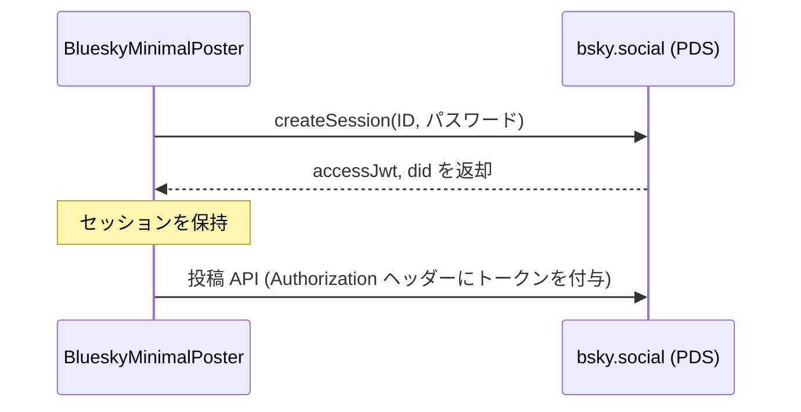
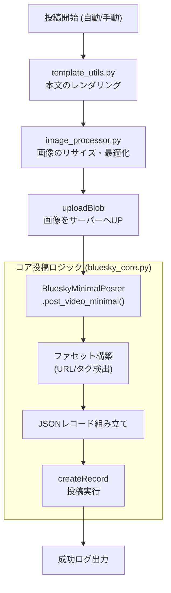

# 投稿の核と認証 (Core Posting & Authentication)

関連ソースファイル
- [v1/docs/SETUP_GUIDE_v1.md](https://github.com/mayu0326/test/blob/abdd8266/v1/docs/SETUP_GUIDE_v1.md)
- [v2/CONTRIBUTING.md](https://github.com/mayu0326/test/blob/abdd8266/v2/CONTRIBUTING.md)
- [v2/docs/ARCHIVE/SESSION_REPORTS.md](https://github.com/mayu0326/test/blob/abdd8266/v2/docs/ARCHIVE/SESSION_REPORTS.md)
- [v2/docs/Technical/RICHTEXT_FACET_SPECIFICATION.md](https://github.com/mayu0326/test/blob/abdd8266/v2/docs/Technical/RICHTEXT_FACET_SPECIFICATION.md)
- [v3/docs/CONTRIBUTING.md](https://github.com/mayu0326/test/blob/abdd8266/v3/docs/CONTRIBUTING.md)
- [v3/docs/Technical/Archive/RICHTEXT_FACET_SPECIFICATION.md](https://github.com/mayu0326/test/blob/abdd8266/v3/docs/Technical/Archive/RICHTEXT_FACET_SPECIFICATION.md)
- [v3/readme_v3.md](https://github.com/mayu0326/test/blob/abdd8266/v3/readme_v3.md)
- [wiki/Getting-Started-Setup.md](https://github.com/mayu0326/test/blob/abdd8266/wiki/Getting-Started-Setup.md)

このページでは、Bluesky HTTP API レイヤー (`v3/bluesky_core.py`) および `BlueskyImagePlugin` (`v3/plugins/bluesky_plugin.py`) について説明します。セッションの確立、投稿レコードの構築、およびプラグインからコア投稿モジュールへの委譲（デリゲーション）の仕組みを解説します。

- リッチテキストの構築（URL やハッシュタグの検出）については、[リッチテキスト・ファセット](./Rich-Text-Facets.md) を参照してください。
- 画像のリサイズやバイナリのアップロードについては、[画像処理とリサイズ](./Image-Processing-&-Resizing.md) を参照してください。
- `post_text` を生成するテンプレート処理については、[テンプレートシステム](./Template-System.md) を参照してください。

---

## 各モジュールの責務

| モジュール | クラス名 | 役割 |
| :--- | :--- | :--- |
| `v3/bluesky_core.py` | `BlueskyMinimalPoster` | **コア**: セッション管理、API 呼び出し、ファセット組み立て。 |
| `v3/plugins/bluesky_plugin.py` | `BlueskyImagePlugin` | **拡張**: テンプレート適用、画像処理、コアへの投稿委譲。 |

---

## 認証 (Authentication)

### セッションの作成と再利用
`BlueskyMinimalPoster` は、AT Protocol の `createSession` エンドポイントを使用して認証を行います。認証情報は `settings.env` から読み込まれます。

一度ログインすると、取得した `accessJwt` トークンと `did`（ユーザー識別子）を保持し、アプリケーション実行中の後続の API 呼び出しで再利用します。トークンが無効になった場合や、再起動時のみ新しいセッションが作成されます。

**認証の流れ:**



---

## 投稿レコードの構造

Bluesky への投稿は、`app.bsky.feed.post` というコレクション形式のレコードとして送信されます。

| フィールド | 必須 | 説明 |
| :--- | :--- | :--- |
| `$type` | ✅ | 常に対象コレクション名 (`app.bsky.feed.post`) です。 |
| `text` | ✅ | 投稿本文（テンプレート等で生成された文字列）。 |
| `createdAt` | ✅ | ISO 8601 形式の UTC タイムスタンプ（末尾に `Z` が必要）。 |
| `facets` | 任意 | URL やハッシュタグなどのリッチテキスト修飾データ。 |
| `embed` | 任意 | 画像 (`images`) またはリンクカード (`external`)。 |

> **Note:** `embed` には画像とリンクカードを同時に含めることはできません。画像がある場合は画像が優先され、画像がない場合のみ OGP（リンクカード）が使用されます。

---

## 投稿処理のフロー



---

## `BlueskyMinimalPoster` (コアロジック)

このモジュールは、実際の HTTP 通信を一手に引き受けます。

1. **テスト投稿 (Dry-run) のガード**: 有効な場合、通信を行わずにログだけ出力します。
2. **本文の解決**: プラグインで生成されたテキスト（`text_override`）があればそれを利用し、なければ標準フォーマットで本文を組み立てます。
3. **ファセット構築**: 本文中の URL を検出し、クリック可能なリンクに変換するためのデータを生成します。
4. **API 送信**: トークンと共にサーバーへリクエストを送ります。

---

## `BlueskyImagePlugin` (委譲パターン)

このプラグインは「前処理」を担当します。自身で投稿 API を叩くのではなく、本文の準備や画像のアップロードを済ませた上で、最終的な投稿を **コアモジュール (`BlueskyMinimalPoster`) に委譲** します。

これによって、画像プラグインが無効であってもコアモジュールだけで「最低限のテキスト投稿」ができる、という柔軟な設計（疎結合）を実現しています。

---

## テスト投稿 (Dry-run) モード

`APP_MODE=dry_run` の場合、API 通信は一切発生しません。
代わりに、以下のようなシミュレーション結果がログに出力されます。

```
🧪 [DRY RUN] 投稿をシミュレートします
📝 本文: 【新着動画】YouTube タイトル...
📊 本文の長さ: 120 文字
📸 画像: thumbnail.jpg が選択されています
🧪 [DRY RUN] 投稿シミュレート完了（実際には送信されていません）
```