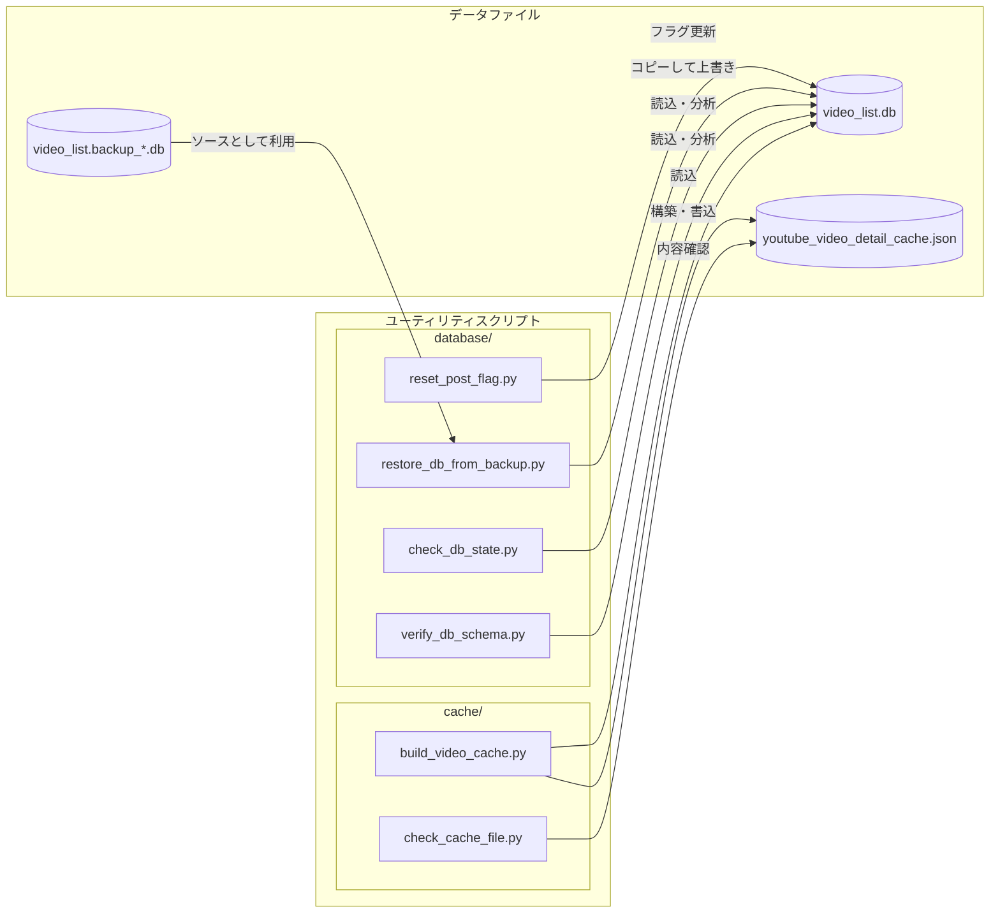

# データベースとキャッシュのユーティリティ (Database & Cache Utilities)

関連ソースファイル
- [v3/utils/DEBUGGING_UTILITIES.md](https://github.com/mayu0326/test/blob/abdd8266/v3/utils/DEBUGGING_UTILITIES.md)
- [v3/utils/database/reset_post_flag.py](https://github.com/mayu0326/test/blob/abdd8266/v3/utils/database/reset_post_flag.py)

このページでは、`v3/utils/database/` および `v3/utils/cache/` にある、単体で動作する診断・メンテナンス用スクリプトについて説明します。これらのスクリプトは、アプリケーション本体を介さずにデータベース (`video_list.db`) や YouTube API のキャッシュファイルを直接操作するもので、主にデバッグやリカバリ、一回限りのメンテナンスを目的としています。

> ⚠️ **注意: すべてのスクリプトはオフライン（アプリ停止中）での使用を前提としています。** アプリ起動中に実行すると、SQLite のロック競合が発生する可能性があります。データを変更するスクリプトを実行する前には、必ずデータベースのバックアップを作成してください。

---

## ディレクトリ構造

```
v3/utils/
├── database/                   # データベース操作
│   ├── reset_post_flag.py      # 投稿フラグのリセット
│   ├── restore_db_from_backup.py # バックアップから復元
│   ├── check_db.py             # 内容確認 (ニコニコ用)
│   ├── verify_db_schema.py     # スキーマの検証
│   └── check_db_state.py       # 統計情報の表示
└── cache/                      # キャッシュ操作
    ├── build_video_cache.py    # キャッシュの再構築
    └── check_cache_file.py     # キャッシュ内容の確認
```

---

## ユーティリティ・マップ



---

## データベース用スクリプト (`database/`)

### `reset_post_flag.py`
特定の動画、またはすべての動画の「投稿済み」フラグ (`posted_to_bluesky`) を `0` にリセットし、投稿時刻を消去します。動画を削除せずに投稿テストをやり直したい場合に便利です。

- **単体リセット**: `python reset_post_flag.py <動画ID>`
- **一括リセット**: `python reset_post_flag.py --all` (二重の確認プロンプトが表示されます)

### `restore_db_from_backup.py`
最新のバックアップファイルから `video_list.db` を復元します。
※ 現在のデータベースファイルは上書きされます。

### `check_db_state.py` / `verify_db_schema.py`
データベースの健康診断用スクリプトです。
- 全動画数、プラットフォームごとの内訳、特定の列に `NULL` が含まれていないか等をチェックします。
- テーブル構成（スキーマ）が最新の開発版と一致しているか確認します。

---

## キャッシュ用スクリプト (`cache/`)

これらは `v3/data/youtube_video_detail_cache.json`（API 節約用のキャッシュ）を操作します。

### `build_video_cache.py`
データベース内の全 YouTube ID を取得し、それらの最新情報を YouTube API から一括取得（50件ずつ）してキャッシュを再構築します。
- **用途**: キャッシュが壊れた場合や、最初から高速に動作させたい場合に使用します。
- **注意**: 1 動画につき 1 クォータを消費します（バッチ一括取得機能を利用）。大規模な DB で実行する際はクォータ残量に注意してください。

### `check_cache_file.py`
現在のキャッシュファイルのサイズ、エントリー数、および中身のサンプルを表示します。
- **用途**: キャッシュが正しく機能しているか、中身が古くなっていないか確認するために使用します。

---

## 注意事項まとめ
1. **アプリ停止中に実行**: 起動中の実行はエラーの原因になります。
2. **バックアップ推奨**: 変更を伴うスクリプトの実行前には必ず手動でファイルをコピーして保存してください。
3. **クォータ消費**: `build_video_cache.py` は API を呼び出すため、利用制限に注意してください。