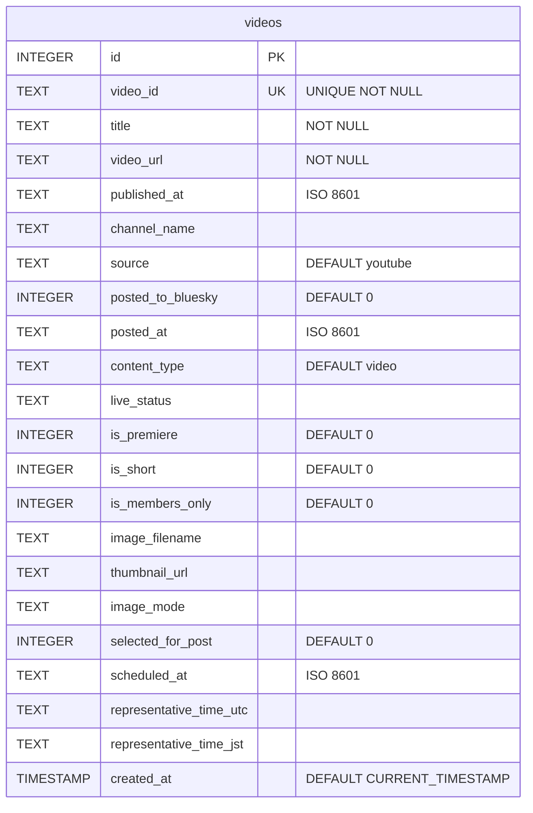
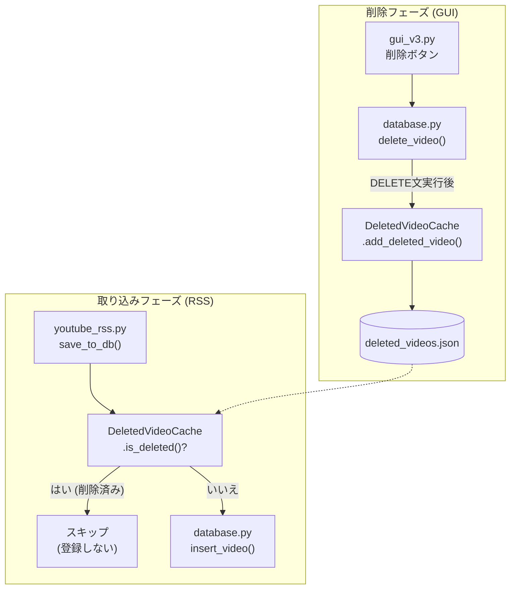

# データベースと削除済み動画キャッシュ (Database & Deleted Video Cache)

関連ソースファイル
- [v2/deleted_video_cache.py](https://github.com/mayu0326/test/blob/abdd8266/v2/deleted_video_cache.py)
- [v2/docs/Technical/DELETED_VIDEO_CACHE.md](https://github.com/mayu0326/test/blob/abdd8266/v2/docs/Technical/DELETED_VIDEO_CACHE.md)
- [v3/deleted_video_cache.py](https://github.com/mayu0326/test/blob/abdd8266/v3/deleted_video_cache.py)
- [v3/docs/Technical/Archive/ARCHITECTURE_AND_DESIGN.md](https://github.com/mayu0326/test/blob/abdd8266/v3/docs/Technical/Archive/ARCHITECTURE_AND_DESIGN.md)
- [v3/docs/Technical/Archive/VIDEO/DELETED_VIDEO_CACHE.md](https://github.com/mayu0326/test/blob/abdd8266/v3/docs/Technical/Archive/VIDEO/DELETED_VIDEO_CACHE.md)

このページでは、全動画レコードを保存する SQLite データベース `video_list.db`、`videos` テーブルのスキーマ、およびユーザーが削除した動画が将来の RSS ポーリングで再登録されるのを防ぐ `DeletedVideoCache` システムについて説明します。

---

## SQLite データベース: `video_list.db`

アプリケーションは、すべての動画レコードをローカルの SQLite データベース `data/video_list.db` に保存します。`database.py` モジュールがすべての読み書き操作を担当し、`get_database()` を介して共有インスタンスを提供します。

### `videos` テーブル・スキーマ



---

## 削除済み動画キャッシュ (Deleted Video Cache)

### 目的
ユーザーが GUI を通じて動画レコードを削除すると、そのデータは `video_list.db` から消えます。しかし、それだけでは次の RSS ポーリング時に同じ動画が再び検出され、新規レコードとして再登録されてしまいます。
`DeletedVideoCache` システムは、削除された動画 ID のリストを `data/deleted_videos.json` に保持し、ポーリング時の再登録を永続的に防ぎます。

### 保存形式
キャッシュは `data/deleted_videos.json` に保存されます。サービス（youtube, niconico 等）ごとに ID の配列を保持する JSON 形式です。

```json
{
  "youtube": ["video_id_1", "video_id_2"],
  "niconico": ["sm12345678"]
}
```

### `DeletedVideoCache` クラス
`v3/deleted_video_cache.py` で定義されており、JSON ファイルの読み書きと、ID の登録・判定 API を提供します。

| メソッド | 役割 |
| :--- | :--- |
| `is_deleted(id, source)` | 指定された ID がキャッシュにあるか（削除済みか）判定します。 |
| `add_deleted_video(id, source)` | 動画 ID をキャッシュに追加し、ファイルに保存します。 |
| `remove_deleted_video(id, source)` | 動画 ID をキャッシュから削除し、再登録を許可します。 |
| `clear_all_deleted()` | キャッシュを完全にクリアします。 |

---

## 連携フロー

`DeletedVideoCache` は以下の 3 つのフェーズで機能します。

**図: データパイプラインにおける削除済みキャッシュの動作**



### 1. 削除時の動作 (`database.py`)
`delete_video()` メソッドは、データベースからレコードを削除した直後に、その ID を `DeletedVideoCache` に登録します。これにより、二度と RSS から取り込まれないようになります。

### 2. 取り込み時の動作 (`youtube_rss.py`)
RSS フィードから新しい動画を検出した際、`save_to_db()` はまず `is_deleted()` を呼び出します。キャッシュに ID が見つかった場合、その動画の処理は即座に中断（スキップ）されます。

### 3. GUI での削除処理 (`gui_v3.py`)
ユーザーが削除操作を行うと、GUI は DB に削除を依頼します。DB モジュール内ですべてのキャッシュ制御が完結するため、GUI 側で特別なキャッシュ操作を意識する必要はありません。

---

## まとめ

| ファイル/モジュール | 役割 |
| :--- | :--- |
| `data/video_list.db` | メインの SQLite データベース。 |
| `database.py` | DB への全操作を管理。削除時にキャッシュへの登録をトリガーします。 |
| `deleted_video_cache.py` | キャッシュのロジックとシングルトン・インスタンスを提供。 |
| `data/deleted_videos.json` | 削除済み ID を永続的に保存するファイル。 |
| `youtube_rss.py` | 新規登録前に `is_deleted()` をチェックし、重複登録を防止。 |