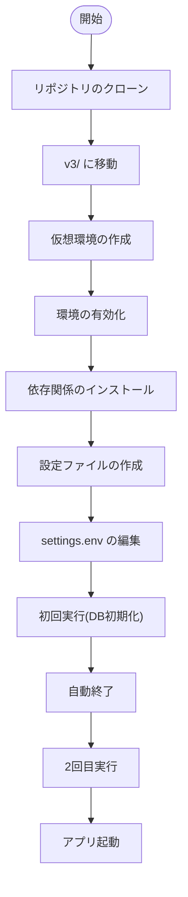
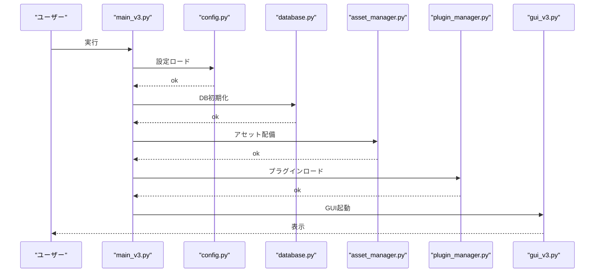
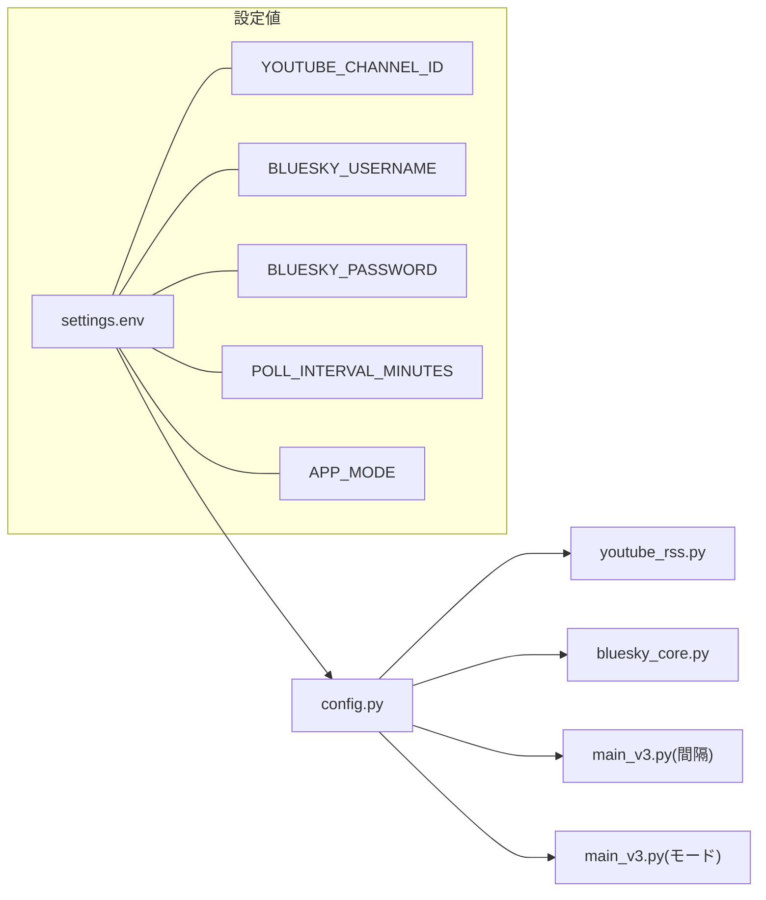

# クイックスタート (Getting Started)

関連ソースファイル
- [v1/docs/SETUP_GUIDE_v1.md](https://github.com/mayu0326/test/blob/abdd8266/v1/docs/SETUP_GUIDE_v1.md)
- [v1/docs/USER_GUIDE_v1.md](https://github.com/mayu0326/test/blob/abdd8266/v1/docs/USER_GUIDE_v1.md)
- [v2/CONTRIBUTING.md](https://github.com/mayu0326/test/blob/abdd8266/v2/CONTRIBUTING.md)
- [v2/docs/Guides/GETTING_STARTED.md](https://github.com/mayu0326/test/blob/abdd8266/v2/docs/Guides/GETTING_STARTED.md)
- [v2/docs/Guides/GUI_USER_MANUAL.md](https://github.com/mayu0326/test/blob/abdd8266/v2/docs/Guides/GUI_USER_MANUAL.md)
- [v2/docs/Technical/OPERATION_MODES.md](https://github.com/mayu0326/test/blob/abdd8266/v2/docs/Technical/OPERATION_MODES.md)
- [v3/docs/CONTRIBUTING.md](https://github.com/mayu0326/test/blob/abdd8266/v3/docs/CONTRIBUTING.md)
- [v3/docs/Guides/DEBUG_DRY_RUN_USER_GUIDE.md](https://github.com/mayu0326/test/blob/abdd8266/v3/docs/Guides/DEBUG_DRY_RUN_USER_GUIDE.md)
- [v3/docs/Guides/GETTING_STARTED.md](https://github.com/mayu0326/test/blob/abdd8266/v3/docs/Guides/GETTING_STARTED.md)
- [v3/docs/Guides/OPERATION_MODES_GUIDE.md](https://github.com/mayu0326/test/blob/abdd8266/v3/docs/Guides/OPERATION_MODES_GUIDE.md)
- [v3/readme_v3.md](https://github.com/mayu0326/test/blob/abdd8266/v3/readme_v3.md)
- [wiki/Getting-Started-Setup.md](https://github.com/mayu0326/test/blob/abdd8266/wiki/Getting-Started-Setup.md)
- [wiki/Testing.md](https://github.com/mayu0326/test/blob/abdd8266/wiki/Testing.md)
- [wiki/User-Manual.md](https://github.com/mayu0326/test/blob/abdd8266/wiki/User-Manual.md)

このページでは、StreamNotify v3 の完全な初期セットアップについて説明します：環境準備、依存関係のインストール、`settings.env` の構成、および初回の起動確認をカバーします。StreamNotify が何を行うかやその設計原則についての概念的な説明は [概要](./Overview.md) を参照してください。`settings.env` の全変数の詳細なリファレンスについては [構成リファレンス](./Configuration-Reference.md) を、4つの動作モードとその使い分けについては [動作モード](./Operation-Modes.md) を参照してください。

---

## 前提条件 (Prerequisites)

| 要件 | 最小 | 推奨 |
| :--- | :--- | :--- |
| OS | Windows 10 / Debian-Ubuntu Linux | Windows 11 / Ubuntu 22.04 LTS |
| Python | 3.10 | 3.13 |
| Git | 任意 | 最新 |
| YouTube チャンネル ID | "UC" で始まる 24文字 | — |
| Bluesky アカウント | ハンドル + アプリパスワード | — |

Bluesky のパスワードは、アカウントのログイン用パスワードではなく、Bluesky の設定ページから生成した **アプリパスワード** である必要があります。YouTube チャンネル ID は必ず `UC` で始まる形式にしてください。

情報源: [v3/readme_v3.md (L218-224)](https://github.com/mayu0326/test/blob/abdd8266/v3/readme_v3.md#L218-L224), [v3/docs/Guides/GETTING_STARTED.md (L23-28)](https://github.com/mayu0326/test/blob/abdd8266/v3/docs/Guides/GETTING_STARTED.md#L23-L28)

---

## セットアップの流れ

**エンドツーエンドのセットアップと初回起動シーケンス:**



情報源: [v3/readme_v3.md (L31-88)](https://github.com/mayu0326/test/blob/abdd8266/v3/readme_v3.md#L31-L88), [v3/docs/Guides/GETTING_STARTED.md (L32-84)](https://github.com/mayu0326/test/blob/abdd8266/v3/docs/Guides/GETTING_STARTED.md#L32-L84)

---

## ステップ 1 — リポジトリのクローン

```bash
git clone <repository-url>
cd Streamnotify_on_Bluesky/v3
```

以降のすべてのコマンドは、`v3/` ディレクトリ内で実行します。

情報源: [v3/readme_v3.md (L31-36)](https://github.com/mayu0326/test/blob/abdd8266/v3/readme_v3.md#L31-L36)

---

## ステップ 2 — 仮想環境の作成

```bash
python -m venv .venv

# Windows の場合
.venv\Scripts\activate

# Linux / macOS / WSL の場合
source .venv/bin/activate
```

仮想環境を使用することで、StreamNotify のパッケージをシステム上の Python と分離して管理できます。

情報源: [v3/docs/Guides/GETTING_STARTED.md (L66-77)](https://github.com/mayu0326/test/blob/abdd8266/v3/docs/Guides/GETTING_STARTED.md#L66-L77), [v3/readme_v3.md (L37-54)](https://github.com/mayu0326/test/blob/abdd8266/v3/readme_v3.md#L37-L54)

---

## ステップ 3 — 依存関係のインストール

```bash
pip install -r requirements.txt
```

すべての実行時依存関係は [v3/requirements.txt](https://github.com/mayu0326/test/blob/abdd8266/v3/requirements.txt) で宣言されています。

---

## ステップ 4 — 設定ファイルの作成

```bash
cp settings.env.example settings.env
```

`settings.env` は `.gitignore` に含まれており、決してリポジトリにコミットしないでください。ここには認証情報やプライベートなチャンネル ID が含まれます。

情報源: [v3/readme_v3.md (L57-68)](https://github.com/mayu0326/test/blob/abdd8266/v3/readme_v3.md#L57-L68), [v3/docs/Guides/GETTING_STARTED.md (L42-48)](https://github.com/mayu0326/test/blob/abdd8266/v3/docs/Guides/GETTING_STARTED.md#L42-L48)

---

## ステップ 5 — `settings.env` の編集

テキストエディタで `settings.env` を開きます。アプリケーションを開始するには以下の4つのフィールドが必須です：

| 変数名 | 説明 | 例 |
| :--- | :--- | :--- |
| `YOUTUBE_CHANNEL_ID` | 監視する YouTube チャンネル ID | `UCxxxxxxxxxxxxxxxxxxxxxxxx` |
| `BLUESKY_USERNAME` | Bluesky のハンドル名（@なし） | `yourname.bsky.social` |
| `BLUESKY_PASSWORD` | Bluesky アプリパスワード | `xxxx-xxxx-xxxx-xxxx` |
| `POLL_INTERVAL_MINUTES` | RSS ポーリング間隔（分、最小5） | `15` |

5番目のフィールドは投稿動作を制御し、初回実行時に明示的に設定することを推奨します：

| 変数名 | 説明 | 安全なデフォルト値 |
| :--- | :--- | :--- |
| `APP_MODE` | 手動または自動投稿の制御 | `selfpost` |

`APP_MODE=selfpost` に設定すると、動画はデータベースに収集されますが、GUI で各投稿を手動で確認するまで Bluesky には投稿されません。詳細なオプション (`autopost`, `dry_run`, `collect`) については [動作モード](./Operation-Modes.md) を参照してください。

**最小限の `settings.env` 例:**

```env
YOUTUBE_CHANNEL_ID=UCxxxxxxxxxxxxxxxxxxxxxxxx
BLUESKY_USERNAME=yourname.bsky.social
BLUESKY_PASSWORD=xxxx-xxxx-xxxx-xxxx
POLL_INTERVAL_MINUTES=15
APP_MODE=selfpost
```

情報源: [v3/readme_v3.md (L270-282)](https://github.com/mayu0326/test/blob/abdd8266/v3/readme_v3.md#L270-L282), [v3/docs/Guides/GETTING_STARTED.md (L49-61)](https://github.com/mayu0326/test/blob/abdd8266/v3/docs/Guides/GETTING_STARTED.md#L49-L61)

---

## ステップ 6 — 初回起動

```bash
python main_v3.py
```

**一番最初の実行時**、`main_v3.py` は `data/video_list.db` が存在しないことを検出し、`database.py` を通じてデータベーススキーマを初期化し、接続を確認した後、自動的に終了します。これは仕様上の動作です。プロセスが終了するまで待ち、それから次に進んでください。

通常の動作のために、もう一度コマンドを実行します：

```bash
python main_v3.py
```

`StreamNotifyGUI` ウィンドウ (`gui_v3.py`) が開き、アプリケーションは YouTube RSS フィードのポーリングを開始します。

情報源: [v3/readme_v3.md (L84-89)](https://github.com/mayu0326/test/blob/abdd8266/v3/readme_v3.md#L84-L89), [v3/docs/Guides/GETTING_STARTED.md (L65-84)](https://github.com/mayu0326/test/blob/abdd8266/v3/docs/Guides/GETTING_STARTED.md#L65-L84)

---

## 起動時に何が起こるか

**起動時の初期化シーケンス — モジュール間の相互作用:**



情報源: [v3/readme_v3.md (L96-212)](https://github.com/mayu0326/test/blob/abdd8266/v3/readme_v3.md#L96-L212), [v3/docs/Guides/GETTING_STARTED.md (L65-84)](https://github.com/mayu0326/test/blob/abdd8266/v3/docs/Guides/GETTING_STARTED.md#L65-L84)

起動時の主要な動作：

- **`config.py`**: `settings.env` のすべてのフィールドを読み取ります。必須項目が欠けている場合は、その項目を特定するエラーメッセージとともに起動が停止します。
- **`asset_manager.py` (`deploy_all()`)**: デフォルトのテンプレートと画像を `Asset/` から実行ディレクトリ (`templates/`, `images/`) へコピーします。既存のファイルは上書きされないため、カスタム設定は保持されます。
- **`plugin_manager.py` (`discover_plugins()`)**: `plugins/` ディレクトリをスキャンし、`is_available()` が `True` を返す全プラグインをロードします。
- **`database.py`**: `data/video_list.db` が存在しない場合に作成し、テーブルスキーマを検証します。

初回起動時に存在しない場合は、以下のディレクトリが自動的に作成されます：

| ディレクトリ | 目的 |
| :--- | :--- |
| `data/` | SQLite データベース (`video_list.db`) |
| `logs/` | ログファイル (`app.log`, `error.log` など) |
| `images/` | ダウンロードされた動画サムネイル (`YouTube/`, `Niconico/` など) |
| `templates/` | アクティブな Jinja2 投稿テンプレート (`youtube/`, `niconico/`) |

情報源: [v3/readme_v3.md (L96-212)](https://github.com/mayu0326/test/blob/abdd8266/v3/readme_v3.md#L96-L212)

---

## 設定項目と使用モジュール

以下の図は、`settings.env` の4つの必須フィールドが `config.py` を経由して、それらを使用する各モジュールにどのように伝達されるかを示しています。

**`settings.env` フィールド → `config.py` → 使用モジュール:**



情報源: [v3/readme_v3.md (L270-282)](https://github.com/mayu0326/test/blob/abdd8266/v3/readme_v3.md#L270-L282), [v3/docs/Guides/GETTING_STARTED.md (L49-61)](https://github.com/mayu0326/test/blob/abdd8266/v3/docs/Guides/GETTING_STARTED.md#L49-L61)

---

## 起動後の確認

GUI が開いたら、以下の順序でセットアップを確認してください：

**1. RSS 取得の確認**

メインウィンドウの動画リスト (`Treeview`) に、設定したチャンネルの動画が表示されるはずです。空の場合は、1回のポーリングサイクル (`POLL_INTERVAL_MINUTES`) 待つか、ツールバーの手動更新ボタンをクリックしてください。

**2. ドライラン投稿テスト**

リスト内の動画を1つ選択し（チェックボックスをオン）、**🧪 投稿テスト** (Post Test) をクリックします。ログパネルに `[DRY RUN]` の出力が表示されます。Bluesky には何も送信されず、データベースの `posted_to_bluesky` フラグも更新されません。

**3. 本番投稿（準備が整い次第）**

**📤 投稿設定** をクリックして `PostSettingsWindow` を開き、レンダリングされたテンプレートと画像を確認し、**✅ 投稿実行** をクリックして Bluesky に投稿します。

情報源: [v3/docs/Guides/GETTING_STARTED.md (L88-166)](https://github.com/mayu0326/test/blob/abdd8266/v3/docs/Guides/GETTING_STARTED.md#L88-L166), [wiki/Getting-Started-Setup.md (L54-62)](https://github.com/mayu0326/test/blob/abdd8266/wiki/Getting-Started-Setup.md#L54-L62)

---

## トラブルシューティング

| 症状 | 考えられる原因 | 解決策 |
| :--- | :--- | :--- |
| GUI が開かない | Python 3.10 未満、またはパッケージ不足 | `python --version` を実行、`pip install -r requirements.txt` を再実行 |
| 初回起動時にすぐ終了する | 仕様上の動作（DB 初期化） | もう一度 `python main_v3.py` を実行 |
| 動画リストに動画が出ない | `YOUTUBE_CHANNEL_ID` の誤り、または通信不可 | ID が `UC` で始まっているか、ネットワーク接続を確認 |
| Bluesky 投稿に失敗する | 認証情報の誤り | Bluesky 設定でアプリパスワードを再生成し `settings.env` を更新 |
| `settings.env` が見つからない | 例から作成されていない | `cp settings.env.example settings.env` を実行 |
| `settings.env` の変更が反映されない | 実行中に編集した | 変更を反映するにはアプリケーションを再起動してください |

すべてのエラー出力は `logs/app.log` に記録されます。`settings.env` で `DEBUG_MODE=true` を設定すると、テンプレートのレンダリング詳細、画像リサイズ手順、API 呼び出しのトレースを含む詳細なログが有効になります。変更後はアプリケーションを再起動してください。

情報源: [v3/readme_v3.md (L448-470)](https://github.com/mayu0326/test/blob/abdd8266/v3/readme_v3.md#L448-L470), [v3/docs/Guides/GETTING_STARTED.md (L199-227)](https://github.com/mayu0326/test/blob/abdd8266/v3/docs/Guides/GETTING_STARTED.md#L199-L227), [wiki/Getting-Started-Setup.md (L1-80)](https://github.com/mayu0326/test/blob/abdd8266/wiki/Getting-Started-Setup.md#L1-L80)