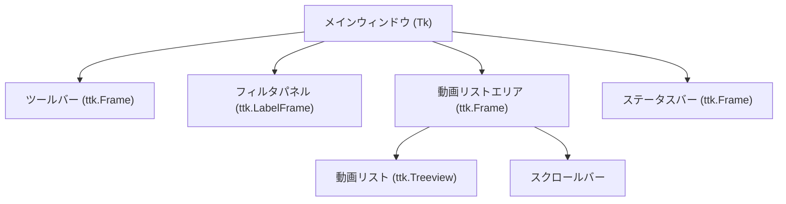

# グラフィカルユーザーインターフェース (Graphical User Interface)

関連ソースファイル
- [v3/docs/Guides/GUI_USER_MANUAL.md](https://github.com/mayu0326/test/blob/abdd8266/v3/docs/Guides/GUI_USER_MANUAL.md)
- [v3/docs/Technical/Archive/GUI_FILTER_AND_DUPLICATE_PREVENTION.md](https://github.com/mayu0326/test/blob/abdd8266/v3/docs/Technical/Archive/GUI_FILTER_AND_DUPLICATE_PREVENTION.md)
- [v3/gui_v3.py](https://github.com/mayu0326/test/blob/abdd8266/v3/gui_v3.py)

このページでは、Tkinter をベースとした StreamNotify の GUI について説明します。`v3/gui_v3.py` の `StreamNotifyGUI` クラス、レイアウト、ツールバーのアクション、フィルタパネル、動画リスト（Treeview）、および各種ダイアログのワークフローをカバーします。

---

## クラス構造と依存関係

`StreamNotifyGUI` は起動時にデータベースやプラグインマネージャーの参照を受け取り、連携して動作します。

| 属性 | ソース | 役割 |
| :--- | :--- | :--- |
| `self.db` | `database.py` | 動画データの読み書き。 |
| `self.plugin_manager` | `plugin_manager.py` | 有効なプラグインを介した投稿処理。 |
| `self.image_manager` | `image_manager.py` | サムネイルのダウンロードと検索。 |
| `self.schedule_mgr` | `batch_schedule_manager.py` | 一括予約情報の永続化。 |

---

## 画面構成 (レイアウト)

GUI のメインウィンドウは以下の階層構造で構成されています。

ウィンドウサイズは 1520x750 ピクセルに初期化されます。

---

## ツールバー

ツールバーには主要な操作アクションが並んでいます。

**主なボタンと機能:**
- **ツール群**: ℹ️統計、💾バックアップ、⚙️全体設定、🔧プラグイン管理、📝テンプレート編集
- **投稿操作**: 🧪投稿テスト（Dry-run）、📤投稿実行（個別）、📅一括投稿予約
- **選択操作**: ☑️すべて選択、☐選択解除、💾選択を保存、🗑️削除
- **更新操作**: 🔄再読込、📡新着取得、🎬YouTube Live手動判定、➕動画追加

> **Note:** `AUTOPOST` モードでは、手動投稿ボタン（🧪/📤）は無効化されます。

---

## フィルタパネル

4 つの条件を組み合わせた AND 検索が可能です。入力や選択が変わるたびに `apply_filters()` が呼ばれ、リストが即座に更新されます。

- **自由入力**: タイトルや ID で検索。
- **投稿状態**: 全て / 投稿済み / 未投稿
- **配信元**: 全て / YouTube / Niconico
- **種別**: 動画 / アーカイブ / 放送予約 / 放送中 / 放送終了 / プレミア公開

---

## 動画リスト (Treeview)

10 個の列を持つテーブル形式で情報を表示します。

| 列 | 内容 |
| :--- | :--- |
| **選択** | チェックボックス (☑️ / ☐) |
| **公開日時** | 動画の公開日 (JST) |
| **種別** | アイコン（🎬, 🔴, 📅 など） |
| **タイトル** | 動画タイトル |
| **時刻** | 投稿時刻、または予約時刻 |
| **状態** | 投稿済み (✓) か未投稿 (–) か |

---

## インタラクション (操作)

### 右クリックメニュー
選択した行に対して以下の操作が可能です。
- **⏰ 予約日時を設定**: 投稿日時を指定します。
- **🖼️ 画像を設定**: サムネイルを手動で選択または再取得します。
- **🗑️ 削除**: レンコードを削除（削除済みキャッシュに登録）します。
- **❌ 選択解除**: 予約や画像指定をクリアします。

---

## ダイアログのワークフロー

### 投稿予約ダイアログ (`edit_scheduled_time`)
カレンダーと時間スピンボックスを使用して、秒単位で投稿予約日時を設定できます。

### 画像管理ダイアログ (`edit_image_file`)
- **参照**: ローカルにある画像をコピーして設定。
- **ダウンロード**: URL から直接取得。
- **再取得**: YouTube の CDN や ニコニコの OGP から高解像度版を再取得。

### 投稿設定ダイアログ (`PostSettingsWindow`)
実際の投稿直前に表示されます。レンダリングされた本文と画像を確認し、最終的な送信を行います。

---

## YouTube Live 手動判定

ツールバーの「🎬 Live判定」ボタンは、直近 24 時間以内のライブ関連動画に対して、YouTube データ API を用いて最新状態を再取得します。自動更新を待たずに状態（ライブ中か終了したかなど）を確定させたい場合に使用します。