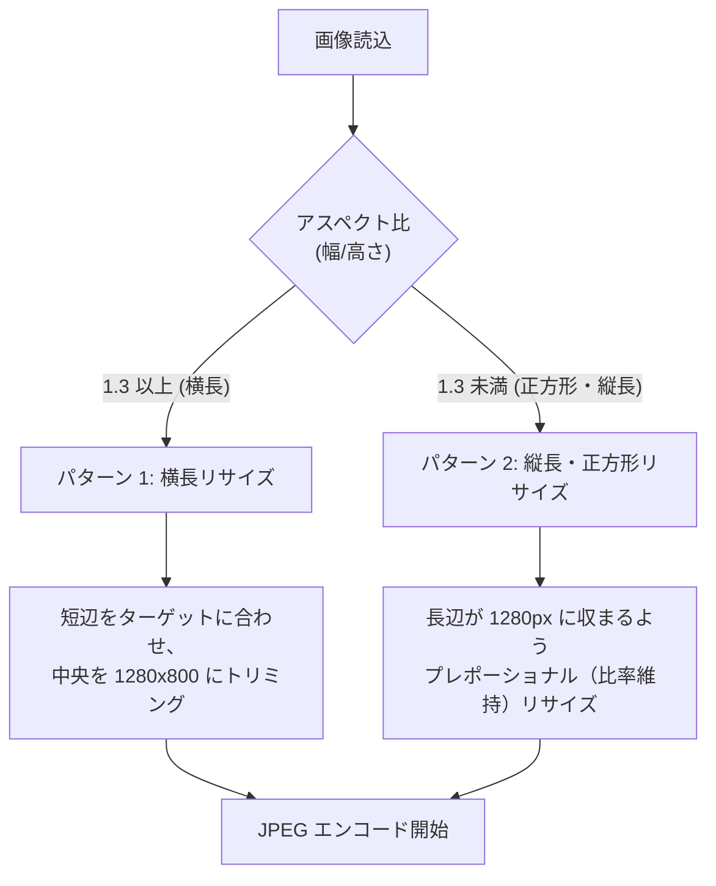

# 画像処理とリサイズ (Image Processing & Resizing)

関連ソースファイル
- [v3/plugins/bluesky_plugin.py](https://github.com/mayu0326/test/blob/abdd8266/v3/plugins/bluesky_plugin.py)
- [v3/image_processor.py](https://github.com/mayu0326/test/blob/abdd8266/v3/image_processor.py)
- [v3/docs/Technical/Archive/IMAGE_RESIZE_GUIDE.md](https://github.com/mayu0326/test/blob/abdd8266/v3/docs/Technical/Archive/IMAGE_RESIZE_GUIDE.md)

このページでは、Bluesky への投稿にサムネイルや画像を添付する際に実行される、画像のリサイズおよび最適化パイプラインについて説明します。

---

## 概要

Bluesky API には **1 MB** という厳格なファイルサイズ制限があります。StreamNotify では、画像をアップロードする前に自動的に以下の処理を行い、制限内に収めます。
- **目標サイズ**: 900 KB 以下
- **ハードリミット**: 1 MB (これを超える場合は、画像添付をスキップし、URL カードのみを投稿します)

---

## 設定値 (settings.env)

以下の変数を `settings.env` で調整可能です。未設定の場合はデフォルト値が使用されます。

| 変数名 | デフォルト | 意味 |
| :--- | :--- | :--- |
| `IMAGE_RESIZE_TARGET_WIDTH` | 1280 | リサイズ後の最大幅 (px) |
| `IMAGE_RESIZE_TARGET_HEIGHT` | 800 | リサイズ後の最大高さ (px) — 3:2 の比率 |
| `IMAGE_OUTPUT_QUALITY_INITIAL` | 90 | 初回の JPEG 保存品質 (0–100) |
| `IMAGE_SIZE_THRESHOLD` | 900,000 | 品質低下処理を開始する閾値 (900 KB) |
| `IMAGE_SIZE_LIMIT` | 1,000,000 | Bluesky API の上限 (1 MB) |

---

## リサイズアルゴリズム

画像の縦横比（アスペクト比）に応じて、2 つの戦略を使い分けます。

---

## 逐次的な品質低下 (Iterative Quality Reduction)

リサイズ後の JPEG ファイルが 900 KB を超える場合、1 MB 以下に収まるまで段階的に画質を落として再試行します。

1. **初期状態**: 品質 90
2. **ステップ 1**: 品質 85
3. **ステップ 2**: 品質 75
4. **ステップ 3**: 品質 65
5. **ステップ 4**: 品質 55
6. **ステップ 5**: 品質 50

品質 50 でも 1 MB を超える場合は、画像の添付をあきらめ、テキストのみ（または URL カードのみ）の投稿に切り替えます。

---

## アルファチャンネルの処理
透過情報を持つ画像 (PNG など) を JPEG に変換する際、背景を自動的に **白** で塗りつぶします。これにより、透過部分が黒くなったり、エンコードエラーが発生したりするのを防ぎます。

---

## ドライラン (Dry-run) での動作
テスト実行モードが有効な場合、実際の画像処理やファイル読み込みはスキップされます。代わりに、ダミーの画像データ（固定の構造を持つ辞書）を返して、投稿処理の全体フローが正常に動作するかどうかのみを確認します。

---

## ログの見方
デバッグ時に役立つ主なログメッセージ：
- `📏 元画像: 1920×1440`: 入力画像の情報
- `⚠️ ファイルサイズが 900KB を超過`: 圧縮処理の開始
- `✅ 品質85で 1MB 以下に圧縮`: 圧縮成功の通知
- `❌ ファイルサイズの最適化に失敗しました`: 画像添付の断念