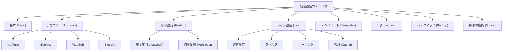
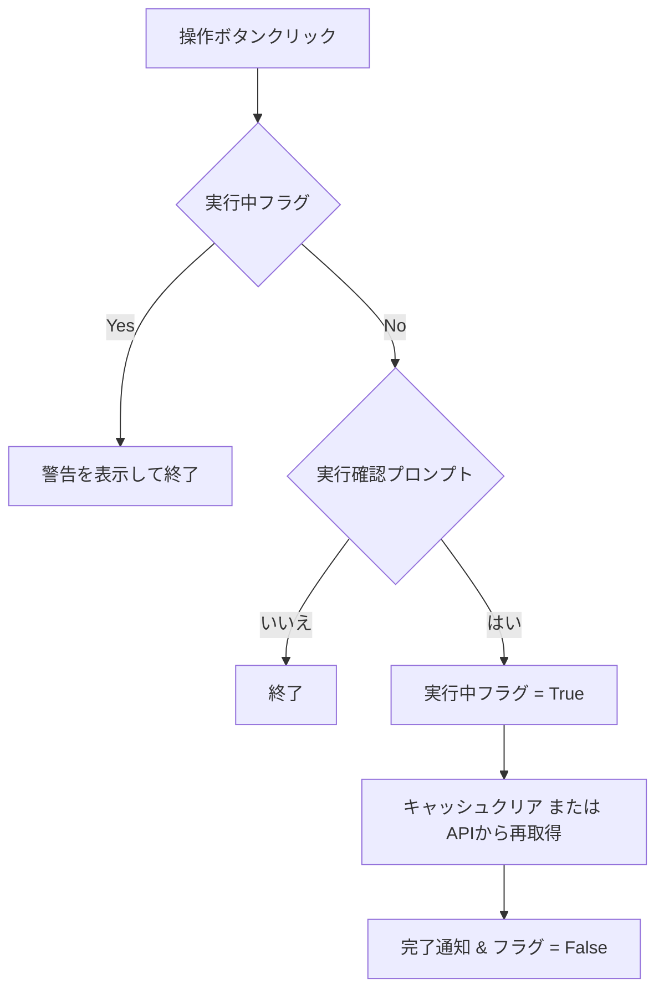

# 統合設定ウィンドウ (Integrated Settings Window)

関連ソースファイル
- [v3/docs/Guides/unified_settings_window_guide.md](https://github.com/mayu0326/test/blob/abdd8266/v3/docs/Guides/unified_settings_window_guide.md)
- [v3/docs/Technical/Archive/GUI_UNIFIED_SETTINGS.md](https://github.com/mayu0326/test/blob/abdd8266/v3/docs/Technical/Archive/GUI_UNIFIED_SETTINGS.md)
- [v3/unified_settings_window.py](https://github.com/mayu0326/test/blob/abdd8266/v3/unified_settings_window.py)

`UnifiedSettingsWindow` クラスは、`settings.env` ファイルを直接編集することなく、すべての設定変数を変更できるタブ付きのダイアログを提供します。入力バリデーションを行い、保存時にはコメント行や空行を保持し、変更前に自動的にバックアップを作成する機能を備えています。

---

## ウィンドウの開き方

`UnifiedSettingsWindow` は `StreamNotifyGUI` から以下の 2 つのモードで開かれます。

| 起動ボタン | 最初に表示されるタブ |
| :--- | :--- |
| ツールバーの **⚙️ アプリ設定** | `"basic"` (基本設定) |
| ツールバーの **🎬 Live判定** (設定確認時) | `"live"` (ライブ設定) |

このウィンドウはモーダルダイアログであり、閉じられるまで親ウィンドウの操作をブロックします。

---

## タブ構造

設定項目は以下の 8 つのメインタブと、その中のサブタブに整理されています。

---

## settings.env の読込・保存ロジック

### 読込
`settings.env` を 1 行ずつ読み込み、`KEY=VALUE` 形式のペアを辞書に格納します。UI 上の各コントロールは、この辞書の値に基づいて初期化されます。

### 保存
1. **バックアップ**: 現在の `settings.env` を `settings.env.backup` にコピーします。
2. **差分更新**: 元のファイルを再読込し、キーが見つかった場合は UI の値で置換し、見つからない場合は末尾に追記します。
3. **コメントの保持**: 空行やコメント行はそのまま維持されます。また、特定の高度な設定項目は、UI で設定されていても常にコメントアウトされた状態で保存される仕組み（`COMMENTED_KEYS`）があります。

---

## YouTube キャッシュ管理

「ライブ設定」タブの「管理」サブタブでは、データベース内の YouTube 動画の分類キャッシュを手動で操作できます。

- **クリア**: 指定した種別のレコードを DB から削除します。
- **更新**: YouTube データ API を呼び出し、最新の状態（放送中か終了したか等）を再分類して保存します。

---

## 入力バリデーション

UI レベルでデータの正確性を担保しています。
- **選択式 (Combobox)**: あらかじめ定義された選択肢（`autopost`, `selfpost` など）からのみ選択可能。
- **数値入力 (Spinbox)**: 範囲（例：ポーリング間隔 1〜120分）を指定。
- **真偽値 (Checkbutton)**: `true` / `false` として正確にシリアライズ。
- **パス参照**: ファイルブラウザダイアログを使用し、実在するパスのみを入力可能。
- **マスク表示**: パスワードや API キーは `*` で隠して表示。