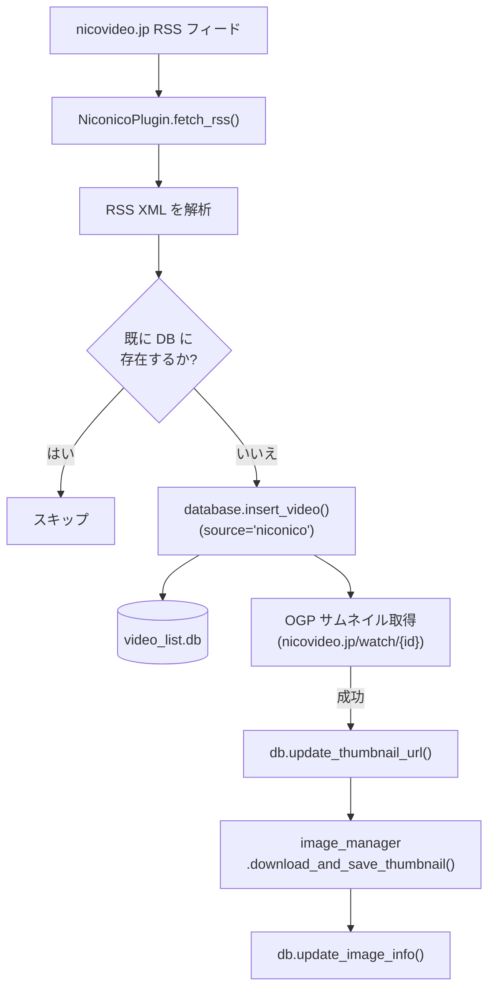
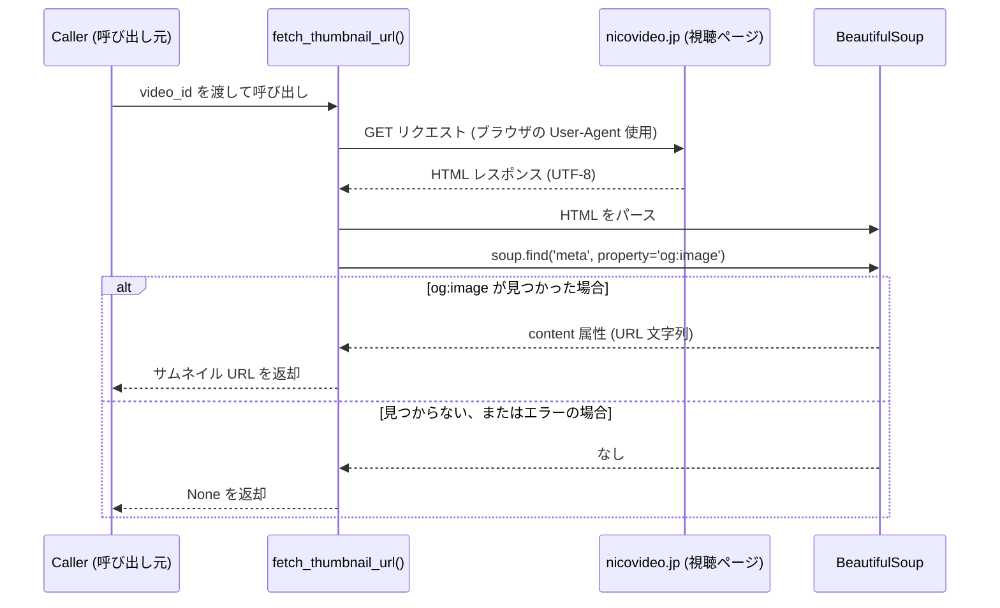
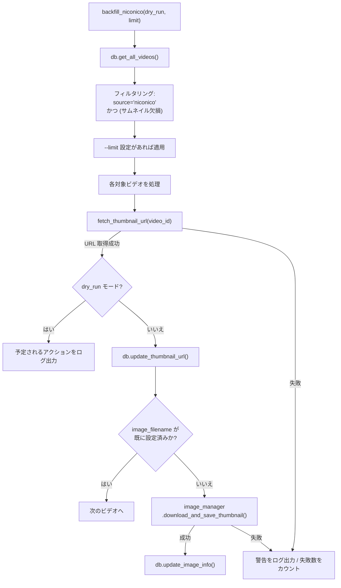
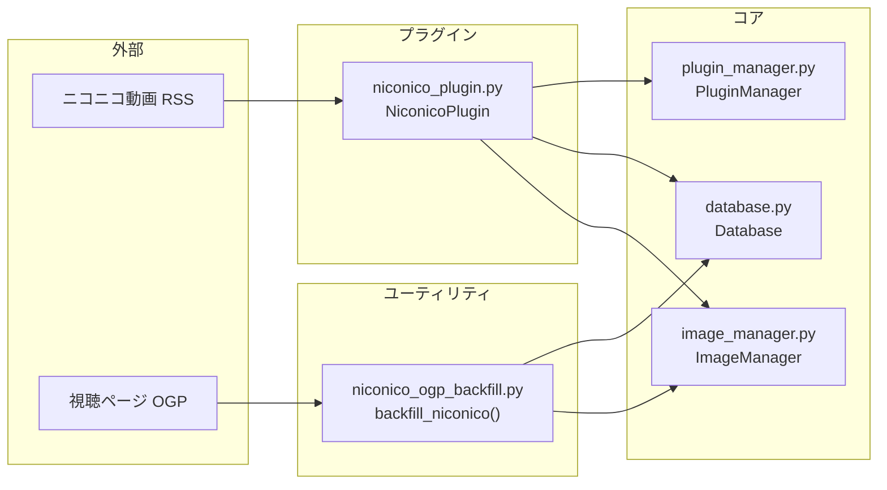

# ニコニコ動画統合 (Niconico Integration)

関連ソースファイル
- [v2/plugin_manager.py](https://github.com/mayu0326/test/blob/abdd8266/v2/plugin_manager.py)
- [v2/thumbnails/niconico_ogp_backfill.py](https://github.com/mayu0326/test/blob/abdd8266/v2/thumbnails/niconico_ogp_backfill.py)
- [v2/thumbnails/youtube_thumb_backfill.py](https://github.com/mayu0326/test/blob/abdd8266/v2/thumbnails/youtube_thumb_backfill.py)
- [v2/thumbnails/youtube_thumb_utils.py](https://github.com/mayu0326/test/blob/abdd8266/v2/thumbnails/youtube_thumb_utils.py)
- [v3/plugin_manager.py](https://github.com/mayu0326/test/blob/abdd8266/v3/plugin_manager.py)
- [v3/thumbnails/niconico_ogp_backfill.py](https://github.com/mayu0326/test/blob/abdd8266/v3/thumbnails/niconico_ogp_backfill.py)
- [v3/thumbnails/youtube_thumb_backfill.py](https://github.com/mayu0326/test/blob/abdd8266/v3/thumbnails/youtube_thumb_backfill.py)
- [v3/thumbnails/youtube_thumb_utils.py](https://github.com/mayu0326/test/blob/abdd8266/v3/thumbnails/youtube_thumb_utils.py)

このページでは、StreamNotify におけるニコニコ動画固有のコンポーネントについて説明します。ニコニコ動画の RSS フィードを取得して動画投稿を行う `NiconicoPlugin`、OGP（Open Graph Protocol）ベースのサムネイル URL 抽出メカニズム、および不足しているサムネイルデータを遡及的に補完するための `niconico_ogp_backfill.py` ユーティリティについて網羅しています。

プラグインの一般的なライフサイクル（ロード、有効化、`post_video_with_all_enabled`）については、[プラグインシステム](./Plugin-System.md) を参照してください。サムネイル取得後に実行される画像のリサイズとアップロードパイプラインについては、[画像処理とリサイズ](./Image-Processing-and-Resizing.md) を参照してください。同様の YouTube 用バックフィルツールについては、[サムネイル・バックフィルツール](./Thumbnail-Backfill-Tools.md) を参照してください。

---

## 概要 (Overview)

ニコニコ動画のサポートは、`NotificationPlugin` インターフェースを継承した自己完結型のプラグイン (`plugins/niconico_plugin.py`) として実装されています。主な責任は以下の通りです。

1. 新しい動画投稿を確認するためのニコニコ動画 RSS フィードのポーリング。
2. 発見された動画レコードを `source = 'niconico'` として `video_list.db` に挿入。
3. 各動画の視聴ページから OGP メタデータを介したサムネイル URL の取得。
4. Bluesky への通知を行う標準的な `post_video()` フローへの参加。

バックフィルユーティリティ (`thumbnails/niconico_ogp_backfill.py`) は、サムネイル取得機能が実装される前に保存されたレコードや、取得に失敗したレコードに対して、遡及的に同じ OGP 抽出処理を行います。

---

## NiconicoPlugin

- **プラグインファイル:** `plugins/niconico_plugin.py`
- **プラグイン管理エントリ:** `PluginManager.discover_plugins()` によって `niconico_plugin` として登録されます。

このプラグインは `NotificationPlugin` 抽象インターフェースを実装しています。主な 2 つのメソッドは以下の通りです。

| メソッド | シグネチャ | 役割 |
| :--- | :--- | :--- |
| `fetch_rss` | `() -> list` | ニコニコ動画の RSS フィードを解析し、動画辞書のリストを返却 |
| `post_video` | `(video: dict) -> bool` | ニコニコ動画の単一通知を投稿（`PluginManager` 経由で `BlueskyImagePlugin` に委譲） |
| `is_available` | `() -> bool` | ニコニコ動画関連の設定が存在する場合に `True` を返却 |

### RSS 取得とデータベース挿入

**図: ニコニコ動画プラグインのデータフロー**



情報源: [v3/thumbnails/niconico_ogp_backfill.py (L64-134)](https://github.com/mayu0326/test/blob/abdd8266/v3/thumbnails/niconico_ogp_backfill.py#L64-L134), [v3/plugin_manager.py (L40-108)](https://github.com/mayu0326/test/blob/abdd8266/v3/plugin_manager.py#L40-L108)

挿入されたレコードは、データベース内で `source = 'niconico'` を持ちます。`content_type` や `live_status` フィールドは、ニコニコ動画では（`YouTubeVideoClassifier` を通る YouTube とは異なり）積極的な分類は行われません。

---

## OGP サムネイル URL 抽出

ニコニコ動画には安定した公開サムネイル API が存在しないため、各動画の視聴ページにある Open Graph Protocol (OGP) メタデータからサムネイル URL を抽出します。

- **関数:** `fetch_thumbnail_url(video_id: str) -> str | None`
- **定義場所:** [v3/thumbnails/niconico_ogp_backfill.py (L50-75)](https://github.com/mayu0326/test/blob/abdd8266/v3/thumbnails/niconico_ogp_backfill.py#L50-L75)

### 抽出ロジック



実装の重要なポイント:
- ボット検知を避けるため、標準的なブラウザの `User-Agent` を使用します。
- 文字化けを防ぐため、パース前に `resp.encoding = 'utf-8'` を明示的に設定します。
- 一部の BeautifulSoup 設定では `og:image` の `content` 属性がリストとして返されることがあるため、v3 実装ではリストの場合に `content[0]` を取得するように処理しています。
- ネットワークエラーやタグの欠損が発生した場合は `None` を返し、呼び出し元で警告をログ出力します。

---

## サムネイル・バックフィルユーティリティ

- **ファイル:** `v3/thumbnails/niconico_ogp_backfill.py`

このユーティリティは、データベースに既に存在するニコニコ動画のレコードに対して、`thumbnail_url` や `image_filename` を遡及的に補完します。これは単発の実行を目的としており、メインアプリケーションのループ内からは呼び出されません。

### 対象の選択

`backfill_niconico()` 関数は、`get_database().get_all_videos()` を介してすべての動画を取得し、以下の条件に一致するレコードを抽出します。

- `source == 'niconico'`
- **かつ** (`thumbnail_url` が空 **または** `image_filename` が空)

### 更新シーケンス

**図: backfill_niconico() の内部フロー**



### CLI の使用方法

本スクリプトは Python モジュールとして起動します。`--execute` フラグを渡さない限り、デフォルトではドライランモード（読み取り専用）で動作します。

| フラグ | 型 | デフォルト | 効果 |
| :--- | :--- | :--- | :--- |
| `--execute` | flag | off | 実際の DB 書き込みと画像ダウンロードを有効化 |
| `--limit N` | int | `None` | 最大 N 件までのレコードに処理を制限 |
| `--verbose` | flag | off | ログレベルを `DEBUG` に設定 |

**実行例:**
```bash
# ドライラン — 何が更新されるかを表示（書き込みなし）
python -m thumbnails.niconico_ogp_backfill

# すべての対象レコードに対して実行
python -m thumbnails.niconico_ogp_backfill --execute
```

補完された画像は、イメージマネージャーによって `images/Niconico/import/` 以下に保存されます。

---

## ログ出力 (Logging)

バックフィルユーティリティは、ロギングプラグインが有効な場合は `ThumbnailsLogger` を優先的に使用し、そうでない場合は `AppLogger` を使用するパターンを採用しています。これは `youtube_thumb_utils.py` と同じ方式です。

通常のプラグイン動作中、ニコニコ動画固有のメッセージは `LoggingPlugin` で定義された `NiconicoLogger` にルーティングされます。詳細は [ロギングシステム](./Logging-System.md) を参照してください。

---

## コンポーネント・マップ

システムレベルの概念と、具体的なコード実体との対応マップです。

**図: ニコニコ動画統合のコード実体マップ**

