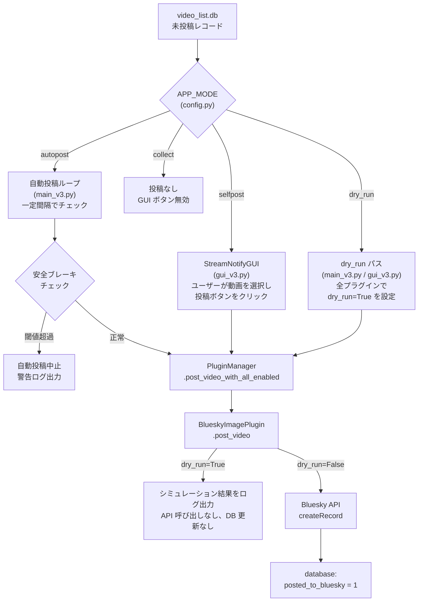
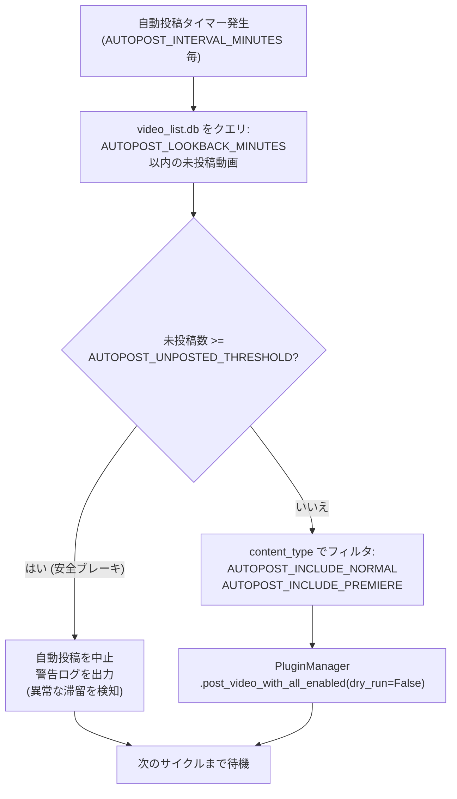
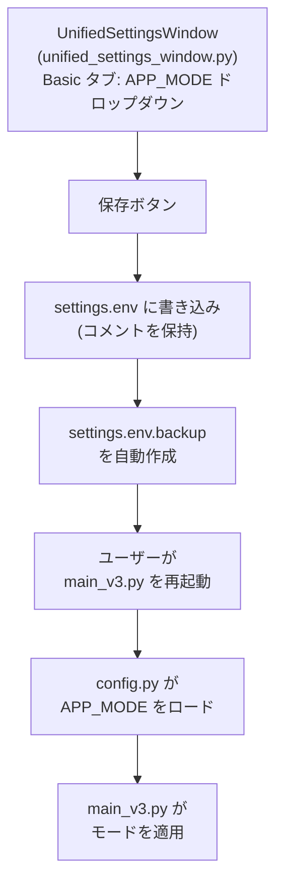

# 動作モード (Operation Modes)

関連ソースファイル
- [v1/docs/USER_GUIDE_v1.md](https://github.com/mayu0326/test/blob/abdd8266/v1/docs/USER_GUIDE_v1.md)
- [v2/docs/Guides/GETTING_STARTED.md](https://github.com/mayu0326/test/blob/abdd8266/v2/docs/Guides/GETTING_STARTED.md)
- [v2/docs/Guides/GUI_USER_MANUAL.md](https://github.com/mayu0326/test/blob/abdd8266/v2/docs/Guides/GUI_USER_MANUAL.md)
- [v2/docs/References/SETTINGS_OVERVIEW.md](https://github.com/mayu0326/test/blob/abdd8266/v2/docs/References/SETTINGS_OVERVIEW.md)
- [v2/docs/Technical/OPERATION_MODES.md](https://github.com/mayu0326/test/blob/abdd8266/v2/docs/Technical/OPERATION_MODES.md)
- [v2/settings.env.example](https://github.com/mayu0326/test/blob/abdd8266/v2/settings.env.example)
- [v3/docs/Guides/DEBUG_DRY_RUN_USER_GUIDE.md](https://github.com/mayu0326/test/blob/abdd8266/v3/docs/Guides/DEBUG_DRY_RUN_USER_GUIDE.md)
- [v3/docs/Guides/GETTING_STARTED.md](https://github.com/mayu0326/test/blob/abdd8266/v3/docs/Guides/GETTING_STARTED.md)
- [v3/docs/Guides/OPERATION_MODES_GUIDE.md](https://github.com/mayu0326/test/blob/abdd8266/v3/docs/Guides/OPERATION_MODES_GUIDE.md)
- [v3/docs/References/SETTINGS_OVERVIEW.md](https://github.com/mayu0326/test/blob/abdd8266/v3/docs/References/SETTINGS_OVERVIEW.md)
- [v3/settings.env.example](https://github.com/mayu0326/test/blob/abdd8266/v3/settings.env.example)
- [wiki/Testing.md](https://github.com/mayu0326/test/blob/abdd8266/wiki/Testing.md)
- [wiki/User-Manual.md](https://github.com/mayu0326/test/blob/abdd8266/wiki/User-Manual.md)

このページでは、設定変数 `APP_MODE` の4つの値、それぞれの動作の違い、自動投稿を制御する安全機構、およびアクティブモードの変更方法について説明します。全設定変数の一覧については [構成リファレンス](./Configuration-Reference.md) を、動画リストや投稿ボタンの動作など GUI レベルの制御については [メインウィンドウと動画管理](./Main-Window-&-Video-Management.md) を参照してください。

---

## モード概要 (Mode Overview)

`settings.env` の `APP_MODE` 変数は、動画データの収集後、アプリケーションがどのように Bluesky へ投稿を行うかを制御します。すべてのモードで、YouTube/ニコニコからのフィード取得と `video_list.db` への書き込みは継続して行われます。

| `APP_MODE` | 自動投稿 | GUI からの手動投稿 | GUI 投稿ボタン | 投稿時に DB 更新 |
| :--- | :--- | :--- | :--- | :--- |
| `selfpost` | なし | あり | **有効** | あり |
| `autopost` | **あり** | あり | **有効** | あり |
| `dry_run` | なし | シミュレーション | **有効** (模擬) | なし |
| `collect` | なし | なし | **無効** | あり (DB保存のみ) |

> **デフォルト (v3):** `APP_MODE=selfpost`
> 
> **注意 (v2):** v2 での同等のモード名は `normal`, `auto_post`, `dry_run`, `collect` でした。v3 では `normal` → `selfpost`、`auto_post` → `autopost` に名称変更されたのが主な違いです。

情報源: [v3/settings.env.example (L22-28)](https://github.com/mayu0326/test/blob/abdd8266/v3/settings.env.example#L22-L28), [v2/docs/Technical/OPERATION_MODES.md (L10-15)](https://github.com/mayu0326/test/blob/abdd8266/v2/docs/Technical/OPERATION_MODES.md#L10-L15), [v3/docs/Guides/OPERATION_MODES_GUIDE.md (L20-26)](https://github.com/mayu0326/test/blob/abdd8266/v3/docs/Guides/OPERATION_MODES_GUIDE.md#L20-L26)

---

## モード決定フロー (Mode Decision Flow)

以下の図は、`APP_MODE` がどのように動画レコードを投稿パイプラインに振り分けるかを示しています。

**図: 投稿パイプラインにおける APP_MODE のルーティング**



情報源: [v3/docs/Guides/OPERATION_MODES_GUIDE.md (L113-160)](https://github.com/mayu0326/test/blob/abdd8266/v3/docs/Guides/OPERATION_MODES_GUIDE.md#L113-L160), [v3/settings.env.example (L113-135)](https://github.com/mayu0326/test/blob/abdd8266/v3/settings.env.example#L113-L135), [v2/docs/Technical/OPERATION_MODES.md (L19-38)](https://github.com/mayu0326/test/blob/abdd8266/v2/docs/Technical/OPERATION_MODES.md#L19-L38)

---

## selfpost

`selfpost` はデフォルトのモードで、ユーザーが GUI を通じて各投稿を手動で開始する必要があります。

**動作:**

- フィードの取得と DB への書き込みは `YOUTUBE_RSS_POLL_INTERVAL_MINUTES` に従って自動的に行われます。
- 新着動画は `StreamNotifyGUI` の動画リスト（ツリービュー）に表示されます。
- ユーザーはチェックボックスで動画を選択し、投稿ボタンをクリックします。
- 各投稿は `PluginManager.post_video_with_all_enabled()` を `dry_run=False` で呼び出します。
- 投稿成功後、`video_list.db` の `posted_to_bluesky` が `1` に設定されます。

**使用場面:** 初回導入時、公開前に内容を確認したい場合、または投稿ごとに制御が必要な場合。

情報源: [v3/docs/Guides/OPERATION_MODES_GUIDE.md (L29-110)](https://github.com/mayu0326/test/blob/abdd8266/v3/docs/Guides/OPERATION_MODES_GUIDE.md#L29-L110), [v3/settings.env.example (L22-28)](https://github.com/mayu0326/test/blob/abdd8266/v3/settings.env.example#L22-L28)

---

## autopost

`autopost` は、ユーザーの介入なしに未投稿の動画を自動的に投稿する定期的なループを実行します。誤って大量の投稿を行わないよう、いくつかの安全変数が適用されます。

### AUTOPOST 設定変数
| 変数名 | デフォルト | 範囲 | 説明 |
| :--- | :--- | :--- | :--- |
| `AUTOPOST_INTERVAL_MINUTES` | `5` | 1–60 分 | 連続する投稿の最小間隔。 |
| `AUTOPOST_LOOKBACK_MINUTES` | `30` | 5–1440 分 | 起動時または各サイクルで未投稿動画を探す対象期間。 |
| `AUTOPOST_UNPOSTED_THRESHOLD` | `20` | 1–1000 | 期間内の未投稿数がこれを超えると、自動投稿を中止します。 |
| `AUTOPOST_INCLUDE_NORMAL` | `true` | true/false | 通常の動画投稿を自動で行うかどうか。 |
| `AUTOPOST_INCLUDE_PREMIERE` | `true` | true/false | プレミア公開の投稿を自動で行うかどうか。 |

### 安全ブレーキの論理 (Safety Brake Logic)

**図: main_v3.py における自動投稿安全ブレーキの判定**



**`AUTOPOST_LOOKBACK_MINUTES` の目的:** 再起動時に、アプリが停止していた間に蓄積された動画を見逃さないようにするための窓口です。ただし、`AUTOPOST_UNPOSTED_THRESHOLD` によって制限されるため、長期間の停止による大量の蓄積が投稿の洪水を引き起こすことはありません。

**`AUTOPOST_UNPOSTED_THRESHOLD` の目的:** 遡及期間内の未投稿動画数がこの値を超えた場合、設定ミスやデバッグ状態の可能性があります。自動投稿ループはすべてを投稿するのではなく、停止して警告を記録します。

**例: 保守的な自動投稿設定**
```env
APP_MODE=autopost
AUTOPOST_INTERVAL_MINUTES=60
AUTOPOST_LOOKBACK_MINUTES=60
AUTOPOST_UNPOSTED_THRESHOLD=10
AUTOPOST_INCLUDE_NORMAL=true
AUTOPOST_INCLUDE_PREMIERE=false
```

情報源: [v3/settings.env.example (L113-135)](https://github.com/mayu0326/test/blob/abdd8266/v3/settings.env.example#L113-L135), [v3/docs/Guides/OPERATION_MODES_GUIDE.md (L113-160)](https://github.com/mayu0326/test/blob/abdd8266/v3/docs/Guides/OPERATION_MODES_GUIDE.md#L113-L160), [v3/docs/References/SETTINGS_OVERVIEW.md (L73-79)](https://github.com/mayu0326/test/blob/abdd8266/v3/docs/References/SETTINGS_OVERVIEW.md#L73-L79)

---

## dry_run

`dry_run` は、テンプレートのレンダリング、画像のリサイズ、ファセットの構築など、投稿パイプライン全体を実行しますが、最終的な Bluesky API 呼び出しのみを遮断します。Bluesky にレコードは書き込まれず、データベースの `posted_to_bluesky` も更新されません。

**動作:**
- `PluginManager.post_video_with_all_enabled()` が `dry_run=True` で呼び出されます。
- 各プラグインの `set_dry_run(True)` メソッドが呼び出されます。
- `BlueskyImagePlugin.post_video()` は、`createRecord` を呼び出す代わりに、シミュレーション結果（本文の長さ、画像サイズ、レンダリング済みテンプレート）をログ出力します。
- GUI の投稿ボタンは有効なままで、クリックするとシミュレーションが実行されます。

**使用場面:**
- 初投稿前のテンプレート変数置換の確認。
- 900 KB の閾値や 1 MB の制限に対する画像リサイズ動作の確認。
- 公開投稿を行わずに、Bluesky の認証機能 (`createSession`) が動作しているかの確認。

**dry_run 時のログ出力例:**
```text
🧪 [DRY RUN] Simulating text post
📝 Body: ...
📊 Text length: 142 chars
📸 Image: thumbnail.jpg (1.2 MB)
🧪 [DRY RUN] Simulation complete (no post made)
```

情報源: [v3/docs/Guides/OPERATION_MODES_GUIDE.md (L163-243)](https://github.com/mayu0326/test/blob/abdd8266/v3/docs/Guides/OPERATION_MODES_GUIDE.md#L163-L243), [v3/docs/Guides/DEBUG_DRY_RUN_USER_GUIDE.md (L17-48)](https://github.com/mayu0326/test/blob/abdd8266/v3/docs/Guides/DEBUG_DRY_RUN_USER_GUIDE.md#L17-L48), [v2/docs/Technical/OPERATION_MODES.md (L29-33)](https://github.com/mayu0326/test/blob/abdd8266/v2/docs/Technical/OPERATION_MODES.md#L29-L33)

---

## collect

`collect` はすべての投稿パスを無効にします。フィードの取得とデータベースへの保存は通常通り行われますが、`StreamNotifyGUI` の投稿ボタンはグレーアウトされ無効になります。

**動作:**
- YouTube RSS / WebSub およびニコニコフィードは、設定された間隔でポーリングされます。
- すべての新着動画は `video_list.db` に挿入されます。
- `PluginManager.post_video_with_all_enabled()` は決して呼び出されません。
- GUI は閲覧やフィルタリングのために動画リストを表示しますが、投稿ボタンは無効化されます。

**自動フォールバック:** 起動時に `video_list.db` が存在しない場合、アプリケーションは `APP_MODE` の設定を無視して、データベースが初期化されるまで強制的に `collect` モードになります。これにより、空または新規作成されたスキーマに対して誤って投稿を行うのを防ぎます。

**使用場面:**
- `selfpost` や `autopost` に切り替える前に、データベースに動画を蓄積したい場合。
- 取得は続けたいが、一時的に投稿を休止したい場合。
- 投稿を抑制すべきデータベース移行やバックアップ作業時。

情報源: [v3/docs/Guides/OPERATION_MODES_GUIDE.md (L247-298)](https://github.com/mayu0326/test/blob/abdd8266/v3/docs/Guides/OPERATION_MODES_GUIDE.md#L247-L298), [v2/docs/Technical/OPERATION_MODES.md (L34-38)](https://github.com/mayu0326/test/blob/abdd8266/v2/docs/Technical/OPERATION_MODES.md#L34-L38), [v2/docs/Technical/OPERATION_MODES.md (L54-59)](https://github.com/mayu0326/test/blob/abdd8266/v2/docs/Technical/OPERATION_MODES.md#L54-L59)

---

## `BLUESKY_POST_ENABLED` との関係

`BLUESKY_POST_ENABLED` は、`APP_MODE` とは独立した物理的なオーバーライドスイッチとして機能します。

| `APP_MODE` | `BLUESKY_POST_ENABLED` | 結果 |
| :--- | :--- | :--- |
| `autopost` | `True` | 通常通り自動投稿 |
| `autopost` | `False` | 投稿は抑制され、`selfpost` のように動作 |
| `selfpost` | `True` | 手動投稿が実行可能 |
| `selfpost` | `False` | 手動投稿が抑制される |
| `dry_run` | どちらでも | 常に実際の投稿は行われない |
| `collect` | どちらでも | 常に実際の投稿は行われない |

情報源: [v2/docs/Technical/OPERATION_MODES.md (L41-51)](https://github.com/mayu0326/test/blob/abdd8266/v2/docs/Technical/OPERATION_MODES.md#L41-L51), [v3/settings.env.example (L95-97)](https://github.com/mayu0326/test/blob/abdd8266/v3/settings.env.example#L95-L97)

---

## アクティブモードの変更方法

### settings.env 経由
`APP_MODE` を直接編集します：
```env
# オプション: selfpost | autopost | dry_run | collect
APP_MODE=selfpost
```
変更を反映させるには `main_v3.py` の再起動が必要です。起動ログの `APP_MODE: selfpost` の行でアクティブなモードを確認してください。

### GUI 設定ウィンドウ経由
ツールバーの **⚙️ App Settings** ボタンから開く `UnifiedSettingsWindow` の **Basic** タブに `APP_MODE` のドロップダウンがあります。保存すると、コメントや他の行を保持したまま `settings.env` に書き込まれ、再起動を促されます。設定ウィンドウの完全なドキュメントについては、[統合設定ウィンドウ](./Integrated-Settings-Window.md) を参照してください。

**図: 設定 UI と構成レイヤーを通じたモード変更フロー**



情報源: [v3/docs/Guides/OPERATION_MODES_GUIDE.md (L336-352)](https://github.com/mayu0326/test/blob/abdd8266/v3/docs/Guides/OPERATION_MODES_GUIDE.md#L336-L352), [v3/docs/Guides/GETTING_STARTED.md (L180-184)](https://github.com/mayu0326/test/blob/abdd8266/v3/docs/Guides/GETTING_STARTED.md#L180-L184), [v3/docs/References/SETTINGS_OVERVIEW.md (L17-33)](https://github.com/mayu0326/test/blob/abdd8266/v3/docs/References/SETTINGS_OVERVIEW.md#L17-L33)

---

## 推奨される導入シーケンス

初回導入時は、以下の順序で運用を開始することでリスクを最小限に抑えられます：

1. `APP_MODE=collect` → 1〜3日間、`video_list.db` に動画を蓄積させる。
2. `APP_MODE=dry_run` → テンプレート、画像パイプライン、Bluesky 認証が正常か確認する。
3. `APP_MODE=selfpost` → 管理された手動投稿を開始する。
4. `APP_MODE=autopost` → `selfpost` で安定動作を確認できた後に切り替える。

`collect` や `dry_run` から投稿モードへ移行する際は、`video_list.db` の内容を確認し、未投稿の蓄積が `AUTOPOST_UNPOSTED_THRESHOLD` を超えていないか確認してください。超えている場合は、一時的に閾値を上げるか、[データベースおよびキャッシュユーティリティ](./Database-&-Cache-Utilities.md) に記載のユーティリティを使用して古い動画に既投稿フラグを立ててください。

情報源: [v3/docs/Guides/OPERATION_MODES_GUIDE.md (L377-407)](https://github.com/mayu0326/test/blob/abdd8266/v3/docs/Guides/OPERATION_MODES_GUIDE.md#L377-L407), [v3/settings.env.example (L113-135)](https://github.com/mayu0326/test/blob/abdd8266/v3/settings.env.example#L113-L135)