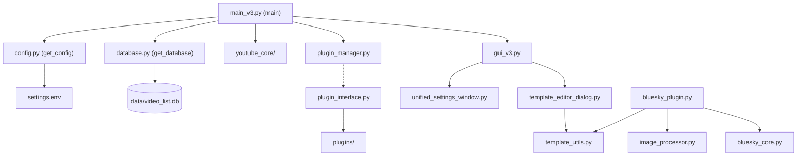
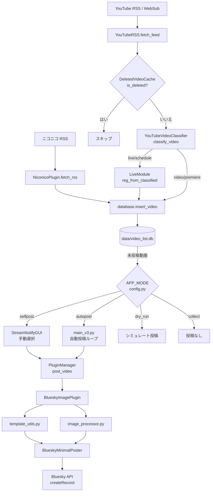

# 概要 (Overview)

関連ソースファイル
- [v1/docs/SETUP_GUIDE_v1.md](https://github.com/mayu0326/test/blob/abdd8266/v1/docs/SETUP_GUIDE_v1.md)
- [v2/CONTRIBUTING.md](https://github.com/mayu0326/test/blob/abdd8266/v2/CONTRIBUTING.md)
- [v2/docs/Technical/ARCHITECTURE_AND_DESIGN.md](https://github.com/mayu0326/test/blob/abdd8266/v2/docs/Technical/ARCHITECTURE_AND_DESIGN.md)
- [v3/docs/CONTRIBUTING.md](https://github.com/mayu0326/test/blob/abdd8266/v3/docs/CONTRIBUTING.md)
- [v3/docs/References/ModuleList_v3.md](https://github.com/mayu0326/test/blob/abdd8266/v3/docs/References/ModuleList_v3.md)
- [v3/docs/Technical/Archive/ARCHITECTURE_AND_DESIGN.md](https://github.com/mayu0326/test/blob/abdd8266/v3/docs/Technical/Archive/ARCHITECTURE_AND_DESIGN.md)
- [v3/readme_v3.md](https://github.com/mayu0326/test/blob/abdd8266/v3/readme_v3.md)
- [wiki/Getting-Started-Setup.md](https://github.com/mayu0326/test/blob/abdd8266/wiki/Getting-Started-Setup.md)

このページでは、StreamNotify の機能、設計原則、および主要コンポーネントのマップについて紹介します。ステップバイステップのセットアップ手順については [クイックスタート](./Getting-Started.md) を、詳細なアーキテクチャとモジュールのドキュメントについては [アーキテクチャ](./Architecture.md) を参照してください。

---

## StreamNotify の機能

StreamNotify は、YouTube とニコニコ動画のチャンネルを監視して新しい動画アクティビティを検出し、Bluesky に通知を投稿するローカル常駐型アプリケーションです。全体のパイプラインは以下の通りです：

1. YouTube RSS フィード（または WebSub プッシュ）およびニコニコ RSS から新しい動画のメタデータを取得。
2. ローカルの SQLite データベース (`data/video_list.db`) で分類、重複排除、およびレコードの保存。
3. Jinja2 テンプレートを使用して通知投稿をレンダリング（オプションでサムネイル画像の添付が可能）。
4. レンダリングされた投稿を HTTP API 経由で Bluesky に公開。

アプリケーションはバックグラウンドプロセスとして継続的に実行されます。Tkinter GUI (`gui_v3.py`) により、動画データベースの閲覧や、手動投稿、スケジューリング、設定、テンプレート編集などのコントロールが提供されます。

情報源: [v3/readme_v3.md (L1-20)](https://github.com/mayu0326/test/blob/abdd8266/v3/readme_v3.md#L1-L20), [v3/docs/Technical/Archive/ARCHITECTURE_AND_DESIGN.md (L22-70)](https://github.com/mayu0326/test/blob/abdd8266/v3/docs/Technical/Archive/ARCHITECTURE_AND_DESIGN.md#L22-L70)

---

## 設計原則

| 原則 | 説明 |
| :--- | :--- |
| **完全ローカル完結** | すべての状態（データベース、テンプレート、画像、ログ）はローカルファイルシステムに保存されます。ターゲットプラットフォーム以外にクラウドサービスは不要です。 |
| **ポーリングベース（プッシュサポート付）** | YouTube は定期的な RSS ポーリングで監視されます。オプションの WebSub プッシュ通知により遅延を削減可能です。ニコニコは RSS のみです。 |
| **2層構造: コア + 拡張** | 最小限のコアが RSS 取得、データベース書き込み、基本的な Bluesky 投稿を処理します。オプションのプラグインが画像処理、YouTube ライブ検出、ニコニコ監視、詳細ログを追加します。 |
| **プラグインによる拡張性** | すべての通知および取得拡張機能は `plugin_interface.py` で定義された `NotificationPlugin` 抽象インターフェースを実装し、`plugin_manager.py` で管理されます。 |
| **非侵襲的なアセット管理** | `AssetManager` クラスは、ユーザーによる編集を保護するため、ファイルが存在しない場合にのみ `Asset/` から実行ディレクトリにテンプレートと画像を配備します。 |

情報源: [v3/docs/Technical/Archive/ARCHITECTURE_AND_DESIGN.md (L22-70)](https://github.com/mayu0326/test/blob/abdd8266/v3/docs/Technical/Archive/ARCHITECTURE_AND_DESIGN.md#L22-L70), [v3/readme_v3.md (L334-372)](https://github.com/mayu0326/test/blob/abdd8266/v3/readme_v3.md#L334-L372)

---

## トップレベル・コンポーネント・マップ

以下の図は、システム構成概念を、それらを担当するソースファイルおよびクラスに直接マッピングしたものです。

**図: StreamNotify コンポーネントマップ（コード実体）**

情報源: [v3/docs/Technical/Archive/ARCHITECTURE_AND_DESIGN.md (L73-116)](https://github.com/mayu0326/test/blob/abdd8266/v3/docs/Technical/Archive/ARCHITECTURE_AND_DESIGN.md#L73-L116), [v3/docs/References/ModuleList_v3.md (L1-90)](https://github.com/mayu0326/test/blob/abdd8266/v3/docs/References/ModuleList_v3.md#L1-L90)

---

## 主要モジュール一覧

### コア・モジュール
| ファイル | 主要クラス / 関数 | 役割 |
| :--- | :--- | :--- |
| `main_v3.py` | `main()` | アプリのエントリーポイント。全サブシステムの初期化、メインポーリングループの実行。 |
| `config.py` | `get_config()` | `settings.env` の読み込みと検証。全モジュールで使用される設定オブジェクトを返す。 |
| `database.py` | `get_database()` | SQLite へのシングルトンアクセサ。`video_list.db` への CRUD 操作を担当。 |
| `youtube_core/youtube_rss.py` | `YouTubeRSS` | YouTube Atom RSS の取得と解析。UTC から JST への変換。分類器へのルート。 |
| `youtube_core/youtube_video_classifier.py` | `YouTubeVideoClassifier` | 動画の分類（`video`, `live`, `archive`, `schedule`, `completed`）。 |
| `youtube_core/youtube_websub.py` | `YouTubeWebSub` | ポーリングの代替手段として WebSub プッシュ通知コールバックを処理。 |
| `bluesky_core.py` | `BlueskyMinimalPoster` | Bluesky セッション作成と `createRecord` 呼び出しの管理。 |
| `plugin_manager.py` | `PluginManager` | プラグインの発見、ロード、有効化/無効化。`post_video_with_all_enabled()` を提供。 |
| `plugin_interface.py` | `NotificationPlugin` | 全プラグインが実装すべき抽象基底クラス。 |
| `asset_manager.py` | `AssetManager` | 起動時に `Asset/` から実行ディレクトリへアセットを（上書きせずに）コピー。 |
| `deleted_video_cache.py` | `get_deleted_video_cache()` | フィードから消えた動画 ID を追跡し再処理を防止。`data/deleted_videos.json` を使用。 |

### 拡張プラグイン
| ファイル | 主要クラス | 役割 |
| :--- | :--- | :--- |
| `plugins/bluesky_plugin.py` | `BlueskyImagePlugin` | `BlueskyMinimalPoster` をラップ。Jinja2 レンダリングと画像アップロードを追加。 |
| `plugins/youtube/youtube_api_plugin.py` | `YouTubeAPIPlugin` | YouTube Data API を呼び出し詳細なメタデータを取得。クォータを追跡。 |
| `plugins/youtube/live_module.py` | `YouTubeLivePlugin` | ライブ配信状態の管理（分類器 → 保存 → ポーリング → 自動投稿の4層構造）。 |
| `plugins/niconico_plugin.py` | `NiconicoPlugin` | ニコニコ RSS をポーリングし、共有データベースにレコードを挿入。 |
| `plugins/logging_plugin.py` | `LoggingPlugin` | ログローテーションを含む、名前付きロガーの階層構造をセットアップ。 |

### GUI モジュール
| ファイル | 主要クラス | 役割 |
| :--- | :--- | :--- |
| `gui_v3.py` | `StreamNotifyGUI` | メインウィンド。動画ツリービュー、ツールバー、フィルタ、手動投稿。 |
| `unified_settings_window.py` | `UnifiedSettingsWindow` | `settings.env` を読み書きするタブ式設定エディタ。 |
| `template_editor_dialog.py` | `TemplateEditorDialog` | ライブプレビュー可能な Jinja2 テンプレートエディタ。 |

情報源: [v3/docs/References/ModuleList_v3.md (L1-167)](https://github.com/mayu0326/test/blob/abdd8266/v3/docs/References/ModuleList_v3.md#L1-L167), [v3/docs/Technical/Archive/ARCHITECTURE_AND_DESIGN.md (L305-340)](https://github.com/mayu0326/test/blob/abdd8266/v3/docs/Technical/Archive/ARCHITECTURE_AND_DESIGN.md#L305-L340)

---

## データフロー: RSS から Bluesky 投稿まで

以下の図は、1つの新しい動画がコードを通過するライフサイクルを辿り、各ステップでの具体的な関数やクラスを示しています。

**図: RSS 取得から Bluesky 投稿までの動画ライフサイクル**

情報源: [v3/docs/Technical/Archive/ARCHITECTURE_AND_DESIGN.md (L73-116)](https://github.com/mayu0326/test/blob/abdd8266/v3/docs/Technical/Archive/ARCHITECTURE_AND_DESIGN.md#L73-L116), [v3/docs/References/ModuleList_v3.md (L1-90)](https://github.com/mayu0326/test/blob/abdd8266/v3/docs/References/ModuleList_v3.md#L1-L90)

---

## 起動シーケンス

`main_v3.py` が実行されると、ポーリングループが開始される前に以下の初期化ステップが行われます：

1. `config.py` が `get_config()` を介して `settings.env` を読み込み検証する。
2. `database.py` が `get_database()` を介して初期化される（未作成ならテーブルを作成）。
3. `deleted_video_cache.py` が `get_deleted_video_cache()` を介して `data/deleted_videos.json` をロードする。
4. `youtube_core/youtube_video_classifier.py` が初期化される。
5. `plugin_manager.py` が `plugins/` から全プラグインを検出しロードする。
6. `asset_manager.py` が有効な各プラグインのテンプレートと画像を配備する。
7. `bluesky_core.py` が `BlueskyMinimalPoster` インスタンスを作成する。
8. `gui_v3.py` が `StreamNotifyGUI` を別スレッドで起動する。
9. メインループの開始：設定された間隔で YouTube RSS をポーリングし、分類し、`APP_MODE` に応じて `PluginManager` を通じて投稿を行う。

情報源: [v3/docs/Technical/Archive/ARCHITECTURE_AND_DESIGN.md (L394-499)](https://github.com/mayu0326/test/blob/abdd8266/v3/docs/Technical/Archive/ARCHITECTURE_AND_DESIGN.md#L394-L499)

---

## 動作モード (Operation Modes)

`settings.env` の `APP_MODE` 設定によって投稿動作を制御します。詳細は [動作モード](./Operation-Modes.md) を参照してください。

| `APP_MODE` の値 | 動作 |
| :--- | :--- |
| `selfpost` | GUI で手動選択された動画のみを投稿します。 |
| `autopost` | 安全しきい値に従い、ルックバック期間内の未投稿動画を自動的に投稿します。 |
| `dry_run` | データベースへの書き込みや Bluesky API の呼び出しを行わずに、投稿をシミュレートします。 |
| `collect` | 新しい動画の取得と保存のみを行い、すべての投稿をスキップします。 |

情報源: [v3/docs/Technical/Archive/ARCHITECTURE_AND_DESIGN.md (L95-115)](https://github.com/mayu0326/test/blob/abdd8266/v3/docs/Technical/Archive/ARCHITECTURE_AND_DESIGN.md#L95-L115)

---

## 次に読むべきページ

| 項目 | Wiki ページ |
| :--- | :--- |
| 初回のセットアップと実行 | [クイックスタート](./Getting-Started.md) |
| `settings.env` の全変数 | [構成リファレンス](./Configuration-Reference.md) |
| コアモジュールの詳細 | [コア・モジュール](./Core-Modules.md) |
| プラグインの構造とライフサイクル | [プラグイン・システム](./Plugin-System.md) |
| データベース・スキーマ | [データベースと削除済み動画キャッシュ](./Database-&-Deleted-Video-Cache.md) |
| GUI の使い方 | [グラフィカル・ユーザー・インターフェース](./Graphical-User-Interface.md) |
| YouTube RSS、WebSub、ライブ検出 | [YouTube 連携](./YouTube-Integration.md) |
| Bluesky 投稿パイプライン | [Bluesky 連携](./Bluesky-Integration.md) |