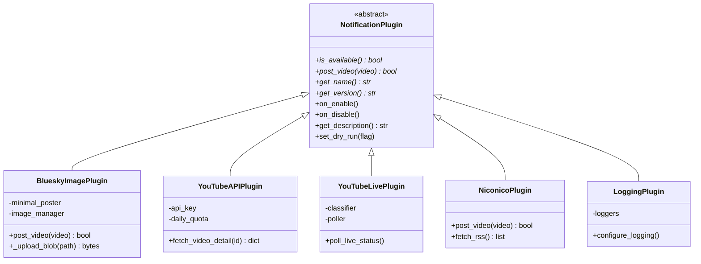
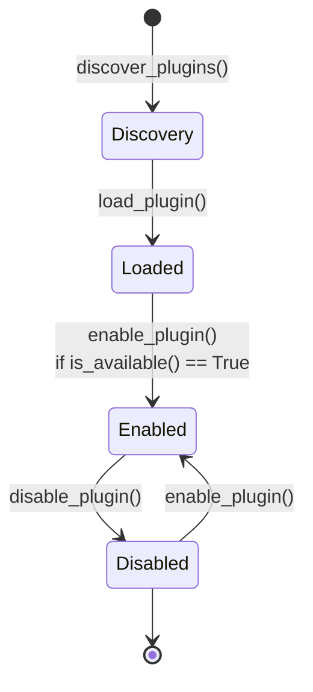
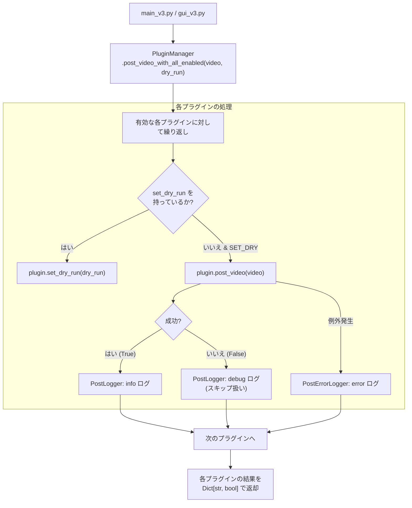

# プラグインシステム (Plugin System)

関連ソースファイル
- [v1/docs/SETUP_GUIDE_v1.md](https://github.com/mayu0326/test/blob/abdd8266/v1/docs/SETUP_GUIDE_v1.md)
- [v2/CONTRIBUTING.md](https://github.com/mayu0326/test/blob/abdd8266/v2/CONTRIBUTING.md)
- [v2/plugin_manager.py](https://github.com/mayu0326/test/blob/abdd8266/v2/plugin_manager.py)
- [v2/thumbnails/youtube_thumb_utils.py](https://github.com/mayu0326/test/blob/abdd8266/v2/thumbnails/youtube_thumb_utils.py)
- [v3/docs/CONTRIBUTING.md](https://github.com/mayu0326/test/blob/abdd8266/v3/docs/CONTRIBUTING.md)
- [v3/docs/Technical/Archive/ARCHITECTURE_AND_DESIGN.md](https://github.com/mayu0326/test/blob/abdd8266/v3/docs/Technical/Archive/ARCHITECTURE_AND_DESIGN.md)
- [v3/plugin_manager.py](https://github.com/mayu0326/test/blob/abdd8266/v3/plugin_manager.py)
- [v3/readme_v3.md](https://github.com/mayu0326/test/blob/abdd8266/v3/readme_v3.md)
- [v3/thumbnails/youtube_thumb_utils.py](https://github.com/mayu0326/test/blob/abdd8266/v3/thumbnails/youtube_thumb_utils.py)
- [wiki/Getting-Started-Setup.md](https://github.com/mayu0326/test/blob/abdd8266/wiki/Getting-Started-Setup.md)

このページでは、StreamNotify の拡張レイヤーについて説明します。具体的には、`NotificationPlugin` 抽象インターフェース、`PluginManager` のライフサイクル（発見 → ロード → 有効化 → 無効化）、および `post_video_with_all_enabled()` がどのようにアクティブな全プラグインに通知をルーティングするかについて網羅しています。また、新しいプラグインを実装するために必要な要件についても触れます。

プラグインレイヤーが 2 階層アーキテクチャ全体の中でどのように位置づけられているかについては、[アーキテクチャ](./Architecture.md) を参照してください。Bluesky 投稿ツールや YouTube ライブ検出器などの個別のプラグインの詳細については、[Bluesky 統合](./Bluesky-Integration.md) および [YouTube ライブ検出](./YouTube-Live-Detection.md) を参照してください。

---

## 概要 (Overview)

プラグインシステムは、コア機能（RSS ポーリング、データベース、GUI）を、プラットフォーム固有の統合機能（Bluesky 投稿、YouTube API、ニコニコ動画、ロギング）から切り離します。すべてのプラグインは `plugin_interface.py` で定義された `NotificationPlugin` 抽象基底クラスを実装します。`v3/plugin_manager.py` にある `PluginManager` が、これらのプラグインの発見、ロード、有効化、およびメソッドの呼び出し（ルーティング）を管理します。

**プラグインディレクトリのレイアウト:**

```
plugins/
├── bluesky_plugin.py          # BlueskyImagePlugin
├── niconico_plugin.py         # NiconicoPlugin
├── logging_plugin.py          # LoggingPlugin
└── youtube/
    ├── youtube_api_plugin.py  # YouTubeAPIPlugin
    └── live_module.py         # YouTubeLivePlugin (および補助クラス)
```

情報源: [v3/readme_v3.md (L135-142)](https://github.com/mayu0326/test/blob/abdd8266/v3/readme_v3.md#L135-L142), [v3/docs/Technical/Archive/ARCHITECTURE_AND_DESIGN.md (L215-224)](https://github.com/mayu0326/test/blob/abdd8266/v3/docs/Technical/Archive/ARCHITECTURE_AND_DESIGN.md#L215-L224)

---

## `NotificationPlugin` インターフェース

すべてのプラグインは `v3/plugin_interface.py` の `NotificationPlugin` を継承する必要があります。このインターフェースは、4 つの **必須** 抽象メソッドと、いくつかの **任意** のフックメソッドを定義しています。

**プラグインシステムのクラス階層**



情報源: [v3/docs/Technical/Archive/ARCHITECTURE_AND_DESIGN.md (L152-183)](https://github.com/mayu0326/test/blob/abdd8266/v3/docs/Technical/Archive/ARCHITECTURE_AND_DESIGN.md#L152-L183)

### メソッドリファレンス

| メソッド | 必須 | 返り値 | 目的 |
| :--- | :--- | :--- | :--- |
| `is_available()` | ✅ | `bool` | 依存関係や認証情報が揃っているか。`enable_plugin()` 前に呼ばれる。 |
| `post_video(video)` | ✅ | `bool` | ターゲットプラットフォームへ投稿を行う。成功時に `True` を返す。 |
| `get_name()` | ✅ | `str` | ログや GUI で表示される、人間が読みやすいプラグイン名。 |
| `get_version()` | ✅ | `str` | セマンティックバージョニング形式の文字列 (例: `"1.0.0"`)。 |
| `on_enable()` | 任意 | `None` | プラグインが `enabled_plugins` に追加された直後に呼ばれるコールバック。 |
| `on_disable()` | 任意 | `None` | プラグインが無効化されたときに呼ばれるコールバック。 |
| `get_description()` | 任意 | `str` | 管理 UI で表示される短い説明文。 |
| `set_dry_run(flag)` | 任意 | `None` | `PluginManager` がテスト投稿フラグを伝搬させるために使用。 |

---

## `PluginManager` のライフサイクル

`PluginManager` (`v3/plugin_manager.py`) は 2 つの内部辞書を管理します。

- `loaded_plugins`: インスタンス化されたすべてのプラグイン。
- `enabled_plugins`: `is_available()` をパスし、実際にアクティブなプラグインのサブセット。

**プラグイン・ライフサイクルの状態遷移図**



### 1. 発見 (Discovery) — `discover_plugins()`

指定された `plugins/` ディレクトリ配下をスキャンします。

1. **ルート直下** — `plugins/*.py`
2. **サブディレクトリ** — `plugins/<subdir>/<name>.py`

`_` で始まるファイルはスキップされます。また、ファイル内容を正規表現で軽くチェックし、`NotificationPlugin` を継承しているクラスが含まれているか確認します。

### 2. ロード (Loading) — `load_plugin(name, path)`

`importlib.util` を使用して、ディスクからモジュールを動的にロードします。モジュール内を調べて `NotificationPlugin` のサブクラス（かつ自身の定義場所がそのモジュールであるもの）を見つけ、インスタンスを作成して `loaded_plugins` に格納します。

### 3. 有効化 (Enabling) — `enable_plugin(name)`

1. `plugin.is_available()` を呼び出します。`False` の場合は有効化を中止します。
2. プラグインを `enabled_plugins` に追加します。
3. `plugin.on_enable()` コールバックを呼び出します。

### 4. 無効化 (Disabling) — `disable_plugin(name)`

`enabled_plugins` から削除し、`plugin.on_disable()` を呼び出します。ロード済みのインスタンスは保持されるため、後で再度有効にすることが可能です。

---

## 通知ルーティング — `post_video_with_all_enabled()`

これは、動画レコードをすべてのアクティブなプラグインに送信するための単一の呼び出しポイントです。`main_v3.py` (自動投稿) や `gui_v3.py` (手動投稿ボタン) から呼び出されます。

**投稿ルーティングのフロー**



重要な挙動:
- `dry_run=True` は、プラグインに `set_dry_run` メソッドがあれば自動的に伝搬されます。
- `post_video()` からの例外は、個々のプラグインごとにキャッチされ、他のプラグインの処理を妨げません。

---

## 同梱されているプラグイン (Bundled Plugins)

| プラグイン名 (キー) | クラス名 | ファイル名 | 役割 |
| :--- | :--- | :--- | :--- |
| `bluesky_image_plugin` | `BlueskyImagePlugin` | `plugins/bluesky_plugin.py` | テンプレートの描画、画像アップロード、Bluesky への投稿。 |
| `youtube_api_plugin` | `YouTubeAPIPlugin` | `plugins/youtube/youtube_api_plugin.py` | YouTube Data API v3 による動画情報の取得、クォータ管理。 |
| `youtube_live_plugin` | `YouTubeLivePlugin` | `plugins/youtube/live_module.py` | ライブ配信の検出、状態監視、自動投稿。 |
| `niconico_plugin` | `NiconicoPlugin` | `plugins/niconico_plugin.py` | ニコニコ動画 RSS の監視、DB への挿入。 |
| `logging_plugin` | `LoggingPlugin` | `plugins/logging_plugin.py` | ログ出力、ファイルローテーション、デバッグモードの設定。 |

> **注:** `bluesky_image_plugin` は、自動発見ではなく `main_v3.py` で直接インスタンス化され、手動で登録されます。それ以外は自動発見されます。

---

## 新しいプラグインの実装

プラグインを追加するには、`plugins/` ディレクトリ（またはそのサブディレクトリ）に、`NotificationPlugin` を継承したクラスを定義する `.py` ファイルを作成します。

**最小限の実装例:**

```python
# plugins/my_plugin.py
from plugin_interface import NotificationPlugin
from typing import Dict, Any
import os

class MyPlugin(NotificationPlugin):
    def is_available(self) -> bool:
        return os.getenv("MY_API_KEY") is not None

    def post_video(self, video: Dict[str, Any]) -> bool:
        # video のキー: video_id, title, video_url, source, content_type 等
        try:
            # ここに投稿処理を記述
            return True
        except Exception:
            return False

    def get_name(self) -> str:
        return "MyPlugin"

    def get_version(self) -> str:
        return "1.0.0"
```

**新しいプラグイン作成時のチェックリスト:**
- `NotificationPlugin` を直接継承していること。
- `is_available()` は認証情報がない場合に適切に `False` を返すこと。
- `post_video()` は致命的でないスキップの場合、例外を投げずに `False` を返すこと。
- 動画情報の辞書 (`video`) を破壊的に変更（書き換え）しないこと。
- テンプレートや画像などの静的アセットが必要な場合は `Asset/` ディレクトリを使用すること（詳細は [アセット管理](./Asset-Management.md) を参照）。