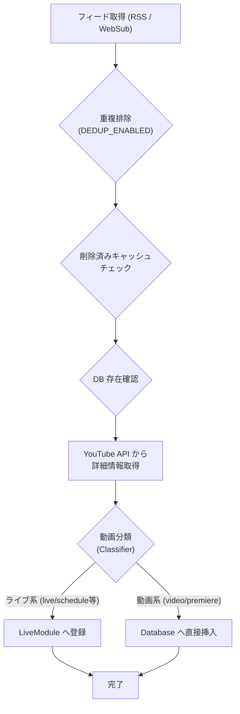

# RSS と WebSub フィード処理 (RSS & WebSub Feed Processing)

関連ソースファイル
- [v3/youtube_core/youtube_rss.py](https://github.com/mayu0326/test/blob/abdd8266/v3/youtube_core/youtube_rss.py)
- [v3/youtube_core/youtube_websub.py](https://github.com/mayu0326/test/blob/abdd8266/v3/youtube_core/youtube_websub.py)
- [v3/settings.env.example](https://github.com/mayu0326/test/blob/abdd8266/v3/settings.env.example)

このページでは、StreamNotify がどのように YouTube 動画データを取得し、解析し、データベースに保存するかを説明します。`v3/youtube_core/` 内の `YouTubeRSS` および `YouTubeWebSub` クラス、および動画を `LiveModule` または `database.insert_video()` に振り分ける分類ロジックについてカバーします。

---

## フィード取得モード

StreamNotify は、YouTube 動画データを取得するために、互いに排他的な 2 つのモードをサポートしています。これは `settings.env` の `YOUTUBE_FEED_MODE` で制御されます。

| モード | 変数値 | 通信方式 | 特徴 |
| :--- | :--- | :--- | :--- |
| **RSS ポーリング** | `poll` | HTTP GET | 定期的に YouTube の Atom フィードを読みに行きます（プル型）。 |
| **WebSub プッシュ** | `websub` | HTTP POST | サーバーからの通知をリアルタイムで受け取ります（プッシュ型）。 |

※ WebSub モードを使用するには、外部からアクセス可能なコールバック URL と専用の API キーが必要です。

---

## データ保存までの流れ (save_to_db)

どちらのモードでも、最終的には共通の `save_to_db()` メソッドが実行され、以下のステップで処理が進みます。

### ステップ 1: 重複排除 (Duplicate Elimination)
同じ動画 ID、タイトル、チャンネル名の組み合わせがフィード内に複数存在する場合、最初の 1 つだけを残します。

### ステップ 2: 削除済みキャッシュチェック
過去にフィードから消えた（投稿者が削除した）として記録されている動画 ID (`data/deleted_videos.json`) は、再取得されないようスキップされます。

### ステップ 3: YouTube API による詳細補完
YouTube Data API が利用可能な場合、正確な「配信開始予定時刻」や「チャンネル名」を補完します。RSS フィード上の時刻よりも API のデータが優先されます。

### ステップ 4: 分類と振り分け
各動画は `YouTubeVideoClassifier` によって分類されます。
- **ライブ動画/放送枠**: `LiveModule` に送られ、そこからライブ監視状態に入ります。
- **通常の動画**: 直接 `video_list.db` に挿入され、投稿待ちリストに入ります。

---

## WebSub モジュールの役割

`YOUTUBE_FEED_MODE=websub` の場合、`YouTubeWebSub` クラスが使用されます。
- WebSub 自体は「動画 ID」と「通知時刻」しか提供しないため、タイトルやサムネイル情報を得るために API 呼び出しを組み合わせて使用します。
- ポーリング（`poll`）と比べて、動画公開から通知までのラグが大幅に短縮されます。

---

## 主な設定項目 (settings.env)

| 変数名 | デフォルト | 内容 |
| :--- | :--- | :--- |
| `YOUTUBE_FEED_MODE` | `poll` | `poll` または `websub` を指定。 |
| `YOUTUBE_RSS_POLL_INTERVAL_MINUTES` | 10分 | RSS モード時の監視間隔。 |
| `YOUTUBE_DEDUP_ENABLED` | `true` | 重複排除を有効にするか。 |
| `WEBSUB_CALLBACK_URL` | (空) | WebSub モード時の受け取り口 URL。 |