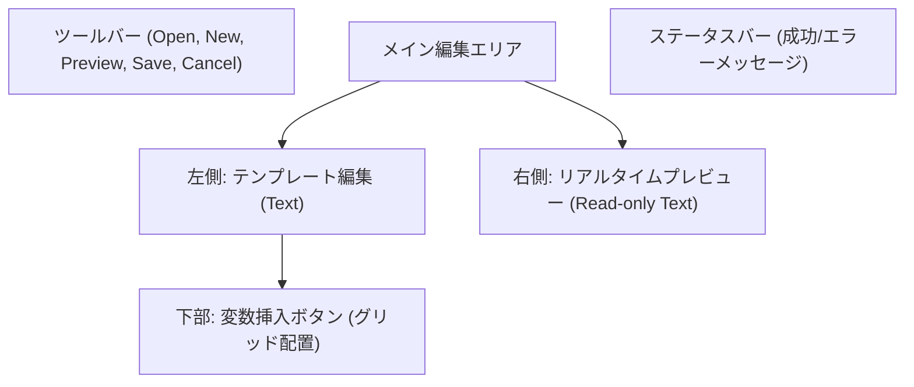
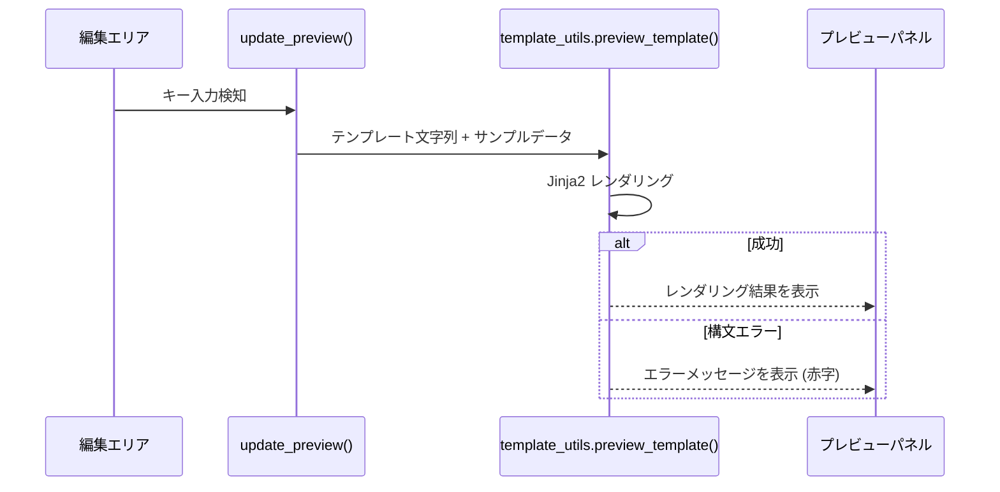

# テンプレートエディタ (Template Editor)

関連ソースファイル
- [v3/template_editor_dialog.py](https://github.com/mayu0326/test/blob/abdd8266/v3/template_editor_dialog.py)
- [v3/template_utils.py](https://github.com/mayu0326/test/blob/abdd8266/v3/template_utils.py)
- [v2/docs/Technical/bluesky_template_manager.py](https://github.com/mayu0326/test/blob/abdd8266/v2/docs/Technical/bluesky_template_manager.py)

`TemplateEditorDialog` は、Bluesky への投稿本文を生成するための Jinja2 テンプレートを編集・プレビューするためのダイアログです。リアルタイムのプレビュー機能や、クリックするだけで変数を挿入できるボタンシステムを備えています。

テンプレートレンダリングエンジンの詳細（フィルタや利用可能な変数の一覧）については [テンプレートシステム](./Template-System.md) を参照してください。

---

## 概要

テンプレートエディタは、`StreamNotifyGUI` のツールバーから起動します。
- **テンプレート種別ごと**: 1 つのエディタインスタンスは、1 つのテンプレート種別（例：YouTube 新着動画）を扱います。
- **リアルタイムプレビュー**: 編集中の内容は、サンプルデータを使用して即座に右側のパネルに反映されます。
- **即時反映**: 保存した内容は、次回の投稿時から即座に使用されます（アプリの再起動は不要です）。

---

## 画面レイアウト

ウィンドウサイズは 1000x700 ピクセルで、ダークテーマが採用されています。

---

## 変数挿入ボタン

ダイアログ下部には、そのテンプレート種別で使用可能な変数がボタンとして並んでいます。ボタンをクリックすると、カーソル位置に `{{ title }}` のような Jinja2 形式のタグが挿入されます。

**挿入される主な変数例:**
- **YouTube 新着**: 動画タイトル (`title`), URL (`video_url`), 投稿日 (`published_at | datetimeformat(...)`)
- **YouTube ライブ**: 配信タイトル, 配信ステータス (`live_status`), 予定時刻
- **ニコニコ新着**: 動画タイトル, 投稿者名

---

## リアルタイムプレビューの仕組み

プレビューパネルは、編集エリアの内容が変更される（キー入力がある）たびに自動で更新されます。

サンプルデータ (`get_sample_context()`) は、各テンプレート種別において現実的で見栄えの良いダミーデータ（「サンプル動画タイトル」など）を提供します。

---

## 保存の挙動

「保存 (Save)」ボタンをクリックすると、以下の処理が行われます。

1. **バリデーション**: 最終的なレンダリングチェックを行い、構文エラーがないか確認します。エラーがある場合は警告が表示されますが、無視して保存することも可能です。
2. **ファイル書込**: 
   - 既存のファイルを開いている場合は、そのファイルを上書きします。
   - 新規作成の場合は、保存先を選択するダイアログが表示されます。
3. **反映**: 保存後、次に Bluesky 投稿が行われる際に、この新しいファイルが読み込まれます。

---

## プラグインとの連携

`BlueskyImagePlugin` は投稿時に `classification_type` に基づいて適切なテンプレートを自動選択します。

| 分類 (Type) | 使用されるテンプレート |
| :--- | :--- |
| `video` | `youtube_new_video` |
| `live` | `youtube_online` |
| `schedule` | `youtube_schedule` |
| `completed` | `youtube_offline` |
| `nico` | `nico_new_video` |