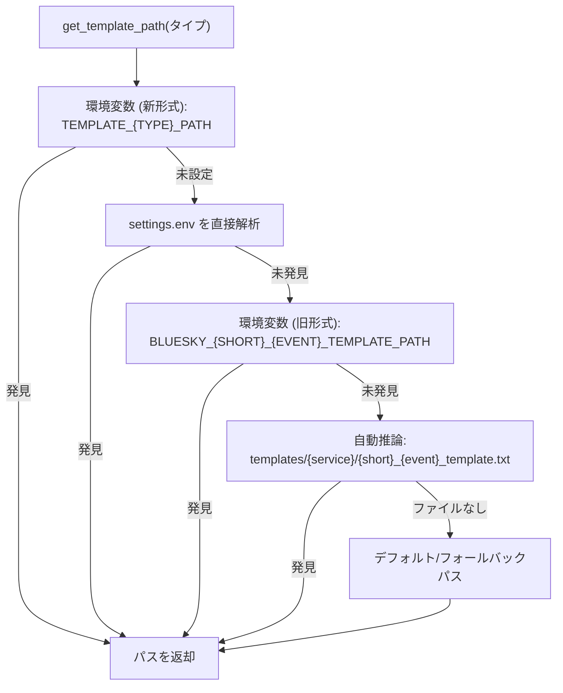
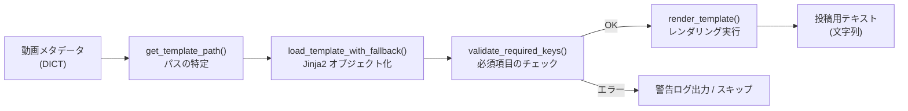
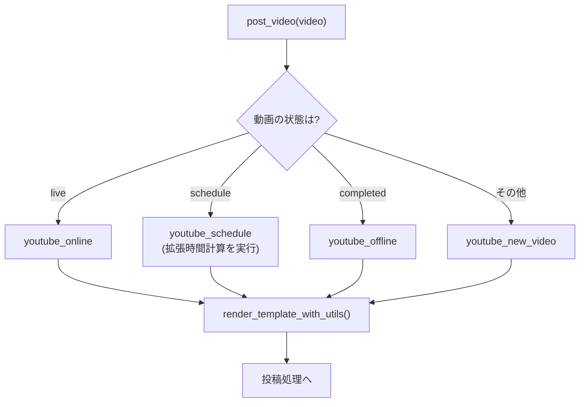

# テンプレートシステム (Template System)

関連ソースファイル
- [v2/docs/ARCHIVE/TEMPLATE_IMPLEMENTATION_CHECKLIST.md](https://github.com/mayu0326/test/blob/abdd8266/v2/docs/ARCHIVE/TEMPLATE_IMPLEMENTATION_CHECKLIST.md)
- [v2/docs/Technical/TEMPLATE_SYSTEM.md](https://github.com/mayu0326/test/blob/abdd8266/v2/docs/Technical/TEMPLATE_SYSTEM.md)
- [v2/docs/Technical/bluesky_template_manager.py](https://github.com/mayu0326/test/blob/abdd8266/v2/docs/Technical/bluesky_template_manager.py)
- [v2/plugins/bluesky_plugin.py](https://github.com/mayu0326/test/blob/abdd8266/v2/plugins/bluesky_plugin.py)
- [v2/template_utils.py](https://github.com/mayu0326/test/blob/abdd8266/v2/template_utils.py)
- [v3/plugins/bluesky_plugin.py](https://github.com/mayu0326/test/blob/abdd8266/v3/plugins/bluesky_plugin.py)
- [v3/template_editor_dialog.py](https://github.com/mayu0326/test/blob/abdd8266/v3/template_editor_dialog.py)
- [v3/template_utils.py](https://github.com/mayu0326/test/blob/abdd8266/v3/template_utils.py)

このページでは、動画のメタデータから Bluesky 投稿用のテキストを生成するために使用されるテンプレートシステムについて説明します。このシステムは主に `v3/template_utils.py` および `v2/template_utils.py` で実装されており、`BlueskyImagePlugin` の `render_template_with_utils()` メソッドを通じて利用されます。

最終的な Bluesky 投稿レコード（ facets, embeds 等）にレンダリングされたテキストがどのように含まれるかについては、[Bluesky 統合](./Bluesky-Integration.md) を参照してください。ユーザーが対話的にテンプレートを編集できる GUI ダイアログについては、[テンプレートエディタ](./Template-Editor.md)（仮）を参照してください。

---

## 主な役割

`template_utils.py` は以下の機能を提供します。

- **パス解決** — 指定されたイベントタイプに対して正しい `.txt` テンプレートファイルを特定します。
- **ロード** — ファイルを読み込み、Jinja2 の `Template` オブジェクトに変換します（エラー時のフォールバック機能付き）。
- **バリデーション** — レンダリング前に、必要なコンテキストキー（動画情報）がすべて揃っているか確認します。
- **レンダリング** — 動画メタデータの辞書をコンテキストとして渡し、Jinja2 でテキストを生成します。
- **拡張時間処理** — 早朝の時間帯を「27:00」のような形式で扱う処理を行います。
- **GUI サポート** — テンプレートエディタ用のサンプルコンテキスト生成やプレビュー機能を提供します。

---

## テンプレートファイルの配置

テンプレートは Jinja2 形式の `.txt` ファイルです。標準的なディレクトリ構造は以下の通りです。

```
templates/
├── youtube/
│   ├── yt_new_video_template.txt
│   ├── yt_online_template.txt
│   ├── yt_offline_template.txt
│   └── yt_schedule_template.txt
├── niconico/
│   └── nico_new_video_template.txt
└── .templates/
    ├── default_template.txt            ← デフォルト
    └── fallback_template.txt           ← 最終的なフォールバック
```

---

## テンプレートタイプ

各テンプレートタイプは、プラットフォームとイベントの組み合わせに対応しています。`TEMPLATE_REQUIRED_KEYS` 辞書によって、レンダリングに必要な最小限のデータ項目が定義されています。

**表: TEMPLATE_REQUIRED_KEYS**
| テンプレートタイプ | 必須コンテキストキー（データ項目） |
| :--- | :--- |
| `youtube_new_video` | `title`, `video_id`, `video_url`, `channel_name` |
| `youtube_online` | `title`, `video_url`, `channel_name`, `live_status` |
| `youtube_offline` | `title`, `channel_name`, `live_status` |
| `nico_new_video` | `title`, `video_id`, `video_url`, `channel_name` |

---

## テンプレートパスの解決フロー

`get_template_path()` は、以下の順序でテンプレートファイルを探索します。



> **Note:** `os.getenv()` はシステムの環境変数のみを読み取るため、`.env` ファイルの内容を確実に取得するために `settings.env` を直接パースする仕組みが備わっています。

---

## コア機能のパイプライン



### 1. ロードとフォールバック
`load_template_with_fallback` はファイルを読み込み、Jinja2 テンプレートとしてコンパイルします。構文エラーやファイル欠落がある場合は、指定されたデフォルトパスのファイルを使用します。

### 2. コンテキストの検証
`validate_required_keys` は、投稿に必要な情報（URL やタイトルなど）が欠けていないかを確認します。

### 3. レンダリングと時間拡張
`render_template` は Jinja2 の `render()` を呼び出します。v3 では、このタイミングで「24時以降の表示用変数」がコンテキストに注入されます。

---

## カスタム Jinja2 フィルタ

テンプレート内で使用できる便利なフィルタが多数登録されています。

| フィルタ名 | 用途 | 例 |
| :--- | :--- | :--- |
| `datetimeformat` | 日時の書式設定 | `{{ published_at \| datetimeformat('%Y/%m/%d') }}` |
| `weekday` | 日本語の曜日 | `{{ published_at \| weekday }}` (→ 月, 火...) |
| `random_emoji` | ランダムな絵文字 | `{{ "" \| random_emoji }}` |
| `extended_time` | 24時形式への正規化 | `{{ "27:00" \| extended_time }}` (→ "03:00") |
| `extended_time_display` | 日本語拡張時間表示 | `{{ "27:00" \| extended_time_display }}` (→ "翌日3:00時") |

---

## 拡張時間の処理 (24時超表記)

深夜・早朝の配信を「27:00」のように表現する文化に対応するため、v3 では以下の処理が行われます。

1. **判定**: `published_at` の時間が 00:00 〜 11:59 の間であれば、「前日の延長線上の時間」とみなします。
2. **変数注入**: `extended_hour` (例: 27) と `extended_display_date` (前日の日付) を自動的に生成します。
3. **テンプレート利用**: 予約枠告知テンプレートなどで `{{ extended_hour }}` を使って「今夜 26:00 から！」といった投稿が可能になります。

---

## `BlueskyImagePlugin` との連携

プラグイン内の `post_video()` は、動画の状態（配信中、予約中、完了など）に応じて適切なテンプレートタイプを選択します。

**テンプレート選択のロジック:**



---

## テンプレートエディタ

`v3/template_editor_dialog.py` で実装されています。以下の特徴があります。

- **挿入ボタン**: `TEMPLATE_ARGS` に定義された変数をワンクリックで挿入可能。
- **ライブプレビュー**: キー入力のたびに `preview_template` が呼ばれ、レンダリング結果を即座に確認できます。
- **サンプルデータ**: `get_sample_context()` により、実際の動作に近いデータでプレビューが表示されます。

---

## フォールバック挙動 (Graceful Degradation)

システムは、エラーが発生しても投稿自体を止めないように設計されています。

| 発生した問題 | 挙動 | 結果 |
| :--- | :--- | :--- |
| 設定ミス / パス不明 | `default_template.txt` を使用 | 標準的なテキストで投稿 |
| ファイルなし | `fallback_template.txt` を使用 | 最小限のテキストで投稿 |
| 必須データ不足 | レンダリングをスキップ | プラグインのデフォルト形式で投稿 |
| 構文エラー / 実行時エラー | エラーをログ出力し `None` を返す | 未加工のデフォルト形式で投稿 |