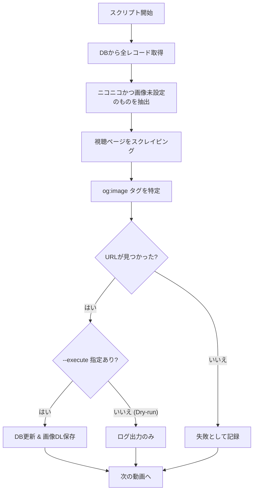

# サムネイル取得ツール (Thumbnail Backfill Tools)

関連ソースファイル
- [v2/thumbnails/niconico_ogp_backfill.py](https://github.com/mayu0326/test/blob/abdd8266/v2/thumbnails/niconico_ogp_backfill.py)
- [v2/thumbnails/youtube_thumb_backfill.py](https://github.com/mayu0326/test/blob/abdd8266/v2/thumbnails/youtube_thumb_backfill.py)
- [v3/thumbnails/niconico_ogp_backfill.py](https://github.com/mayu0326/test/blob/abdd8266/v3/thumbnails/niconico_ogp_backfill.py)
- [v3/thumbnails/youtube_thumb_backfill.py](https://github.com/mayu0326/test/blob/abdd8266/v3/thumbnails/youtube_thumb_backfill.py)

これらのスクリプトは、データベース内の動画レコードに対して、欠落しているサムネイル情報を遡及的に取得するためのコマンドラインツールです。
古いバージョンからの移行後や、何らかの理由で画像情報なしで登録されたレコードに対し、手動で実行して `thumbnail_url` や `image_filename` を補完します。

---

## 設置場所

v2 と v3 それぞれのディレクトリに存在します。

| スクリプト名 | v2 でのパス | v3 でのパス |
| :--- | :--- | :--- |
| ニコニコ OGP 取得 | `v2/thumbnails/niconico_ogp_backfill.py` | `v3/thumbnails/niconico_ogp_backfill.py` |
| YouTube サムネ取得 | `v2/thumbnails/youtube_thumb_backfill.py` | `v3/thumbnails/youtube_thumb_backfill.py` |

---

## コマンドライン・インターフェース

両方のスクリプトで共通のフラグを使用します。

| フラグ | デフォルト | 説明 |
| :--- | :--- | :--- |
| `--execute` | オフ | 実際に DB 更新とファイル保存を行います。指定しない場合は **Dry-run (テスト実行)** です。 |
| `--limit N` | なし | 最大 N 件の処理で停止します。 |
| `--verbose` | オフ | ログレベルを `DEBUG` に変更します。 |

### 実行例
```bash
# テスト実行 (何が更新されるか確認するだけ)
python -m thumbnails.niconico_ogp_backfill

# 実際に更新を実行 (niconico 用)
python -m thumbnails.niconico_ogp_backfill --execute

# 最大 10 件まで YouTube のサムネイルを取得
python -m thumbnails.youtube_thumb_backfill --execute --limit 10
```

---

## 処理の対象選択

スクリプトは全動画レコードをロードし、以下の条件すべてに合致するものを「取得対象」とみなします。
1. `source` が対象サービス (`youtube` または `niconico`) であること。
2. `thumbnail_url` または `image_filename` のどちらかが空であること。

---

## ニコニコ動画の OGP 取得

ニコニコ動画の視聴ページ (`nicovideo.jp/watch/{video_id}`) にアクセスし、HTML 内の `<meta property="og:image">` タグを解析して、1280x720 などの高解像度サムネイル URL を特定します。

**処理フロー:**



---

## YouTube サムネイル取得

YouTube の場合はスクレイピングではなく、YouTube のサムネイル配信サーバー（CDN）に対して、高解像度から順にアクセスを試みる「フォールバック・チェーン」方式を採用しています。

**解像度の優先順位:**
1. `maxresdefault` (1280x720)
2. `sddefault` (640x480)
3. `hqdefault` (480x360)
4. `mqdefault` (320x180)
5. `default` (120x90)

最初に有効な画像が返ってきた URL を採用します。

---

## 更新されるデータベース項目

成功すると、以下の 3 つのフィールドが更新されます。

| フィールド | 説明 |
| :--- | :--- |
| `thumbnail_url` | 取得した画像の直リンク URL。 |
| `image_mode` | `"import"` (外部から取り込まれた画像) として設定されます。 |
| `image_filename` | 保存されたローカルファイル名。 |

画像ファイルは、それぞれ `images/Niconico/import/` または `images/YouTube/import/` に保存されます。

---

## 実行後のサマリー

終了時に、以下のような実行結果の統計が表示されます。

```
=== SUMMARY ===
サムネURL更新: 5 件
画像保存: 5 件
失敗: 0 件
```
※ Dry-run の場合、更新と保存の件数は常に 0 件と表示されます。