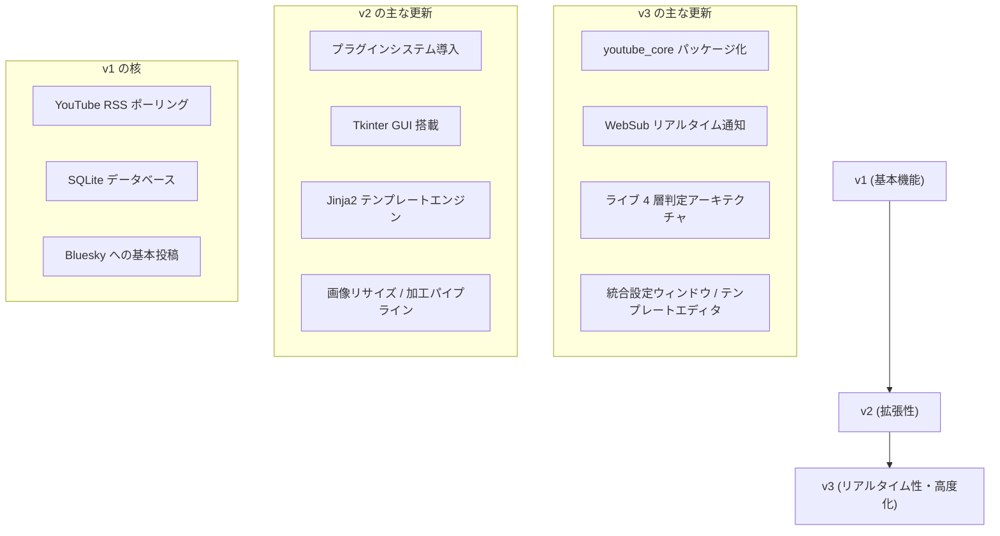

# バージョン履歴 (Version History)

関連ソースファイル
- [v1/docs/ARCHITECTURE_v1.md](https://github.com/mayu0326/test/blob/abdd8266/v1/docs/ARCHITECTURE_v1.md)
- [v2/app_version.py](https://github.com/mayu0326/test/blob/abdd8266/v2/app_version.py)
- [v3/app_version.py](https://github.com/mayu0326/test/blob/abdd8266/v3/app_version.py)
- [v3/readme_v3.md](https://github.com/mayu0326/test/blob/abdd8266/v3/readme_v3.md)

このページでは、StreamNotify の v1 から v3 に至るまでの進化の過程を記録しています。それぞれの世代で導入された主要なコンポーネントや、設計の変更点について説明します。

---

## 世代別サマリー

| 世代 | エントリポイント | 代表的なバージョン | 主要なテーマ |
| :--- | :--- | :--- | :--- |
| **v1** | `v1/main_v1.py` | v0.1.0 | 単一ファイルによる RSS ポーリング。プラグインや GUI は未搭載。 |
| **v2** | `v2/main_v2.py` | v2.1.0 | プラグインシステム、Tkinter GUI、ニコニコ動画対応、画像処理パイプライン。 |
| **v3** | `v3/main_v3.py` | v3.2.1 | WebSub (リアルタイム通知)、ライブ 4 層判定、統合設定、一括予約。 |

それぞれの世代は独立したディレクトリ (`v1/`, `v2/`, `v3/`) に格納されており、完全に自己完結したアプリケーションツリーとなっています。

---

## 世代別の機能追加マップ

---

## v1 — 単一ファイルの RSS ボット
v1 はプロジェクトの基礎を築きました。固定間隔で YouTube の RSS をチェックし、新着があれば Bluesky に自動投稿するという設計です。すべてのロジックが少数のフラットなファイルに収められていました。

## v2 — GUI とプラグインアーキテクチャ
v2 では、現在の設計の根幹となる「コア + 拡張機能」の構成が導入されました。
- **プラグインシステム**: `PluginManager` を導入し、複数の SNS への同時投稿や機能追加が容易になりました。
- **GUI**: Tkinter による操作画面が追加され、手動投稿や統計確認が可能になりました。
- **ニコニコ動画対応**: RSS を介したニコニコ動画の監視ができるようになりました。

## v3 — WebSub、ライブ判定、統合設定
v3 では、さらなるリアルタイム性と使い勝手の向上が図られました。
- **WebSub 対応**: YouTube からの通知をリアルタイムで受け取る「プッシュ型」の通知に対応しました。
- **ライブ 4 層判定**: ライブ配信の「予定・開始・終了・アーカイブ化」という複雑な状態遷移を正確に捉える専用モジュールが開発されました。
- **統合設定**: GUI 上から安全に `settings.env` を編集できるようになり、テンプレートのライブプレビュー機能も搭載されました。

---

## プラグイン別のバージョン (v3.2.1 時点)
アプリ自体のバージョンとは別に、各プラグインも個別に進化しています。
- **LoggingPlugin (v2.0.0)**: ログの整理と日次ローテーション。
- **BlueskyImagePlugin (v1.1.0)**: 画像添付と Jinja2 レンダリング。
- **YouTubeAPIPlugin (v0.2.0)**: クォータ節約のためのバッチ取得対応。
- **NiconicoPlugin (v0.4.0)**: OGP サムネイル取得の最適化。