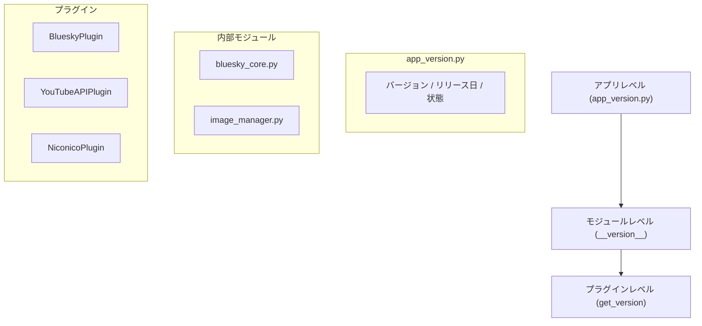

# バージョン管理 (Version Management)

関連ソースファイル
- [v2/app_version.py](https://github.com/mayu0326/test/blob/abdd8266/v2/app_version.py)
- [v3/app_version.py](https://github.com/mayu0326/test/blob/abdd8266/v3/app_version.py)
- [v3/docs/Technical/Archive/VERSION_MANAGEMENT.md](https://github.com/mayu0326/test/blob/abdd8266/v3/docs/Technical/Archive/VERSION_MANAGEMENT.md)

このページでは、StreamNotify のコードベースで使用されている 3 層のバージョン管理戦略について説明します。これには、アプリケーション全体の `app_version.py`、モジュールごとの `__version__` 属性、およびプラグインレベルの `get_version()` インターフェースが含まれます。

---

## 3 層のバージョン構造

StreamNotify は、粒度の異なる 3 つのバージョン管理レイヤーを使用しています。これらは互いに独立しており、アプリケーション全体のリリースとは別に、個別のプラグインやモジュールのみをバージョンアップすることが可能です。

---

## アプリケーションレベル: `app_version.py`

`v3/app_version.py` は、アプリケーション全体のバージョンを定義する唯一の信頼できる情報源です。

- **`__version__`**: メジャー.マイナー.パッチ形式のバージョン文字列 (例: `"3.2.1"`)。
- **`__release_date__`**: リリース日 (ISO 形式)。
- **`__status__`**: 開発状態 (`development`, `alpha`, `beta`, `stable`)。
- **`get_version_info()`**: 人間が読みやすい形式のバージョン文字列を返します。

---

## セマンティックバージョニングの規則

すべてのレイヤーで `メジャー.マイナー.パッチ` 形式を採用しています。

| レベル | 更新タイミング | 例 |
| :--- | :--- | :--- |
| **メジャー (MAJOR)** | 互換性のない大きな変更や設計の刷新 | v2 → v3 |
| **マイナー (MINOR)** | 後方互換性のある新機能の追加 | v3.1 → v3.2 |
| **パッチ (PATCH)** | バグ修正や軽微な改善 | v3.2.0 → v3.2.1 |

---

## モジュールレベル: ファイルごとの `__version__`

プラグインシステムとは独立して動作する内部ライブラリ（`bluesky_core.py` や `image_manager.py` など）は、各ファイルの先頭に独自の `__version__` 文字列を持っています。これらはモジュールの API や挙動が変更された際に更新されます。

---

## プラグインレベル: `get_version()` インターフェース

すべてのプラグインは `get_version()` メソッドを実装する必要があります。プラグインは個別にバージョン管理されるため、1 つのアプリケーションリリースの中に、異なるバージョン番号を持つプラグインが混在することになります。

**現在の主なプラグインバージョン:**
- `LoggingPlugin`: 2.0.0
- `BlueskyImagePlugin`: 1.1.0
- `YouTubeAPIPlugin`: 0.2.0
- `NiconicoPlugin`: 0.4.0

---

## CI/CD 連携 (計画中)

`app_version.py` 内の `__git_commit__` および `__git_branch__` フィールドは、将来的に CI/CD パイプライン（GitHub Actions 等）によって自動的に入力される予定です。これにより、ビルドされたバイナリやログから、どのコミット時点のコードであるかを正確に特定できるようになります。