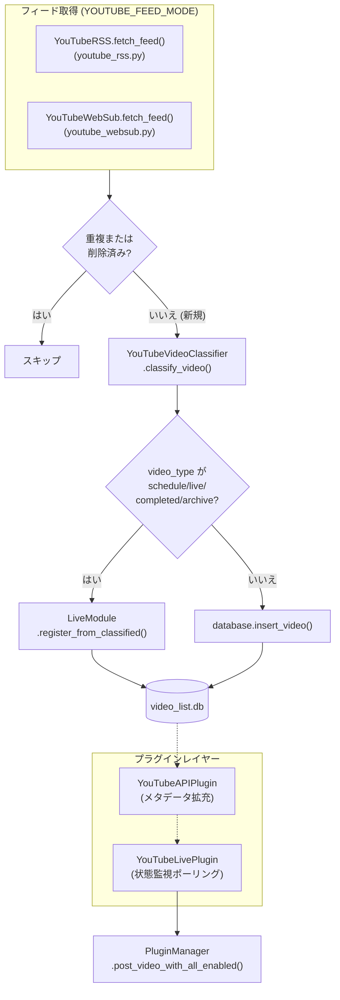
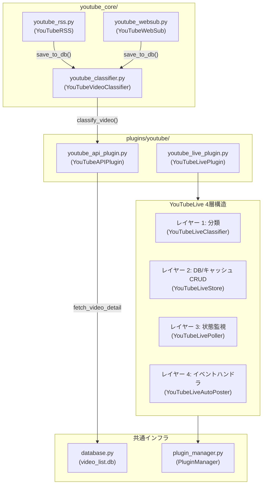
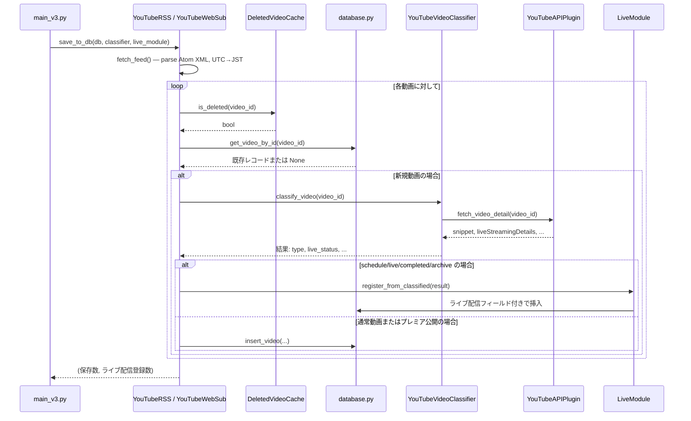

# YouTube 統合 (YouTube Integration)

関連ソースファイル
- [v2/docs/Guides/YOUTUBE_SETUP_GUIDE.md](https://github.com/mayu0326/test/blob/abdd8266/v2/docs/Guides/YOUTUBE_SETUP_GUIDE.md)
- [v2/docs/References/SETTINGS_OVERVIEW.md](https://github.com/mayu0326/test/blob/abdd8266/v2/docs/References/SETTINGS_OVERVIEW.md)
- [v2/plugins/youtube_api_plugin.py](https://github.com/mayu0326/test/blob/abdd8266/v2/plugins/youtube_api_plugin.py)
- [v2/settings.env.example](https://github.com/mayu0326/test/blob/abdd8266/v2/settings.env.example)
- [v3/docs/Guides/YOUTUBE_SETUP_GUIDE.md](https://github.com/mayu0326/test/blob/abdd8266/v3/docs/Guides/YOUTUBE_SETUP_GUIDE.md)
- [v3/docs/References/SETTINGS_OVERVIEW.md](https://github.com/mayu0326/test/blob/abdd8266/v3/docs/References/SETTINGS_OVERVIEW.md)
- [v3/docs/Technical/Archive/WEBSUB/WEBSUB_RSS_LIVEMODULE_INTEGRATION.md](https://github.com/mayu0326/test/blob/abdd8266/v3/docs/Technical/Archive/WEBSUB/WEBSUB_RSS_LIVEMODULE_INTEGRATION.md)
- [v3/docs/Technical/Archive/YouTube/LIVE_LIVESTREAM_SEPARATION.md](https://github.com/mayu0326/test/blob/abdd8266/v3/docs/Technical/Archive/YouTube/LIVE_LIVESTREAM_SEPARATION.md)
- [v3/plugins/youtube/youtube_api_plugin.py](https://github.com/mayu0326/test/blob/abdd8266/v3/plugins/youtube/youtube_api_plugin.py)
- [v3/settings.env.example](https://github.com/mayu0326/test/blob/abdd8266/v3/settings.env.example)
- [v3/youtube_core/youtube_rss.py](https://github.com/mayu0326/test/blob/abdd8266/v3/youtube_core/youtube_rss.py)

このページでは、StreamNotify v3 における YouTube 固有のすべてのサブシステムの概要を提供します。RSS ポーリング、WebSub プッシュ配信、YouTube Data API プラグイン、およびライブ配信検出がどのように構成され、互いに連携して完全な動画通知パイプラインを形成しているかを説明します。

各サブシステムの詳細については、以下の関連ページを参照してください:

- RSS フィードの解析と保存ロジック: [RSS・WebSub フィード処理](./RSS-and-WebSub-Feed-Processing.md) を参照
- YouTube Data API のクォータ管理、チャンネル解決、バッチ取得: [YouTube API プラグイン](./YouTube-API-Plugin.md) を参照
- 4 層のライブ配信状態遷移マシン: [YouTube ライブ配信の検出](./YouTube-Live-Detection.md) を参照
- API バッチ最適化の詳細: [API バッチ最適化](./API-Batch-Optimization.md) を参照

生成された動画レコードがどのように Bluesky に投稿されるかについては、[Bluesky 統合](./Bluesky-Integration.md) を参照してください。

---

## サブシステムの概要 (Subsystems at a Glance)

YouTube 統合は、データパイプラインの異なるポイントで動作する 4 つの独立したサブシステムに分割されています。

| サブシステム | 主要クラス / モジュール | 場所 | 役割 |
| :--- | :--- | :--- | :--- |
| RSS ポーリング | `YouTubeRSS` | `v3/youtube_core/youtube_rss.py` | YouTube Atom フィードを取得し、新規エントリを解析・保存 |
| WebSub プッシュ | `YouTubeWebSub` | `v3/youtube_core/youtube_websub.py` | WebSub ハブからリアルタイムのプッシュ通知を受信 |
| API プラグイン | `YouTubeAPIPlugin` | `v3/plugins/youtube/youtube_api_plugin.py` | チャンネル ID の解決、動画メタデータの取得、クォータ管理 |
| ライブプラグイン | `YouTubeLivePlugin` | `v3/plugins/youtube/youtube_live_plugin.py` | ライブ状態の遷移を監視し、自動投稿イベントを発火 |

2 つのフィード取得モード（RSS と WebSub）は排他的であり、`YOUTUBE_FEED_MODE` 設定によって選択されます。API プラグインとライブプラグインはプラグインマネージャーを通じてロードされるオプションの拡張機能です。これらが利用可能かどうかは、`YOUTUBE_API_KEY` が設定され、プラグインが有効になっているかどうかに依存します。

情報源: [v3/settings.env.example (L41-83)](https://github.com/mayu0326/test/blob/abdd8266/v3/settings.env.example#L41-L83), [v3/youtube_core/youtube_rss.py (L1-30)](https://github.com/mayu0326/test/blob/abdd8266/v3/youtube_core/youtube_rss.py#L1-L30), [v3/plugins/youtube/youtube_api_plugin.py (L1-50)](https://github.com/mayu0326/test/blob/abdd8266/v3/plugins/youtube/youtube_api_plugin.py#L1-50)

---

## ハイレベルなデータフロー (High-Level Data Flow)

**図: YouTube 統合 — エンドツーエンドのデータフロー**

情報源: [v3/youtube_core/youtube_rss.py (L139-510)](https://github.com/mayu0326/test/blob/abdd8266/v3/youtube_core/youtube_rss.py#L139-L510), [v3/docs/Technical/Archive/WEBSUB/WEBSUB_RSS_LIVEMODULE_INTEGRATION.md (L1-60)](https://github.com/mayu0326/test/blob/abdd8266/v3/docs/Technical/Archive/WEBSUB/WEBSUB_RSS_LIVEMODULE_INTEGRATION.md#L1-L60), [v3/docs/Technical/Archive/YouTube/LIVE_LIVESTREAM_SEPARATION.md (L30-80)](https://github.com/mayu0326/test/blob/abdd8266/v3/docs/Technical/Archive/YouTube/LIVE_LIVESTREAM_SEPARATION.md#L30-L80)

---

## フィード取得モード (Feed Acquisition Modes)

`settings.env` の `YOUTUBE_FEED_MODE` を使用して、2 つの取得戦略のいずれかを選択します。

### ポーリングモード (`YOUTUBE_FEED_MODE=poll`)

`YouTubeRSS` は、設定された間隔（`YOUTUBE_RSS_POLL_INTERVAL_MINUTES`、最小 10 分、最大 60 分）で、`https://www.youtube.com/feeds/videos.xml?channel_id={channel_id}` にある標準の YouTube Atom フィードを取得します。フィードは最大 15 エントリを返します。タイムスタンプは解析され、保存前に UTC から JST に変換されます。

### WebSub モード (`YOUTUBE_FEED_MODE=websub`)

`YouTubeWebSub` は、タイマーによるポーリングではなく、WebSub ハブからプッシュ通知を受信します。これには、公開されているコールバック URL (`WEBSUB_CALLBACK_URL`) と認証情報 (`WEBSUB_CLIENT_ID`, `WEBSUB_CLIENT_API_KEY`) が必要です。プッシュペイロードには RSS フィードと同じ Atom XML が含まれているため、その後の処理は同一です。WebSub はサポーター限定のベータ機能です。

どちらのモードも、それぞれのクラスで同じ `save_to_db(database, classifier, live_module)` メソッドを呼び出します。つまり、分類と保存のロジックは共通です。

情報源: [v3/settings.env.example (L41-83)](https://github.com/mayu0326/test/blob/abdd8266/v3/settings.env.example#L41-L83), [v3/youtube_core/youtube_rss.py (L41-138)](https://github.com/mayu0326/test/blob/abdd8266/v3/youtube_core/youtube_rss.py#L41-L138), [v3/docs/Guides/YOUTUBE_SETUP_GUIDE.md (L94-108)](https://github.com/mayu0326/test/blob/abdd8266/v3/docs/Guides/YOUTUBE_SETUP_GUIDE.md#L94-L108)

---

## 保存時の動画分類 (Video Classification at Storage Time)

新しい動画 ID が初めて検出されたとき、`save_to_db()` は `YouTubeVideoClassifier.classify_video(video_id)` を呼び出します。その結果によって、使用される保存パスが決まります。

| `video_type` | 保存パス |
| :--- | :--- |
| `schedule` | `LiveModule.register_from_classified()` |
| `live` | `LiveModule.register_from_classified()` |
| `completed` | `LiveModule.register_from_classified()` |
| `archive` | `LiveModule.register_from_classified()` |
| `video` | `database.insert_video()` |
| `premiere` | `database.insert_video()` |

ライブ配信タイプの動画は、`database.insert_video()` を完全にバイパスします。これにより、`content_type` と `live_status` フィールドが `LiveModule` によって正しく設定され、通常の動画用に使用されるデフォルト値で上書きされるのを防ぎます。

情報源: [v3/docs/Technical/Archive/YouTube/LIVE_LIVESTREAM_SEPARATION.md (L30-130)](https://github.com/mayu0326/test/blob/abdd8266/v3/docs/Technical/Archive/YouTube/LIVE_LIVESTREAM_SEPARATION.md#L30-L130), [v3/youtube_core/youtube_rss.py (L377-430)](https://github.com/mayu0326/test/blob/abdd8266/v3/youtube_core/youtube_rss.py#L377-L430)

---

## 主要コンポーネントとコード実体

**図: YouTube サブシステムのコード実体**

情報源: [v3/plugins/youtube/youtube_api_plugin.py (L40-120)](https://github.com/mayu0326/test/blob/abdd8266/v3/plugins/youtube/youtube_api_plugin.py#L40-L120), [v3/youtube_core/youtube_rss.py (L1-30)](https://github.com/mayu0326/test/blob/abdd8266/v3/youtube_core/youtube_rss.py#L1-L30)

---

## YouTube API プラグインの役割

`YouTubeAPIPlugin` は 2 つの明確な役割を担います:

1. **チャンネル ID の解決**: `YOUTUBE_CHANNEL_ID` が `UC` プレフィックスの ID ではない場合（ユーザー名や `@ハンドル` など）、プラグインは `channels` エンドポイントを呼び出して `UCxx...` ID に解決します。結果は `youtube_channel_cache.json` にキャッシュされるため、次回の起動時には API ユニットを消費しません。
2. **動画メタデータの拡充**: `fetch_video_detail()` と `fetch_video_details_batch()` は `videos.list` エンドポイントを呼び出します（1 リクエストあたり 1 ユニット、1 回の呼び出しで最大 50 個の ID）。プラグインは `snippet`, `contentDetails`, `liveStreamingDetails`, `status` フィールドを返します。このデータにより、`(content_type, live_status, is_premiere)` を生成する `_classify_video_core()` 分類ロジックが動作します。

プラグインはシングルトン（`_instance` クラス属性）として実装され、`get_plugin()` モジュールレベル関数を介して公開されます。詳細は [v3/plugins/youtube/youtube_api_plugin.py (L43-55)](https://github.com/mayu0326/test/blob/abdd8266/v3/plugins/youtube/youtube_api_plugin.py#L43-L55) を参照してください。

クォータは `self.daily_quota` (10,000 ユニット/日) に対して `self.daily_cost` で追跡されます。HTTP 403 レスポンスを受け取ると `quota_exceeded` フラグが設定され、そのセッションの残りの間、それ以降のすべての呼び出しを停止します。詳細は [v3/plugins/youtube/youtube_api_plugin.py (L87-95)](https://github.com/mayu0326/test/blob/abdd8266/v3/plugins/youtube/youtube_api_plugin.py#L87-L95) および [v3/plugins/youtube/youtube_api_plugin.py (L388-394)](https://github.com/mayu0326/test/blob/abdd8266/v3/plugins/youtube/youtube_api_plugin.py#L388-L394) を参照してください。

情報源: [v3/plugins/youtube/youtube_api_plugin.py (L56-120)](https://github.com/mayu0326/test/blob/abdd8266/v3/plugins/youtube/youtube_api_plugin.py#L56-L120), [v3/plugins/youtube/youtube_api_plugin.py (L438-475)](https://github.com/mayu0326/test/blob/abdd8266/v3/plugins/youtube/youtube_api_plugin.py#L438-L475), [v3/plugins/youtube/youtube_api_plugin.py (L560-620)](https://github.com/mayu0326/test/blob/abdd8266/v3/plugins/youtube/youtube_api_plugin.py#L560-L620)

---

## YouTube ライブプラグインの役割

`YouTubeLivePlugin` は、RSS/WebSub フィードのサイクルとは独立してライブ配信の状態を監視する 4 層のサブシステムです。各レイヤーは以下の通りです:

| レイヤー | クラス | 責任 |
| :--- | :--- | :--- |
| 1 | `YouTubeLiveClassifier` | `classify()` → `(content_type, live_status, is_premiere)` |
| 2 | `YouTubeLiveStore` | 追跡中のライブ動画に関する DB および JSON キャッシュの CRUD 操作 |
| 3 | `YouTubeLivePoller` | `poll_live_status()`、遷移検出、動的なポーリング間隔の管理 |
| 4 | `YouTubeLiveAutoPoster` | `on_live_started()`, `on_live_ended()`, `on_archive_available()` イベントハンドラ |

レイヤー 3 は（`YouTubeAPIPlugin` を介して）レイヤー 1 を呼び出して現在の動画状態を取得し、レイヤー 2 に保存されている状態と比較します。状態の遷移が発生すると、レイヤー 4 にイベントを発火します。レイヤー 4 は、`_should_autopost_event()` および設定された `YOUTUBE_LIVE_AUTO_POST_MODE` / 個別フラグに基づいて、自動投稿するかどうかを決定します。

各レイヤーのより詳細なドキュメントについては、[YouTube ライブ配信の検出](./YouTube-Live-Detection.md) を参照してください。

---

## 設定のまとめ (Configuration Summary)

以下の表は、YouTube 統合の動作を制御する主要な `settings.env` 変数の一覧です。

| 変数名 | デフォルト | 目的 |
| :--- | :--- | :--- |
| `YOUTUBE_CHANNEL_ID` | *(必須)* | 監視対象のチャンネル ID（UC 形式） |
| `YOUTUBE_FEED_MODE` | `poll` | フィード取得モード (`poll` または `websub`) |
| `YOUTUBE_RSS_POLL_INTERVAL_MINUTES` | `10` | RSS ポーリングの間隔（10〜60 分） |
| `YOUTUBE_WEBSUB_POLL_INTERVAL_MINUTES` | `5` | WebSub ポーリングの間隔（3〜30 分） |
| `YOUTUBE_API_KEY` | *(空)* | API プラグインを有効化。ライブ配信検出に必須。 |
| `YOUTUBE_DEDUP_ENABLED` | `true` | 取り込み時の優先度ベースの重複排除 |
| `YOUTUBE_LIVE_AUTO_POST_MODE` | `off` | 自動投稿モード: `all`, `schedule`, `live`, `archive`, `off` |
| `YOUTUBE_LIVE_AUTO_POST_SCHEDULE` | `true` | SELFPOST: 予約枠の自動投稿 |
| `YOUTUBE_LIVE_AUTO_POST_LIVE` | `true` | SELFPOST: 配信開始/終了の自動投稿 |
| `YOUTUBE_LIVE_AUTO_POST_ARCHIVE` | `true` | SELFPOST: アーカイブ公開の自動投稿 |
| `YOUTUBE_LIVE_POLL_INTERVAL_ACTIVE` | `15` | ライブ/予約枠がアクティブな時のポーリング間隔 (15〜60 分) |
| `YOUTUBE_LIVE_POLL_INTERVAL_COMPLETED_MIN` | `60` | 配信終了後の最小間隔 (30〜180 分) |
| `YOUTUBE_LIVE_POLL_INTERVAL_COMPLETED_MAX` | `180` | アーカイブ待機中の最大間隔 (30〜180 分) |
| `YOUTUBE_LIVE_ARCHIVE_CHECK_COUNT_MAX` | `4` | アーカイブ遷移後の再確認回数 |
| `WEBSUB_CLIENT_ID` | *(空)* | WebSub クライアント識別子 |
| `WEBSUB_CALLBACK_URL` | *(空)* | YouTube からの通知をプッシュする URL |
| `WEBSUB_CLIENT_API_KEY` | *(空)* | WebSub センターサーバー用の認証キー |
| `WEBSUB_LEASE_SECONDS` | `432000` | 購読期間 (秒) (1〜30 日) |

情報源: [v3/settings.env.example (L41-261)](https://github.com/mayu0326/test/blob/abdd8266/v3/settings.env.example#L41-L261), [v3/docs/References/SETTINGS_OVERVIEW.md (L36-135)](https://github.com/mayu0326/test/blob/abdd8266/v3/docs/References/SETTINGS_OVERVIEW.md#L36-135)

---

## コンポーネント間の連携

**図: save_to_db() 実行時のコンポーネント間の相互作用**

情報源: [v3/youtube_core/youtube_rss.py (L139-510)](https://github.com/mayu0326/test/blob/abdd8266/v3/youtube_core/youtube_rss.py#L139-L510), [v3/docs/Technical/Archive/WEBSUB/WEBSUB_RSS_LIVEMODULE_INTEGRATION.md (L21-95)](https://github.com/mayu0326/test/blob/abdd8266/v3/docs/Technical/Archive/WEBSUB/WEBSUB_RSS_LIVEMODULE_INTEGRATION.md#L21-L95), [v3/docs/Technical/Archive/YouTube/LIVE_LIVESTREAM_SEPARATION.md (L36-80)](https://github.com/mayu0326/test/blob/abdd8266/v3/docs/Technical/Archive/YouTube/LIVE_LIVESTREAM_SEPARATION.md#L36-L80)