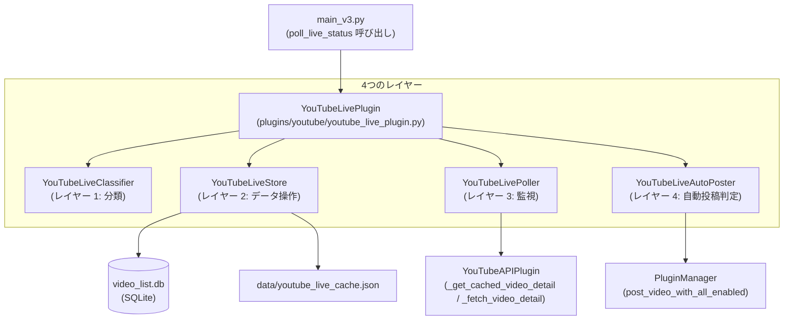
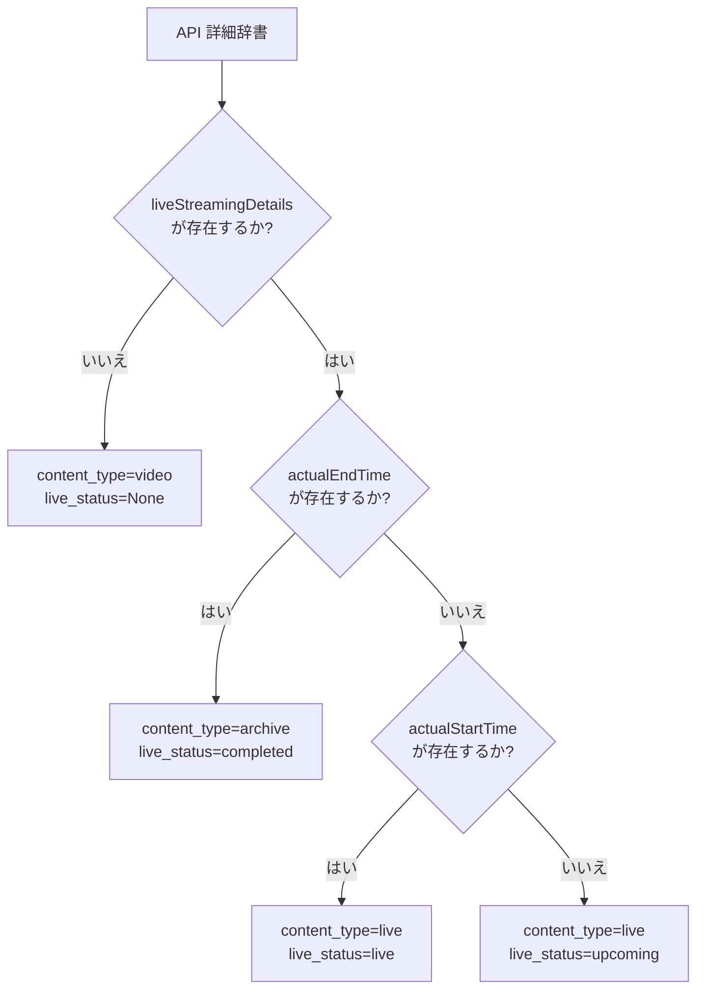
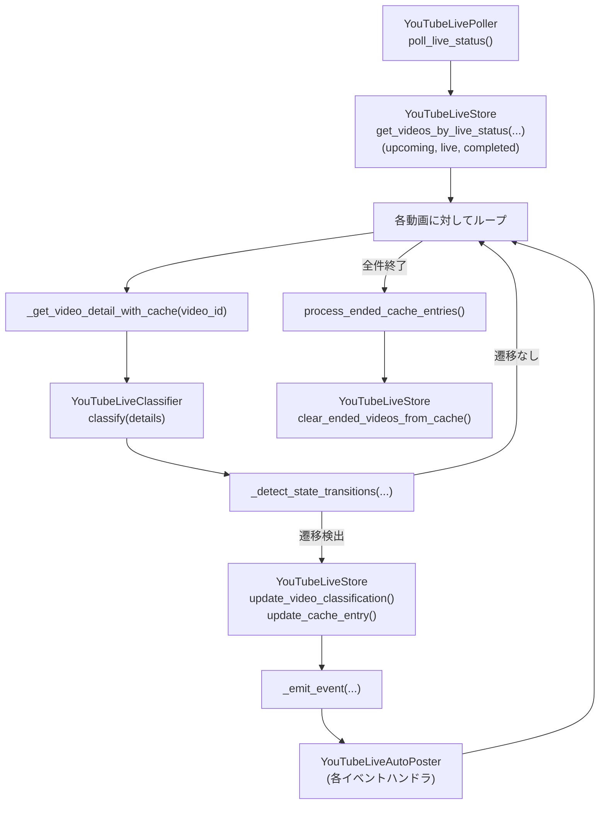
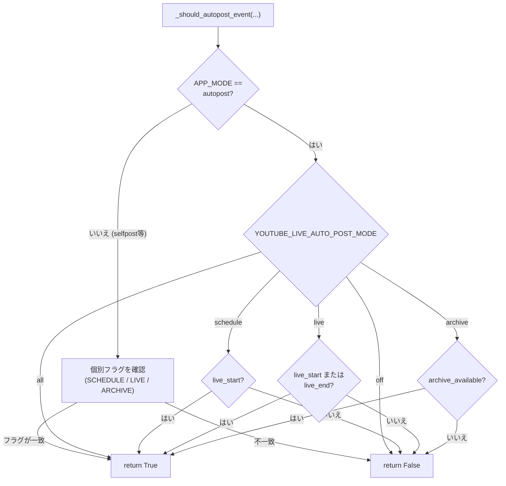
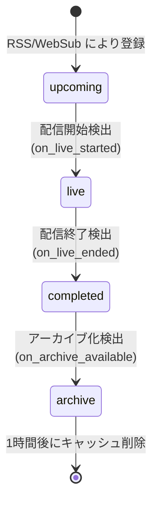

# YouTube ライブ配信の検出 (YouTube Live Detection)

関連ソースファイル
- [v2/docs/References/SETTINGS_OVERVIEW.md](https://github.com/mayu0326/test/blob/abdd8266/v2/docs/References/SETTINGS_OVERVIEW.md)
- [v2/settings.env.example](https://github.com/mayu0326/test/blob/abdd8266/v2/settings.env.example)
- [v2/youtube_live_cache.py](https://github.com/mayu0326/test/blob/abdd8266/v2/youtube_live_cache.py)
- [v3/docs/References/SETTINGS_OVERVIEW.md](https://github.com/mayu0326/test/blob/abdd8266/v3/docs/References/SETTINGS_OVERVIEW.md)
- [v3/docs/Technical/Archive/YouTube/LIVE_IMPLEMENTATION_FINAL_REPORT_REVISED.md](https://github.com/mayu0326/test/blob/abdd8266/v3/docs/Technical/Archive/YouTube/LIVE_IMPLEMENTATION_FINAL_REPORT_REVISED.md)
- [v3/docs/Technical/Archive/YouTube/YOUTUBE_LIVE_CACHE_IMPLEMENTATION.md](https://github.com/mayu0326/test/blob/abdd8266/v3/docs/Technical/Archive/YouTube/YOUTUBE_LIVE_CACHE_IMPLEMENTATION.md)
- [v3/docs/Technical/Archive/YouTube/YOUTUBE_LIVE_PLUGIN_COMPLETE_SPECIFICATION.md](https://github.com/mayu0326/test/blob/abdd8266/v3/docs/Technical/Archive/YouTube/YOUTUBE_LIVE_PLUGIN_COMPLETE_SPECIFICATION.md)
- [v3/settings.env.example](https://github.com/mayu0326/test/blob/abdd8266/v3/settings.env.example)

このページでは、YouTube ライブストリームを定期的な API ポーリングで監視し、状態の遷移に応じて Bluesky 通知を送信する `YouTubeLivePlugin` の内部アーキテクチャについて説明します。4 層のクラス設計、JSON キャッシュ、ステートマシンロジック、動的なポーリング間隔、および自動投稿の設定を網羅しています。

動画が RSS や WebSub フィードから最初にデータベースに到達する仕組み（このシステムの入力）については、[RSS・WebSub フィード処理](./RSS-and-WebSub-Feed-Processing.md) を参照してください。基盤となる YouTube Data API ラッパーについては、[YouTube API プラグイン](./YouTube-API-Plugin.md) を参照してください。ポーラー内のクォータ消費を削減するバッチ API 最適化については、[API バッチ最適化](./API-Batch-Optimization.md) を参照してください。

---

## 4 層アーキテクチャ (Four-Layer Architecture)

プラグインはその責任を 4 つのクラスに分割しています。`YouTubeLivePlugin` は `main_v3.py` に公開されるファサードであり、これら 4 つのレイヤーのインスタンスを保持します。

**図: クラスとファイルの対応 — YouTubeLivePlugin の 4 つのレイヤー**



| レイヤー | クラス | 責任 |
| :--- | :--- | :--- |
| 1 | `YouTubeLiveClassifier` | 純粋関数: YouTube API の辞書 → `content_type`, `live_status`, `is_premiere` |
| 2 | `YouTubeLiveStore` | 純粋な CRUD: DB 行と JSON キャッシュエントリの操作（ロジックなし） |
| 3 | `YouTubeLivePoller` | 状態監視、遷移検出、キャッシュ優先の取得戦略 |
| 4 | `YouTubeLiveAutoPoster` | 唯一の投稿決定ポイント。遷移タイプごとのイベントハンドラ |
| 補助 | `YouTubeLiveCache` | JSON キャッシュ管理 (`data/youtube_live_cache.json`) |

情報源: [v3/docs/Technical/Archive/YouTube/YOUTUBE_LIVE_PLUGIN_COMPLETE_SPECIFICATION.md (L40-120)](https://github.com/mayu0326/test/blob/abdd8266/v3/docs/Technical/Archive/YouTube/YOUTUBE_LIVE_PLUGIN_COMPLETE_SPECIFICATION.md#L40-L120)

---

## レイヤー 1: YouTubeLiveClassifier

`YouTubeLiveClassifier.classify(details)` は、YouTube Data API の生の動画詳細辞書を受け取り、副作用のない 3 つの要素からなるタプルを返します。ここは、プラグイン内で API のフィールド名が解釈される唯一の場所です。

`YouTubeLivePlugin` 上の `_classify_live()` ヘルパーは、同じロジックを実装している `YouTubeAPIPlugin._classify_video_core()` に委譲します。

### 戻り値
| フィールド | 型 | 可能な値 |
| :--- | :--- | :--- |
| `content_type` | 文字列 | `"video"`, `"live"`, `"archive"` |
| `live_status` | 文字列 | `None`, `"upcoming"`, `"live"`, `"completed"` |
| `is_premiere` | 真偽値 | 配信がプレミア公開の場合は `True` |

### 決定木

**図: `YouTubeLiveClassifier.classify()` — API フィールドから分類への流れ**



| API フィールドの有無 | `content_type` | `live_status` |
| :--- | :--- | :--- |
| `liveStreamingDetails` なし | `video` | `None` |
| `liveStreamingDetails` あり、`actualStartTime` なし、`actualEndTime` なし | `live` | `upcoming` |
| `liveStreamingDetails` あり、`actualStartTime` あり、`actualEndTime` なし | `live` | `live` |
| `liveStreamingDetails` あり、`actualEndTime` あり | `archive` | `completed` |

情報源: [v3/docs/Technical/Archive/YouTube/YOUTUBE_LIVE_PLUGIN_COMPLETE_SPECIFICATION.md (L124-168)](https://github.com/mayu0326/test/blob/abdd8266/v3/docs/Technical/Archive/YouTube/YOUTUBE_LIVE_PLUGIN_COMPLETE_SPECIFICATION.md#L124-L168), [v3/docs/Technical/Archive/YouTube/YOUTUBE_LIVE_PLUGIN_COMPLETE_SPECIFICATION.md (L1060-1110)](https://github.com/mayu0326/test/blob/abdd8266/v3/docs/Technical/Archive/YouTube/YOUTUBE_LIVE_PLUGIN_COMPLETE_SPECIFICATION.md#L1060-L1110)

---

## レイヤー 2: YouTubeLiveStore

`YouTubeLiveStore` は、判断ロジックを適用することなく、2 つのバッキングストア（DB とキャッシュ）への読み書きを行います。すべてのロジックは `YouTubeLivePoller` と `YouTubeLiveAutoPoster` に集約されています。

### DB 操作
| メソッド | クエリ条件 | 備考 |
| :--- | :--- | :--- |
| `get_unclassified_videos()` | `content_type = "video"`, 公開から 7 日以内 | 起動時の分類用フィード |
| `get_videos_by_live_status(status)` | `live_status = status` | ポーラーからステータスごとに呼び出し |
| `get_video_by_id(video_id)` | `video_id = ?` | 行全体の取得 |
| `update_video_classification(video_id, content_type, live_status)` | — | 入力を検証。キャッシュには触れません。 |
| `mark_as_posted(video_id)` | — | `posted_to_bluesky = 1` を設定 |

### キャッシュ操作
| メソッド | 説明 |
| :--- | :--- |
| `add_live_video_to_cache(video_id, db_data, api_data)` | `status="live"` でキャッシュエントリを作成 |
| `update_cache_entry(video_id, api_data)` | `api_data` を置換。状態変化時のみ呼び出し |
| `get_live_videos_by_status(status)` | `status` フィールドで JSON キャッシュをフィルタリング |
| `mark_as_ended_in_cache(video_id)` | キャッシュエントリを `status="ended"` に遷移 |
| `clear_ended_videos_from_cache()` | 1 時間以上前のエントリを削除。削除数を返却 |

情報源: [v3/docs/Technical/Archive/YouTube/YOUTUBE_LIVE_PLUGIN_COMPLETE_SPECIFICATION.md (L170-228)](https://github.com/mayu0326/test/blob/abdd8266/v3/docs/Technical/Archive/YouTube/YOUTUBE_LIVE_PLUGIN_COMPLETE_SPECIFICATION.md#L170-L228)

---

## レイヤー 3: YouTubeLivePoller

`YouTubeLivePoller` は主要な状態監視ユニットです。キャッシュ優先の取得戦略を管理し、DB に保存された状態と API から返された状態を比較することで遷移を検出します。

### エントリポイント
| メソッド | 呼び出し元 | 目的 |
| :--- | :--- | :--- |
| `poll_unclassified_videos()` | プラグイン起動時 (`on_enable`) | プラグイン実行前に RSS で届いた `content_type="video"` の動画を分類 |
| `poll_live_status()` | `main_v3.py` ポーリングループ | メインのループ。すべての状態遷移を検出 |
| `process_ended_cache_entries()` | `poll_live_status()` の最後 | すでに `"ended"` 状態にあるキャッシュエントリの投稿漏れを処理 |

### `_get_video_detail_with_cache(video_id)` — キャッシュ戦略

1. `YouTubeAPIPlugin._get_cached_video_detail(video_id)` を呼び出し、5 分以内のデータがあればそれを返します。
2. キャッシュミスの場合: `YouTubeAPIPlugin._fetch_video_detail(video_id)` を呼び出します。
3. API がライブ状態（upcoming/live/completed）を示している場合、`YouTubeLiveStore.add_live_video_to_cache()` を介して動画を JSON キャッシュに登録します。
4. API エラー時は `None` を返し、そのサイクルの処理をスキップします。

v0.3.1 のバッチ最適化では、これを `_get_videos_detail_with_cache_batch()` にリファクタリングし、1 回のバッチ API 呼び出しですべての ID をまとめて取得するようにしています。詳細は [API バッチ最適化](./API-Batch-Optimization.md) を参照してください。

### `_detect_state_transitions(video, new_content_type, new_live_status)`

（DB 行からの）`old_live_status` と（API からの）`new_live_status` を比較します。遷移が見つかった場合は `True` を返し、適切な `YouTubeLiveAutoPoster` ハンドラを呼び出す `_emit_event()` を実行します。

| 旧 `live_status` | 新 `live_status` | イベント名 | ハンドラ |
| :--- | :--- | :--- | :--- |
| `"upcoming"` | `"live"` | `"live_started"` | `on_live_started()` |
| `"live"` | `"completed"` | `"live_ended"` | `on_live_ended()` |
| `"completed"` + `content_type="none/live"` | `"completed"` + `content_type="archive"` | `"archive_available"` | `on_archive_available()` |

> **2 段階の終了遷移**: `live → completed` 時、API が何を返していても `content_type` は一時的に `"live"` として保持され、「配信終了」の投稿が正しいテンプレートで行われます。アーカイブ投稿は、API が `content_type="archive"` を返した次のポーリングサイクルで実行されます。

**図: `poll_live_status()` の実行パス（関数レベル）**



情報源: [v3/docs/Technical/Archive/YouTube/YOUTUBE_LIVE_PLUGIN_COMPLETE_SPECIFICATION.md (L230-343)](https://github.com/mayu0326/test/blob/abdd8266/v3/docs/Technical/Archive/YouTube/YOUTUBE_LIVE_PLUGIN_COMPLETE_SPECIFICATION.md#L230-L343), [v3/docs/Technical/Archive/YouTube/YOUTUBE_LIVE_PLUGIN_COMPLETE_SPECIFICATION.md (L1230-1275)](https://github.com/mayu0326/test/blob/abdd8266/v3/docs/Technical/Archive/YouTube/YOUTUBE_LIVE_PLUGIN_COMPLETE_SPECIFICATION.md#L1230-L1275)

---

## レイヤー 4: YouTubeLiveAutoPoster

`YouTubeLiveAutoPoster` は `_emit_event()` からイベントを受け取ります。ここは、システム内で「投稿するかスキップするか」の決定が行われる唯一の場所です。これにより、自動投稿ロジックの分散を防いでいます。

### イベントハンドラ

各ハンドラは以下のパターンに従います:

1. `_should_autopost_event(event_type, video_data)` を呼び出す。
2. `True` の場合: 動画辞書に `event_type` と `classification_type` を設定し、`PluginManager.post_video(video_data)` を呼び出す。
3. 成功時: `YouTubeLiveStore.mark_as_posted(video_id)` を呼び出す。
4. `on_live_ended()` はさらに `YouTubeLiveStore.mark_as_ended_in_cache(video_id)` を呼び出します。

| ハンドラ | 設定される `event_type` | 設定される `classification_type` | 選択されるテンプレート |
| :--- | :--- | :--- | :--- |
| `on_live_started()` | `"live_start"` | `"live"` | `yt_online_template.txt` |
| `on_live_ended()` | `"live_end"` | `"completed"` | `yt_offline_template.txt` |
| `on_archive_available()` | `"archive_available"` | `"archive"` | `yt_archive_template.txt` |

### `_should_autopost_event(event_type, video_data)` — 唯一の判断ポイント

**図: `_should_autopost_event()` のロジック**



情報源: [v3/docs/Technical/Archive/YouTube/YOUTUBE_LIVE_PLUGIN_COMPLETE_SPECIFICATION.md (L345-425)](https://github.com/mayu0326/test/blob/abdd8266/v3/docs/Technical/Archive/YouTube/YOUTUBE_LIVE_PLUGIN_COMPLETE_SPECIFICATION.md#L345-L425), [v3/docs/Technical/Archive/YouTube/YOUTUBE_LIVE_PLUGIN_COMPLETE_SPECIFICATION.md (L615-673)](https://github.com/mayu0326/test/blob/abdd8266/v3/docs/Technical/Archive/YouTube/YOUTUBE_LIVE_PLUGIN_COMPLETE_SPECIFICATION.md#L615-L673)

---

## キャッシュシステム: `YouTubeLiveCache`

`data/youtube_live_cache.json` にある JSON キャッシュは、ポーリングサイクルを跨いでライブ動画の状態を保存し、冗長な API 呼び出しを避けるための 5 分間のデータキャッシュを提供します。

### キャッシュエントリの構造

```json
{
  "<video_id>": {
    "video_id": "<video_id>",
    "db_data": {
      "title": "...",
      "channel_name": "...",
      "video_url": "...",
      "published_at": "...",
      "thumbnail_url": "..."
    },
    "api_data": {
      "snippet": {},
      "liveStreamingDetails": {}
    },
    "cached_at": "2025-12-30T07:53:08.026000",
    "status": "live",
    "poll_count": 3,
    "last_polled_at": "2025-12-30T08:08:15.123456",
    "ended_at": null
  }
}
```

### ステータス値
| ステータス | 意味 | 有効期限ルール |
| :--- | :--- | :--- |
| `"live"` | 配信中または予約済み | 5 分後にデータ期限切れ (`LIVE_CACHE_EXPIRY_SECONDS = 300`) |
| `"ended"` | 配信終了 | 1 時間後に `clear_ended_videos()` により削除 |

### `YouTubeLiveCache` 公開メソッド
| メソッド | 説明 |
| :--- | :--- |
| `add_live_video(video_id, db_data, api_data)` | 新規エントリ挿入。`status="live"`, `poll_count=0` |
| `update_live_video(video_id, api_data)` | `api_data` 置換、`poll_count` インクリメント、`last_polled_at` 更新 |
| `mark_as_ended(video_id)` | `status="ended"` に設定し、`ended_at` タイムスタンプを記録 |
| `get_live_videos_by_status(status)` | 指定したステータスに一致するエントリのリストを返却 |
| `clear_ended_videos(max_age_seconds=3600)` | `ended_at` が指定秒数を超えたエントリを削除 |
| `_save_cache()` | キャッシュデータを JSON としてファイルに書き込み |
| `get_youtube_live_cache()` | `YouTubeLiveCache` インスタンスを返すモジュールレベルのファクトリ |

情報源: [v2/youtube_live_cache.py (L26-257)](https://github.com/mayu0326/test/blob/abdd8266/v2/youtube_live_cache.py#L26-L257), [v3/docs/Technical/Archive/YouTube/YOUTUBE_LIVE_PLUGIN_COMPLETE_SPECIFICATION.md (L932-993)](https://github.com/mayu0326/test/blob/abdd8266/v3/docs/Technical/Archive/YouTube/YOUTUBE_LIVE_PLUGIN_COMPLETE_SPECIFICATION.md#L932-L993)

---

## 状態遷移ライフサイクル

**図: ライブストリームのステートマシン**



ライブ → 終了 → アーカイブの 2 段階パターンが存在するのは、YouTube が配信終了直後の動画をすぐにアーカイブとして分類しないためです。配信終了後の最初のポーリングで `live → completed` を検出し、`content_type="live"` として終了通知を送信します。その後のポーリングで API が `content_type="archive"` を返した時点で、アーカイブ通知を送信し DB レコードを確定させます。

情報源: [v3/docs/Technical/Archive/YouTube/YOUTUBE_LIVE_PLUGIN_COMPLETE_SPECIFICATION.md (L1230-1275)](https://github.com/mayu0326/test/blob/abdd8266/v3/docs/Technical/Archive/YouTube/YOUTUBE_LIVE_PLUGIN_COMPLETE_SPECIFICATION.md#L1230-L1275), [v3/docs/Technical/Archive/YouTube/YOUTUBE_LIVE_CACHE_IMPLEMENTATION.md (L24-50)](https://github.com/mayu0326/test/blob/abdd8266/v3/docs/Technical/Archive/YouTube/YOUTUBE_LIVE_CACHE_IMPLEMENTATION.md#L24-L50)

---

## 動的なポーリング間隔 (Dynamic Polling Intervals)

`main_v3.py` のスケジューラに渡されるポーリング間隔は、データベース内の `live_status` の状態に基づいて調整されます。

| DB の状態 | `settings.env` 変数名 | デフォルト | 有効範囲 |
| :--- | :--- | :--- | :--- |
| `upcoming` または `live` が存在 | `YOUTUBE_LIVE_POLL_INTERVAL_ACTIVE` | 5 分 | 5–60 分 |
| `completed` のみ（初回確認） | `YOUTUBE_LIVE_POLL_INTERVAL_COMPLETED_MIN` | 60 分 | 30–180 分 |
| `completed` のみ（待機上限） | `YOUTUBE_LIVE_POLL_INTERVAL_COMPLETED_MAX` | 180 分 | 30–180 分 |
| ライブ動画なし | (デフォルトの待機間隔) | 30 分 | — |

アーカイブ追跡の制御:
| 変数名 | デフォルト | 範囲 | 目的 |
| :--- | :--- | :--- | :--- |
| `YOUTUBE_LIVE_ARCHIVE_CHECK_COUNT_MAX` | 4 | 1–10 | `completed → archive` 後の最大ポーリング回数 |
| `YOUTUBE_LIVE_ARCHIVE_CHECK_INTERVAL` | 180 分 | 30–480 分 | アーカイブ確定の確認間隔 |

情報源: [v3/settings.env.example (L229-260)](https://github.com/mayu0326/test/blob/abdd8266/v3/settings.env.example#L229-L260), [v3/docs/Technical/Archive/YouTube/YOUTUBE_LIVE_CACHE_IMPLEMENTATION.md (L55-115)](https://github.com/mayu0326/test/blob/abdd8266/v3/docs/Technical/Archive/YouTube/YOUTUBE_LIVE_CACHE_IMPLEMENTATION.md#L55-L115)

---

## 自動投稿設定リファレンス

### `autopost` モード — 統合フラグ

`APP_MODE=autopost` の場合にのみ適用されます。`YOUTUBE_LIVE_AUTO_POST_MODE` で制御します。

| 設定値 | `live_start` を投稿 | `live_end` を投稿 | `archive_available` を投稿 |
| :--- | :--- | :--- | :--- |
| `off` | ✗ | ✗ | ✗ |
| `schedule` | ✓ | ✗ | ✗ |
| `live` | ✓ | ✓ | ✗ |
| `archive` | ✗ | ✗ | ✓ |
| `all` | ✓ | ✓ | ✓ |

### `selfpost` モード — 個別フラグ

`APP_MODE=selfpost` の場合、イベントごとのフラグにより、「ライブ配信のみ自動投稿、通常の動画は手動のみ」といった細かい制御が可能です。

| 変数名 | デフォルト | 制御されるイベント |
| :--- | :--- | :--- |
| `YOUTUBE_LIVE_AUTO_POST_SCHEDULE` | `true` | `upcoming` レコード作成時 |
| `YOUTUBE_LIVE_AUTO_POST_LIVE` | `true` | 配信の開始および終了 |
| `YOUTUBE_LIVE_AUTO_POST_ARCHIVE` | `true` | アーカイブの公開 |

情報源: [v3/settings.env.example (L201-225)](https://github.com/mayu0326/test/blob/abdd8266/v3/settings.env.example#L201-L225), [v3/docs/Technical/Archive/YouTube/YOUTUBE_LIVE_PLUGIN_COMPLETE_SPECIFICATION.md (L401-425)](https://github.com/mayu0326/test/blob/abdd8266/v3/docs/Technical/Archive/YouTube/YOUTUBE_LIVE_PLUGIN_COMPLETE_SPECIFICATION.md#L401-L425)

---

## エラーハンドリング

| 失敗ポイント | 動作 |
| :--- | :--- |
| API 呼び出し失敗 | 2 秒間隔で最大 3 回リトライ。3 回失敗でその動画はスキップ。 |
| キャッシュ保存失敗 | 例外をキャッチし、警告ログを出力。処理は中断せず継続。 |
| Bluesky 投稿失敗 | `posted_to_bluesky` フラグは **設定されません**。次回のポーリングでリトライ対象となります。 |
| キャッシュにあるが DB にない | 投稿の生成にフォールバック値 (`live_status="completed"`, `content_type="archive"`) が使用されます。 |

情報源: [v3/docs/Technical/Archive/YouTube/YOUTUBE_LIVE_PLUGIN_COMPLETE_SPECIFICATION.md (L1310-1343)](https://github.com/mayu0326/test/blob/abdd8266/v3/docs/Technical/Archive/YouTube/YOUTUBE_LIVE_PLUGIN_COMPLETE_SPECIFICATION.md#L1310-L1343)