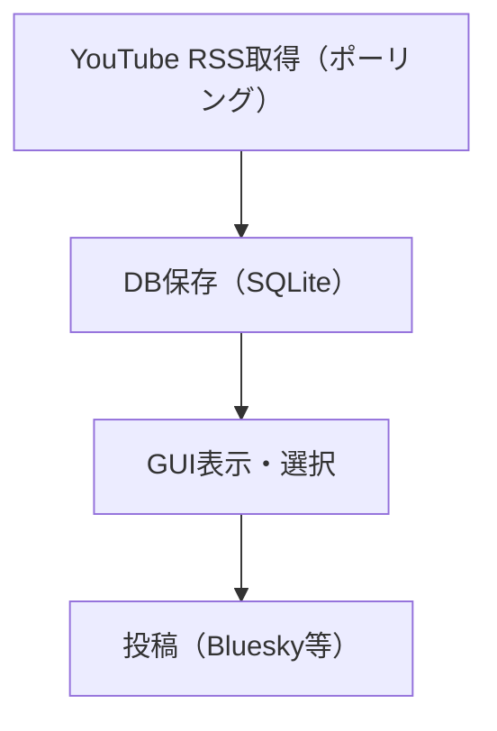
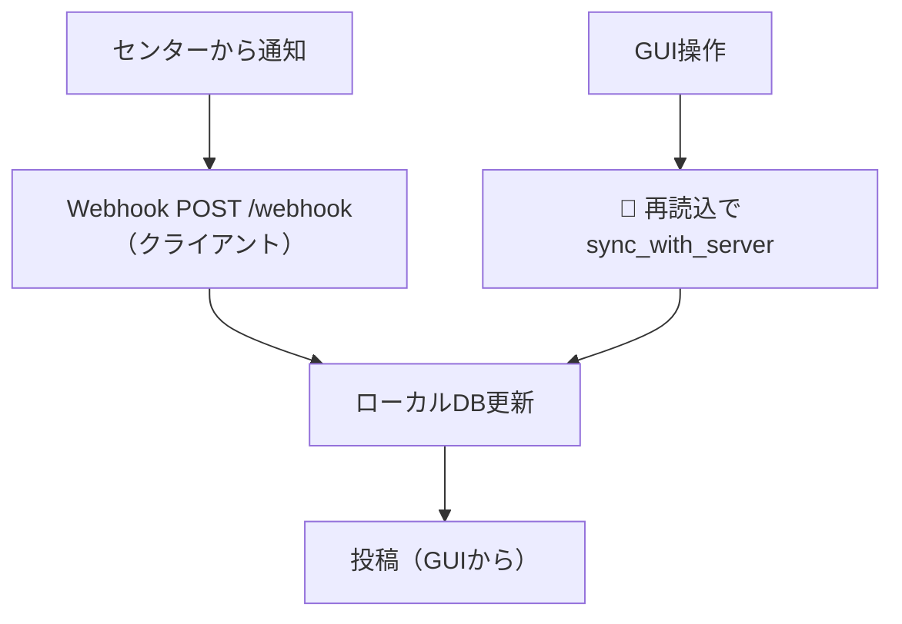

# v3 と v4 の比較（設計・データフロー・要件）

このページは、StreamNotify v3 と v4 の違いを「設計」「データフロー」「必要な要件（設定）」の観点で整理し、v4 の理解を助けるための比較ドキュメントです。

---

## 関連ソースファイル

- v3 起動：`v3/main_v3.py`
- v3 アーキテクチャ：`wiki/technical/Architecture.md`
- v3 WebSub 概要（フォールバック含む）：`wiki/websub_guide.md`
- v4 起動：`v4/main_v4.py`
- v4 Webhook：`v4/core/webhook_server.py`
- v4 センター同期：`v4/core/websub_client.py`, `v4/gui/adapter.py`
- v4 DB：`v4/core/database.py`

---

## 1. 大枠の違い（ひと目で）

| 観点 | v3 | v4 |
| :--- | :--- | :--- |
| 主な収集 | YouTube RSS のポーリング中心 | `YOUTUBE_FEED_MODE` により、センター経由（websub）またはローカル収集（poll） |
| リアルタイム通知 | 基本はポーリング | センター→クライアント Webhook（`POST /webhook`） |
| GUI との結合 | ローカルDB（SQLite）中心 | ローカルDB + センター同期（`🔄 再読込`） |
| 実装の中心 | Core + 拡張（プラグイン） | クライアント側 workers + センター連携アダプタ + SQLAlchemy DB |
| フォールバック | RSS 側へフォールバック | WebSub 不通時に RSS ワーカーへフォールバック + 再接続導線 |
| DB 未作成時の起動 | `video_list.db` が無いと設定上 collect 強制になり、初回取得のあと終了しうる | `client_v4.db` は起動時に作成・初期化。collect への自動切り替えはなく、GUI は開いたまま |

---

## 2. 設計差分（コードレベルのイメージ）

### v3：プラグイン中心のローカル動作

- `v3/main_v3.py` が「起動→設定読込→DB準備→収集→投稿導線（GUI）」を所有します
- 機能追加は `PluginManager` を経由する設計（Core / Extensions 分離）
- WebSub は「センターサーバ経由」で通知を受けるが、基本の運転はポーリング/フォールバックを前提に組まれています

参照：

- `v3/main_v3.py`
- `wiki/technical/Architecture.md`

### v4：クライアントWebhook + センター同期

- `v4/main_v4.py` は次の処理を起動します
  - Webhook サーバ（バックグラウンド）
  - YouTube/Niconico worker（条件に応じて）
  - GUI（メインスレッド）
- センター経由のモードでは、ローカルDB更新に「Webhook受信」が含まれ、さらに GUI の `🔄 再読込` で「センターから差分同期」も行います
- v4 の DB は `v4/core/database.py` の SQLAlchemy（`VideoModel` 等）で管理されます

参照：

- `v4/main_v4.py`
- `v4/core/webhook_server.py`
- `v4/gui/adapter.py`
- `v4/core/database.py`

---

## 3. データフロー比較

### v3（概略）：RSS → DB → GUI → 投稿

### v4（websub）：センター通知 + GUI同期

### v4（フォールバック）：websub不通 → RSSワーカー

- `YOUTUBE_FEED_MODE=websub` を選んでいても、起動時にセンター疎通が取れない場合は RSS ワーカーへ切り替わります
- フォールバック中はセンター経由の機能入力が制限され、代わりに RSS 操作用ボタンが表示されます
- 復帰は `🔌 WebSubに再接続` を使います

参照：

- `v4/main_v4.py`
- `v4/gui/app.py`
- `v4/gui/views/settings_view.py`

---

## 4. 要件（設定）差分

### v4 で特に追加される要件

v4 のセンターモード（websub）では、ローカル webhook をセンターから呼べる必要があります。

| 設定項目 | 説明（v4） |
| :--- | :--- |
| `WEBSUB_CALLBACK_BASE_URL` | センターが到達する「クライアント側 webhook ベースURL」 |
| `WEBSUB_CLIENT_ID` | センターAPI呼び出し時の識別子 |
| `WEBSUB_CLIENT_API_KEY` | webhook の署名検証/センターAPI識別に利用 |
| `CENTER_SERVER_URL` | センターの URL |
| `YOUTUBE_FEED_MODE` | `poll` か `websub` を選択 |

### 保存先DBの違い

- v3：主に `v3/data/` 配下の SQLite（構成はバージョンにより異なる）
- v4：クライアントは `v4/data/client_v4.db`（SQLAlchemy）を使用するため、移行時は「別DBとして扱う」前提が安全です

参照：

- `v4/core/database.py`

---

## 5. 移行・運用チェックリスト（最小）

v3 から v4 に移る際、まずは以下だけ確認すると失敗率が下がります。

1. `YOUTUBE_FEED_MODE`
   - `websub` を使うならセンター到達性（`WEBSUB_CALLBACK_BASE_URL`）を満たす
2. `WEBSUB_CLIENT_*` 周り
   - `WEBSUB_CLIENT_ID` と `WEBSUB_CLIENT_API_KEY` の整合性
3. Bluesky 投稿の設定
   - `BLUESKY_USERNAME` / `BLUESKY_PASSWORD` を正しく設定する（本ページではアプリパスワード経路のみ対象）
4. 初回起動後の挙動確認
   - `YOUTUBE_FEED_MODE=websub` でフォールバックになっていないか（`🔌 WebSubに再接続` の表示有無）

---

## 次に読むべきページ

- `wiki/technical/v4-overview-and-usage.md`（起動・設定・GUI操作の全体）
- `wiki/technical/v4-new-features.md`（v4で増えた機能）

