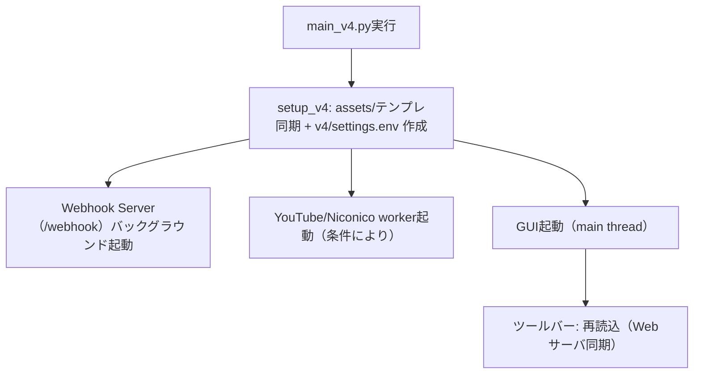

# StreamNotify v4（クライアント）概要と使い方

このページは、StreamNotify v4 の「クライアント側（`v4/`）」について、起動〜設定〜GUI操作までをまとめた導入ドキュメントです。  
`v4-websub-server`（センター側サーバー）は別実装のため、必要事項のみ明記します。

---

## 関連ソースファイル

- 起動エントリポイント：`v4/main_v4.py`
- 設定ファイル例：`v4/settings.env.example`
- セットアップ（assets/テンプレート/初期 `.env` 作成）：`v4/setup_v4.py`
- Webhook サーバ（`/webhook`）：`v4/core/webhook_server.py`
- センター連携（YouTube/Twitch 同期）：`v4/core/websub_client.py`, `v4/gui/adapter.py`
- GUI：`v4/gui/app.py`, `v4/gui/components/toolbar.py`, `v4/gui/views/settings_view.py`
- DB（クライアント側の SQLite）：`v4/core/database.py`

---

## v4 は何をするアプリか（全体像）

v4 は、次のコンポーネントを同時に動かすデスクトップアプリです。

- GUI（メインスレッド）
- Webhook サーバ（センターからの通知を受ける FastAPI / Uvicorn、バックグラウンド）
- YouTube / ニコニコ動画の収集ワーカー（バックグラウンド）
- GUI 操作からの投稿処理（Bluesky への投稿等）

---

## 前提（センター連携が必要なケース）

`YOUTUBE_FEED_MODE=websub` の場合、YouTube の通知や Twitch の配信イベントは「センター経由」で利用します。

そのため、最低限以下が必要です。

- `CENTER_SERVER_URL`（デフォルトあり）
- `WEBSUB_CLIENT_ID`（センター側で識別に使用）
- `WEBSUB_CLIENT_API_KEY`（Webhook 署名検証やセンターAPIの識別に使用）
- `WEBSUB_CALLBACK_BASE_URL`（センターが到達するローカル webhook ベースURL）

`YOUTUBE_FEED_MODE=poll` の場合、センターを使わずローカル収集（RSSポーリング相当）で動作します。

---

## セットアップ手順（v4 クライアント）

### 1. 起動と初期ファイル作成

`v4/main_v4.py` を実行すると、起動時に `setup_v4()` が走り、以下が自動で行われます。

- テンプレート・画像の配置（assets/テンプレート同期）
- `v4/settings.env` が無ければ `v4/settings.env.example` から作成

### 2. `v4/settings.env` を編集

`v4/settings.env.example` を基に、必要な値を `v4/settings.env` に設定します。

最低限の目安（必須カテゴリ）：

- Bluesky 投稿
  - `BLUESKY_USERNAME`
  - `BLUESKY_PASSWORD`（Bluesky のアプリパスワード）
- YouTube 収集
  - `YOUTUBE_CHANNEL_ID`
  - `YOUTUBE_FEED_MODE`（`poll` or `websub`）

必要に応じて設定（任意カテゴリ）：

- `YOUTUBE_API_KEY`（チャンネル名解決や詳細取得に利用される可能性）
- `NICONICO_USER_ID`（設定がある場合のみニコニコ worker が起動）
- `USE_LOCAL_SERVER`（ローカル `v4-websub-server` を使う検証用）

### 3. 初回起動

GUI が起動し、設定に応じて以下が分岐します。

- ローカル DB（`v4/data/client_v4.db`）は未作成でも、起動時に作成・スキーマ初期化されます。**v3 のように「初回だけ取得してすぐ終了」はしません。**
- `YOUTUBE_FEED_MODE=poll`
  - RSS 系ボタンが表示される
  - センター経由の機能は無効化される（Bluesky 投稿は可能）
- `YOUTUBE_FEED_MODE=websub`
  - 起動時にセンター疎通を確認
  - 接続できない場合は RSS フォールバックへ切り替え（後述）

---

## GUIの使い方（ツールバー中心）

v4 のツールバーには、主に次のボタンがあります。

| ボタン | 概要 |
| :--- | :--- |
| `🔄 再読込` | ローカル表示を更新（Web 同期も含む） |
| `📡 新着取得 / RSS更新` | YouTube の手動取得（pollモード時のみ） |
| `🎬 Live判定` | 動画のライブ状態判定（手動） |
| `🔌 WebSubに再接続` | WebSub（センター）不通時の復帰操作 |
| `📝 テンプレート` | 投稿テンプレートの編集 |
| `📤 投稿` | 選択した動画を投稿 |
| `📅 一括スケジュール` | 複数動画の投稿予定を連番で予約 |
| `🗑️ 一括削除` | 選択中の動画を削除 |
| `🖼️ 画像設定` | 画像を割り当て（選択1件時に有効） |
| `📅 投稿予定一覧` | 予約済みの一覧を別ウィンドウで確認 |
| `⚙️ 設定` | 全体設定・アカウント設定を編集 |

---

### 動的ボタンの表示条件（重要）

`YOUTUBE_FEED_MODE` と「センター疎通状況」に応じて、ツールバーの一部が切り替わります。

- RSS 系ボタン（`📡 新着取得 / RSS更新`, `🎬 Live判定`）
  - `YOUTUBE_FEED_MODE=poll` の場合、または websub 選択時でもフォールバック中に表示されます。
- WebSub 再接続ボタン（`🔌 WebSubに再接続`）
  - `YOUTUBE_FEED_MODE=websub` でセンター不通となり RSS フォールバックへ切り替わった場合に表示されます

フォールバックからの復帰は、`🔌 WebSubに再接続` を押すことで試行されます。

---

## 設定時に気をつけること

### センター経由の機能は条件付き

センター経由の機能（YouTube の WebSub / Twitch の配信イベント等）は、取得モードが `websub` であり、  
かつ、センターとの通信が確立している状態にのみ利用できる前提です。

このため GUI 側でも、条件を満たさない場合はセンター経由の入力欄・ボタンが無効化（または抑制表示）されます。

### 署名検証（上級者向け）

`v4/core/webhook_server.py` は webhook `POST /webhook` を受け取ります。  
受信時に署名ヘッダーを検証するようになっています（設定キーが空の場合の挙動は要確認）。

センターから到達可能な `WEBSUB_CALLBACK_BASE_URL` を設定し、`WEBSUB_CLIENT_API_KEY` を整合させてください。

---

## 次に読むべきページ

- `wiki/technical/v4-new-features.md`（v3 から増えた機能）
- `wiki/technical/v3-v4-comparison.md`（v3 との比較）

